## Construct 2 Engine

### Downloads
Open source, clone https://github.com/ouya/ouya-sdk-examples/tree/master/Construct2

### Forums

@OUYA - (Construct 2 on OUYA Forums) - http://forums.ouya.tv/categories/construct2-on-ouya

@Construct 2 - (Forums) - https://www.scirra.com/forum/

## Getting Started

<table border=1>

 <tr>
 <td>Intro to Construct 2 (19:40) 

 </td>
 <td></td>
 </tr>
</table>

### Resources

Construct 2 - https://www.scirra.com/construct2

Supported Platforms - https://www.scirra.com/manual/168/supported-platforms

### Construct 2

Construct 2 is an visually programable engine that publishes HTML5.

## Setup ##

### Windows ###

1. Install [Construct 2](https://www.scirra.com/construct2).

2. Install your license file into the `C:\Program Files\Construct 2\` folder.

3. Install the `Construct 2` plugin changes and the [OuyaSDK plugins](https://github.com/ouya/ouya-sdk-examples/tree/master/Construct2/Program%20Files/Construct%202/exporters/html5/plugins) into your `Construct 2` plugin folder.

4. Restart Construct 2

## Publishing ##

Publishing to the OUYA requires that you package the generated HTML from `Construct 2` into an Android wrapper, preferrably using the `WebArchive` prebuilt configuration from the [HTML5 docs](html5.md). The `WebArchive` prebuilt configuration provides accelerated `WebGL` and accelerated video decoding.

1. Use the menu `File->Export project...` item

2. Select `HTML5 website` and click `Next` button

3. Specify the `HTML5` output folder and click `Next` button

4. Select `Normal style` and click the `Export` button

5. Zip the `HTML5` output into a single zip file.

6. Rename the zip file to `web_archive.jar`

7. Move `web_archive.jar` into the WebArchive `res/raw` folder

8. Customize the package name in `ContentShell/AndroidManifest.xml`

9. Customize the app name in 'ContentShell/res/values/string.xml`

10. Repackage the WebArchive and run on the OUYA using the available WebArchive scripts

# Setup

Before you can use the `OuyaSDK` be sure to create a game in the [developer portal](http://devs.ouya.tv) and download the signing key.

The IAP example places the signing key in `ouya-sdk-examples\Construct2\InAppPurchases\customization\assets\key.der` which gets packaged when running `ouya-sdk-examples\Construct2\InAppPurchases\package.cmd` after exporting HTML5 to `ouya-sdk-examples\Construct2\InAppPurchases\Build`. 

## Testing

You won't be charged when making IAP purchases of your own game.
Be sure to log into the OUYA with the same developer account that the game is created for in the [developer portal](http://devs.ouya.tv).
You can reverse purchases in the [purchase page](https://devs.ouya.tv/developers/products) of the [developer portal](http://devs.ouya.tv) to test refund scenarios or testing first-time purchases.
Look for the `View and remove your purchases of your products` link on the bottom of the [purchase page](https://devs.ouya.tv/developers/products) to refund purchases of your own game.

# `OuyaSDK` API

To access the `OUYA SDK`, insert an `OuyaSDK` object into your layout.
The `OuyaSDK` object has to be in the layout for the `OuyaSDK` events to fire.

Right click the `Layout` and select `Insert New Object`.

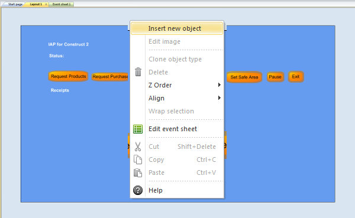

Select `OuyaSDK` and click `Insert`.

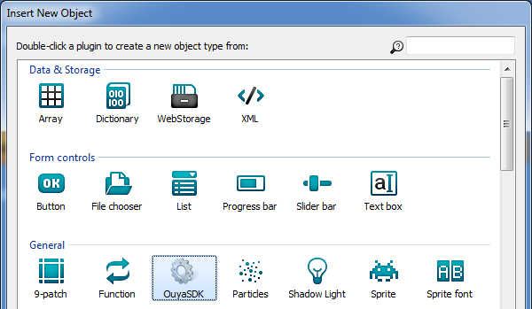

## Initialize the OUYA Plugin

Interacting with the OUYA SDK can be done via the `event sheet`.

### Start of Layout

Add an event `System\On start of layout`.

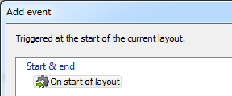

Add actions `addInitOuyaPluginValues` and `initOuyaPlugin` to the `On start of layout` event.

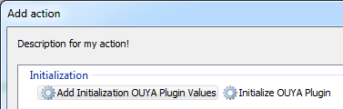

### `Developer UUID`

The `Developer UUID` is available in the [developer portal](http://devs.ouya.tv).

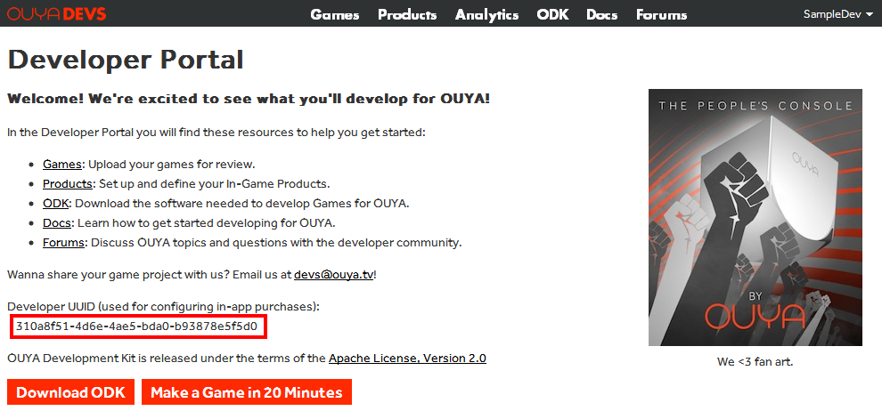

### `addInitOuyaPluginValues`

`addInitOuyaPluginValues` has `key` and `value` arguments.
Add a `key` of "tv.ouya.developer_id".
Add a `value` using your `Developer UUID`.

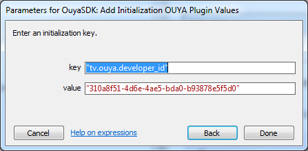

The `initOuyaPlugin` action will invoke initializing the OUYA Plugin given the values added with `addInitOuyaPluginValues`.

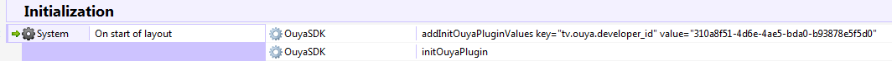

### Init Events

`Initialize OUYA Plugin on Success` will be invoked if the OUYA Plugin was initialized.

`Initialize OUYA Plugin on Failure` will be invoked if the OUYA Plugin failed to initialize.

After initializing the OUYA Plugin the other IAP actions can be invoked.

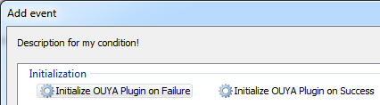

Actions can be added to the init events.

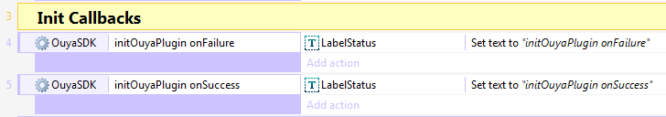

The `onFailure` event provides error code and error message fields.

* `OuyaSDK.errorCodeOnFailureInitOuyaPlugin` - The failure `error code` as a number

* `OuyaSDK.errorMessageOnFailureInitOuyaPlugin` - The failure `error message` as a string

## Request Gamer Info

The gamer info includes the gamer's username and unique identifier. Add an `OuyaSDK\Request Gamer Info` action.

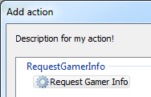

`Request Gamer Info` has 3 events for `on Success`, `on Failure`, and `on Cancel`.

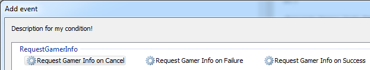

The `Gamer Info` fields are available in the `onSuccess` event.

`OuyaSDK.GamerInfoUsername` returns the string for the gamer's username which can be used to display in a `Text` object. 

`OuyaSDK.GamerInfoUuid` returns the string for the gamer's unique identifier.

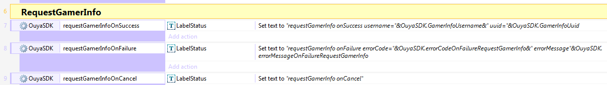

The `onFailure` event provides error code and error message fields.

* `OuyaSDK.errorCodeOnFailureRequestGamerInfo` - The failure `error code` as a number

* `OuyaSDK.errorMessageOnFailureRequestGamerInfo` - The failure `error message` as a string

## Request Products

Requesting products gets the details about the Product created in the [developer portal](http://devs.ouya.tv).

<pre>
{
    "currencyCode": "USD",
    "originalPrice": 2.99,
    "localPrice": 2.99,
    "description": "",
    "name": "Sharp Axe",
    "developerName": "Sample Developer",
    "identifier": "sharp_axe",
    "percentOff": 0
}
</pre>

Add the action `OuyaSDK\Request Products`.

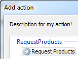

`Request Products` takes a string which is a comma separated list of product ids.
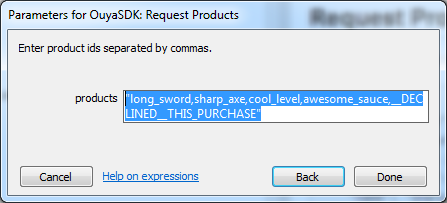

The IAP example waits for a button press before invoking the `Request Products` action.
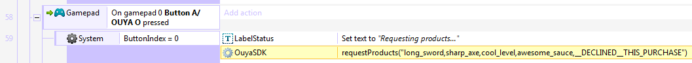

`Request Products` has 3 events for `on Success`, `on Failure`, and `on Cancel`.

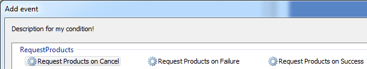

`Request Products on Success` gets a list of product details.
`OuyaSDK.ProductsLength` returns the count of products returned. 

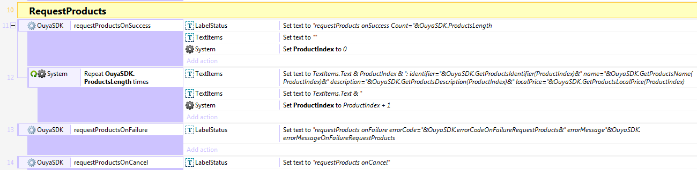

Retrieving product details uses an index from 0 to (`OuyaSDK.ProductsLength` - 1).
Create a global `ProductIndex` used to get the product details.

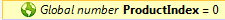

Use the `Set` action to set the `ProductIndex` to start at the beginning of the products list.

Add a `Repeat` event to iterate over each of the returned products. 

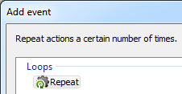

The count will be `OuyaSDK.ProductsLength` times.

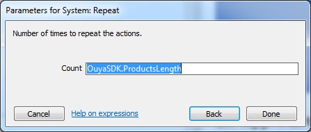

All the `OuyaSDK.GetProducts*` accessors take the `ProductIndex` to return the Product item's details.

`OuyaSDK.GetProductsIdentifier(ProductIndex)` - Returns a string of the product identifier

`OuyaSDK.GetProductsName(ProductIndex)` - Returns a string of the product name

`OuyaSDK.GetProductsDescription(ProductIndex)` - Returns a string of the product description

`OuyaSDK.GetProductsLocalPrice(ProductIndex)` returns a float for the local price of the product.

Increment the `ProductIndex` with a `Set` action after looking up the data for each product.

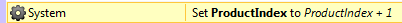

The `onFailure` event provides error code and error message fields.

* `OuyaSDK.errorCodeOnFailureRequestProducts` - The failure `error code` as a number

* `OuyaSDK.errorMessageOnFailureRequestProducts` - The failure `error message` as a string

## Request Purchase

Requesting a purchase requires the Product entitlement or consumable was created in the [developer portal](http://devs.ouya.tv).

Add the action `OuyaSDK\Request Purchase`.

`Request Purchase` has 3 events for `on Success`, `on Failure`, and `on Cancel`.

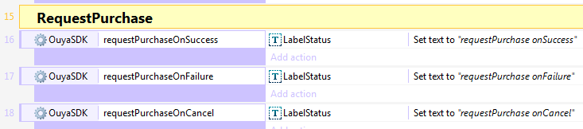

The `onFailure` event provides error code and error message fields.

* `OuyaSDK.errorCodeOnFailureRequestPurchase` - The failure `error code` as a number

* `OuyaSDK.errorMessageOnFailureRequestPurchase` - The failure `error message` as a string

## Request Receipts

<pre>

{
    "gamer": "2927b3d9-e940-077a-8f68-af923f52f5d9",
    "uuid": "be05dfcdc4eb0d50",
    "generatedDate": "Thu Jan 01 00:00:00 GMT 1970",
    "localPrice": 0.99,
    "identifier": "cool_level",
    "currency": "USD",
    "purchaseDate": "Tue Nov 11 01:36:12 GMT 2014"
}

</pre>

Add the action `OuyaSDK\Request Receipts`.

`Request Receipts` has 3 events for `on Success`, `on Failure`, and `on Cancel`.

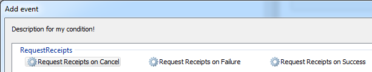

`Request Receipts` on Success gets a list of receipt details. `OuyaSDK.ReceiptsLength` returns the count of receipts returned. 

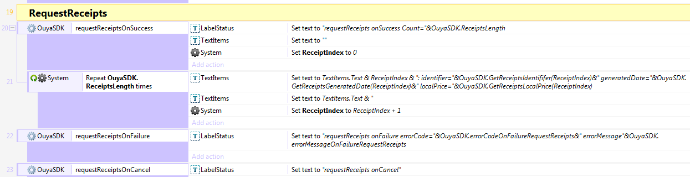

Retrieving receipts details uses an index from 0 to (`OuyaSDK.ReceiptsLength` - 1). Create a global ReceiptIndex used to get the receipt details.

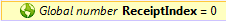

Use the `Set` action to set the ReceiptIndex to start at the beginning of the receipts list.

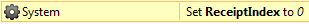

Add a `Repeat` event to iterate over each of the returned receipts. 

The count will be `OuyaSDK.ReceiptsLength` times.

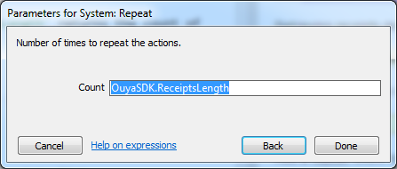

All the `OuyaSDK.GetReceipts*` accessors take the `ReceiptIndex` to return the Receipt item's details.

`OuyaSDK.GetReceiptsIdentifier(ReceiptIndex)` - Returns a string of the product identifier

`OuyaSDK.GetReceiptsGeneratedDate(ReceiptIndex)` - Returns a string of the generated date

`OuyaSDK.GetReceiptsLocalPrice(ReceiptIndex)` returns a float for the local price of the receipt.

Increment the `ReceiptIndex` with a `Set` action after looking up the data for each product.

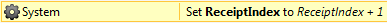

The `onFailure` event provides error code and error message fields.

* `OuyaSDK.errorCodeOnFailureRequestReceipts` - The failure `error code` as a number

* `OuyaSDK.errorMessageOnFailureRequestReceipts` - The failure `error message` as a string

## Set Safe Area

Add the action `OuyaSDK\Set Safe Area`.

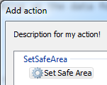

The IAP example uses a floating-point `SafeAreaAmount` global variable that adjusts the safe area amount.

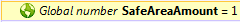

The `Set Safe Area` action takes a `SafeAreaAmount` floating-point number. Safe area amounts range from 0.0 with full border to 1.0 with border. 

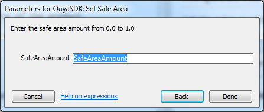

`Set Safe Area` has 2 events for `on Success`, and `on Failure`.

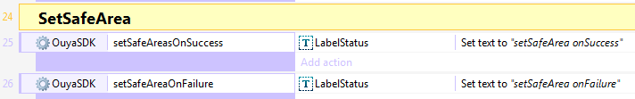

The `onFailure` event provides error code and error message fields.

* `OuyaSDK.errorCodeOnFailureSetSafeArea` - The failure `error code` as a number

* `OuyaSDK.errorMessageOnFailureSetSafeArea` - The failure `error message` as a string

## Shutdown

Add the action `OuyaSDK\Shutdown`.

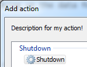

`Shutdown` has 2 events for `on Success`, and `on Failure`.

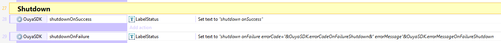

The `onFailure` event provides error code and error message fields.

* `OuyaSDK.errorCodeOnFailureShutdown` - The failure `error code` as a number

* `OuyaSDK.errorMessageOnFailureShutdown` - The failure `error message` as a string

# Examples

The examples are `capx` files which are complete projects that depend on installing the `OuyaSDK` Construct 2 plugin.

## `Virtual Controller` ##

The [Virtual Controller](https://github.com/ouya/ouya-sdk-examples/tree/master/Construct2/VirtualController) example shows 4 images of the OUYA Controller which moves axises and highlights buttons when the physical controller is manipulated. The Virtual Controller example includes support for [OUYA-Everywhere](ouya-everywhere.md).

Open the `VirtualController.capx` from the Construct 2 SDK examples.

## `In-App-Purchases` ##

The [In-App-Purchases](https://github.com/ouya/ouya-sdk-examples/tree/master/Construct2/InAppPurchases) example shows making purchases, checking receipts, adjusting the safe area, and exiting the app.

Open the `InAppPurchases.capx` from the Construct 2 SDK examples.

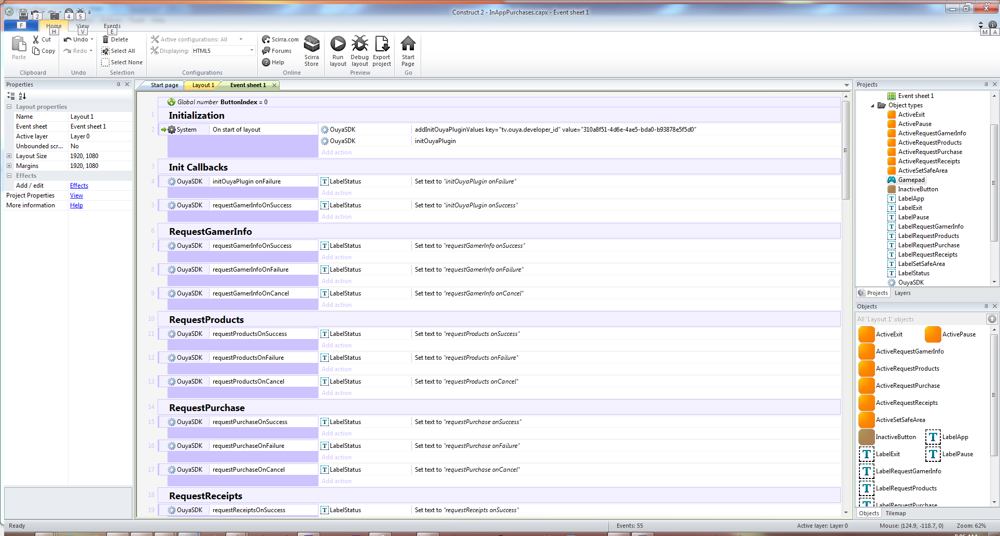