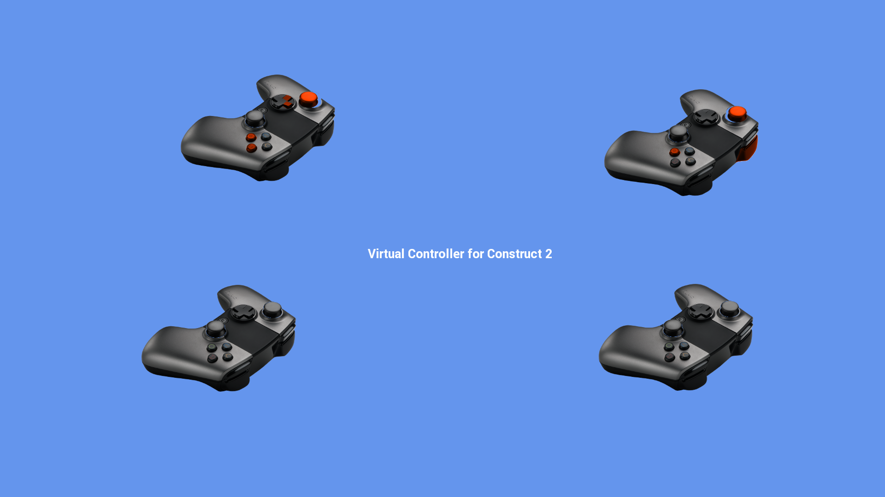

## Construct 2 Engine

### Downloads
Open source, clone https://github.com/ouya/ouya-sdk-examples/tree/master/Construct2

### Forums

@OUYA - (Construct 2 on OUYA Forums) - http://forums.ouya.tv/categories/construct2-on-ouya 

## Getting Started

<table border=1>

 <tr>
 <td>Intro to Construct 2 (19:40) 

 </td>
 <td></td>
 </tr>
</table>

### Resources

Construct 2 - https://www.scirra.com/construct2

Supported Platforms - https://www.scirra.com/manual/168/supported-platforms

### Construct 2

Construct 2 is an visually programable engine that publishes HTML5.

## Setup ##

### Windows ###

1. Install [Construct 2](https://www.scirra.com/construct2).

2. Install your license file into the `C:\Program Files\Construct 2\` folder.

3. Install the `Construct 2` plugin changes and the [OuyaSDK plugins](https://github.com/ouya/ouya-sdk-examples/tree/master/Construct2/Program%20Files/Construct%202/exporters/html5/plugins) into your `Construct 2` plugin folder.

4. Restart Construct 2

## Publishing ##

Publishing to the OUYA requires that you package the generated HTML from `Construct 2` into an Android wrapper, preferrably using the `WebArchive` prebuilt configuration from the [HTML5 docs](html5.md).

1. Use the menu `File->Export project...` item

2. Select `HTML5 website` and click `Next` button

3. Specify the `HTML5` output folder and click `Next` button

4. Select `Normal style` and click the `Export` button

5. Zip the `HTML5` output into a single zip file.

6. Rename the zip file to `web_archive.jar`

7. Move `web_archive.jar` into the WebArchive `res/raw` folder

8. Customize the package name in `ContentShell/AndroidManifest.xml`

9. Customize the app name in 'ContentShell/res/values/string.xml`

10. Repackage the WebArchive and run on the OUYA using the available WebArchive scripts

### Examples

## `Virtual Controller` ##

The [Virtual Controller](https://github.com/ouya/ouya-sdk-examples/tree/master/Construct2/VirtualController) example shows 4 images of the OUYA Controller which moves axises and highlights buttons when the physical controller is manipulated. The Virtual Controller example includes support for [OUYA-Everywhere](ouya-everywhere.md).

Open the `VirtualController.capx` from the Construct 2 SDK examples.

