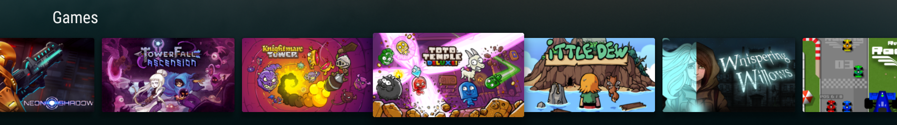

# Cortex Store Technical Requirements
Version 2.0
May 12 2016


We are very excited that you are interested in developing an App or Game for the Cortex Store. We will do everything we can to help support you in this endeavor and look forward to working with you. Our intention with these guidelines is to inform our developers of our testing procedures and make sure that customers are getting the best experience on the Cortex Store.

If you have feedback or questions about any of these requirements, please feel free to email us at [officehours@ouya.tv](mailto:officehours@ouya.tv), and we will promptly reply.


## 0.1 [REQUIRED] Game/App (henceforth referred to as “game”) and Developer are in compliance with Marketplace Agreement

When signing up to become a developer, you must agree to our Marketplace Agreement. The developer is responsible for complying with the terms of the Marketplace Agreement. Noncompliance with agreed-upon terms within the Marketplace Agreement may result in your game being pulled from the Cortex Store.

## 1.0 [REQUIRED] If GAME is not completely free, GAME is built with the latest ODK

If you want to charge money for your game, you’ll need to us our ODK. In order to make sure things function properly, make sure your game has the latest ODK.

The latest ODK can always be found here: https://devs.ouya.tv/developers/odk

There are many benefits to using the ODK, and it supports all the major game engines. Benefits include, IAP support, multiple controller compatibility, multiple device compatibility, dynamic button images, and much more.

Be sure to check out the engine specific documentation for details on how to integrate the ODK for your game.

It’s also easy to implement, usually only a quick recompile.

Upon review QA will test for the latest ODK in the developers APK.

## 1.1 [REQUIRED] Game supports the leanback launcher

Games downloaded from the Cortex store may appear outside of the Cortex environment. To that end, we require that all games and apps launch from outside the Cortex environment, and that the game icon appears correctly.

Learn more about the leanback_launcher activity here:
[http://developer.android.com/training/tv/start/start.html](http://developer.android.com/training/tv/start/start.html)

## 1.2 [REQUIRED] Submitted games have the appropriate intent filter set in the manifest (App or Game)

Like above, games or apps may appear outside the Cortex environment. We require that the game icon  appears in the proper row. If a game appears in the app row it will fail review, likewise if an app appears in the game row.

## 1.3 [REQUIRED] Games must increment their version numbers for each submission

When a developer submits and update, we ask that they use an appropriately higher version number. Games that do not have an appropriate version number will fail the review process.

## 1.4 [RECOMMENDED] Updated Game submissions should include a short changelog

We would like developers to send a short changelog when they update their game on the Cortex Store. This helps our Review team know what to focus on during their testing and will help bring any critical bugs to the developers attention. We provide an area for this during the games submission.

## 1.5 [RECOMMENDED] Game should use ODK controller APIs for maximum compatibility 

By using the controller APIs in the ODK, developers gain the ability to receive new controller mappings via OTA, keeping your game up to date at all times with no other actions required by the developer. We highly recommend developers use it.

## 1.6 [RECOMMENDED] Games released on multiple stores (Google Play, etc. ) should use a single APK file

We would prefer developers use a single APK solution if they have submitted their title to multiple stores. It makes things easier to keep track of, and we want to make sure that Cortex users are getting the latest versions of your title.

## 2.0 [REQUIRED] Game icon displays properly

Your Titles icon can appear in a few different places. Our reviewers make sure they appear correctly in all instances. See below for the details of each kind of icon that the Cortex Store supports. If our reviewers check a titles icons and they appear incorrect the title will fail its review.

## 2.0.1 [REQUIRED] Game icon displays properly inside the Cortex Store

This is the first place our reviewers will see your titles icon, The store icon that is shown in the Cortex launcher is embedded inside of the APK itself. The expected file is in res/drawable-xhdpi/ouya_icon.png and the image size must be 732x412.

Consult the developer documentation page, and your engine’s support page for specific icon location and naming conventions.

## 2.0.2 [REQUIRED] Game icon displays properly on the Games or Apps Row of the leanback launcher 

The next place our reviewers check is outside the Cortex environment, in the Games or Apps row. The leanback icon is shown in the Android TV default launcher when the game is installed. The expected file is in res/drawable/icon.png and the image size must be 320x180.

This is also specific to the engine. Consult the developer documentation page.

## 2.0.3 [REQUIRED] Game icon displays properly inside Settings > Apps

The last place our reviewers look for your titles icon is in the Settings > Apps section. The default icon that is shown in the app settings is embedded inside of the APK itself. The expected file is in res/drawable/app_icon.png and the image size must be 96x96.

You can find out more about icons and more here.

## 2.0.4 [REQUIRED] Game icon displays the correct pricing information (price, price*, FREE or FREE*)

This requirement is only valid inside the Cortex Store. This requirement can be met by properly filling out the product and game submission forms. Our reviewers will play through a large portion of your title in order to hit paywalls or discover in app purchases. 

Note in your submission build notes where the paywalls occur, if applicable.

Setup products for your game here.

## 2.1 [REQUIRED] Game details display properly in Cortex Store 

All metadata (screenshots, videos and text) must appear correctly inside the game details screen. 

## 2.1.1 [REQUIRED] Videos, screenshots and text displays no mature content

While we don’t censor submitted content, we don’t allow mature profanity or nudity within the Game Details Page of a tile. A title that violates this requirement will fail the review process.

## 2.1.2 [REQUIRED] The age rating is appropriate for the content

We want to make the Cortex Store a safe space for gamers of all ages. To that end we require developers to be honest about the content in their title. Developers must give their title an appropriate rating. Reviewers will keep that rating in mind when looking at the title. If it seems that the content is inappropriate for the rating, the title will fail the review process.

## 2.1.3 [REQUIRED] Game details screen displays no licensed material

Anything appearing in your game details page, you must own. A media app can’t show a movie poster or music cover if it doesn’t belong to the developer. An emulator can’t show licensed games as a demonstration. If the text, video or screen shots appearing in the game details page violate this requirement your title will fail the review process

## 2.1.4 [REQUIRED] Game details display video properly (*Required for Premium titles)

Developers have the option to include a free-to-try mode with their title, or make their title premium. Because premium titles don’t have a demo, we require that developers include a video that shows a good representation of the title. We also require that their video be free of unintentional defects and must play properly. 

## 2.1.5 [REQUIRED] Developer must inform Cortex Store Team if they make changes to their linked video

We require that if you decide to change the video attached to your title, that you inform the Cortex Store Team immediately. Like anything appearing on the store we must first verify its content. Failure to inform the Cortex Team, will result in the developer's title being removed from the store.

## 2.1.6 [REQUIRED] Title’s genre tags are representative of the content

The developers select the genres for their title in the game submission process. A reviewer will flag an inappropriate genre in the review process. If a mistake is made, it can be corrected by contacting the Cortex Store team


## 2.2 [REQUIRED] Title’s description is legible and easily understandable

The developer has complete control of their titles description, but we must insist that the developers use proper english, clearly convey their message and it must not contain any spelling errors. Most issues involving this requirement can be corrected by reviewers, but the worst offenders may fail their review.

## 2.3 [REQUIRED] Title meets Android technical requirements in such as they are able to be downloaded and installed properly

Reviewers will download and install your title from the store.


## 2.4 [REQUIRED] Title can be started from all supported areas

Reviewers will test a title in three places. Within the Cortex Store, outside the Cortex Store, in the Game or App row, and finally within Setting > Apps. A title will fail if it fails to launch or crashes when launched.

## 2.5 [REQUIRED] Game text is legible at 10'

All Cortex Store games must be optimized for a TV experience. If the UI or text appears too small to be read from 10 feet away, the title may fail the review process.


## 2.6 [REQUIRED] Launching the title while holding multiple buttons does not cause problems or crash the Game

The reviewer will attempt to launch the title while holding several different combinations of buttons, the title must not have any trouble launching under this scenario.

## 2.7 [RECOMMENDED] The download size of the Application cannot exceed 1.25GB when downloading from the Cortex Store. 

We recommend keeping a titles APK size small, and would prefer it less that 1.25 GB. If your APK must exceed that size, you must contact the Cortex Store Team before attempting to upload your title. 

The preferable option would be to download extra content, like a high rez texture pack, optional in order to keep sizes down. Extra content of any size can be downloaded by the application after launching.

A friendly message must appear when the Cortex supported device has full memory. The user must be able to download the item after the memory issue has been cleared up.

## 2.8 [REQUIRED] Title has an exit or quit option

We require developers to have an exit or quit option in their title. Reviewers will test the exit option and make sure that the title closes properly.

# Game Content / Display

## 3.0 [REQUIRED] Game displays properly on 720p

For compatibility we require that all titles support 720dpi resolution.
Reviewers will test the title on 720p TVs, any graphical corruption will fail the review process.

## 3.1 [REQUIRED] Game displays properly on 1080p

This is the Cortex Store’s prefered resolution, all titles must display in 1080p.

## 3.2 [REQUIRED] All critical UI and text is within the safe zone

If one thing causes titles to fail the most, it is the above requirement. Most TVs have different amounts of overscan, and because of this all titles must be within what we call ‘the safe zone.’

All this means is that all critical UI elements mustn’t be within the outer 10%  of the screen. We consider important UI elements to be health bars, score counters, power meters, and things of that nature. A way most developers can get around this requirement is to add an option to resize the TV screen for optimal viewing.

## 3.3.1 [RECOMMENDED] Game makes use of the full screen, has no large black areas on either side, and is sized correctly. 

Shoot-em-ups and break-out style games often use a narrow portion of the screen. We urge developers not to leave large black areas on either side of the game play, by using a background wallpaper.

## 3.3.2 [REQUIRED] The screen must not rotate when the game is loading.

We often encounter violators of this requirement with mobile ports. If the screen rotates during launch, the title will fail the review process.

## 3.4 [RECOMMENDED] Title should contain a simple tutorial to teach player how use the different modes of the game and show it during initial startup

We encourage developers to either make controls intuitive or give the gamers a helping hand by including a tutorial, a controller layout screen, or gameplay tips, at start of game.

## 3.5 [REQUIRED] Title must NOT mention vibration controls, telephone, tilt, accelerometer, or tablet sleeping

The Razer Serval does not have vibration, and the Razer Forge TV, and all supported Cortex Store devices do not support telephone, tilt, accelerometer, or tablet sleeping. No title can mention mobile functionality.

## 3.6 [RECOMMENDED] All menu features function properly *(COMING SOON areas not applicable)

Reviewers will check all menus and all options during the review process. Any menu that fails to do what is expected may cause a title to fail the review process.

## 3.7 [RECOMMENDED] Title must be fully functional using a Razer Serval controller

All titles on the Cortex Store must support the Razer Serval controller. The easiest way to do this is use the controller APIs in the Razer ODK.

## 3.7.2 [RECOMMENDED] OUYA controllers and 3rd-party-controller support

Developers have the option of supporting 3rd party controllers on their own. The easy way of supporting many popular 3rd party controllers is by using the controller APIs in the Razer ODK.

## 3.7.4 [REQUIRED] For multiplayer titles, the maximum number of supported players must be able to connect and play without issues. 

Reviewers will test titles with the declared maximum number of players allowed. This must not cause any issues with framerate or stuttering sound, etc.

## 3.7.5 [RECOMMENDED] The Developer is responsible for extensive multiplayer testing.

Reviewers will test the multiplayer portions of a submitted title, as time allows, but developers are responsible for testing their own titles extensively. 

## 3.7.6 [REQUIRED] Title has no other representation of controllers other than Razer Serval

Titles must not contain the graphical representation of any licensed controller other than a Razer Serval. An artistic interpretation of/or a generic controller with the correct layout and button callouts may be permitted in certain circumstances.

## 3.7.7 [RECOMMENDED] Use ODK controller image API for device appropriate controller images

We recommend that developers use the Controller Image API in the ODK if they don’t have their own custom controller images.


## 3.8 [RECOMMENDED] B button is used for back

## 3.9 [RECOMMENDED] A button is used for select

## 3.10 [RECOMMENDED] The start button is used to pause the game, and/or open option menus.

## 3.11 [RECOMMENDED] Both Dpad and Left Analog are functional for menu use

We prefer the developers use both the Dpad and the Left Analog stick for menu use. This cuts down on initial gamer confusion.

## 3.12 [REQUIRED] Title must support the System Menu being opened and dismissed

Reviewers will test the title with the System Menu opening and closing. The game shouldn’t have any issues handling these events occurring. If the game crashes, has audio that plays, or graphical corruption occurs, the title will fail the review process.


## 3.13 [REQUIRED] The Title does not use "Long-Press of the Razer Serval Home+Back Button" for anything

This combination of buttons cause the Razer Serval to enter pairing mode. No title should use this button combination at all.

## 3.14 [REQUIRED] Title handles loss of Network connection and offline gameplay  gracefully

The Cortex Store does not require the console to be online to launch a title. Reviewers will disable their network connection within a title in various ways. The title must not crash, hang or behave poorly in any way upon network loss.

## 3.15 [REQUIRED] Multiplayer titles must have distinct player controls for the maximum supported local players

Reviewers will test a title with multiple controllers paired. If the controller of player 2 can control the character that player 1 is controlling, this may cause the title to fail the review process. Not applicable in menus and apps.

## 3.16 [REQUIRED] It is clear to the user how to begin using the app / playing the game

## 3.17 [RECOMMENDED] Navigation of the title's user interface and text entry fields is intuitive

Reviewers will navigate the titles UI extensively. They will flag any difficult sections to navigate or places where text entry is not easy to accomplish. 

## 3.18 [RECOMMENDED] Audio is stereo output, without sound-quality issues

Reviewers will check for unintentional sound quality issues and will flag them in their review. Severe bugs in music or SFX will cause a title to fail the review process.


## 3.19 [REQUIRED] Game performs with no excessive lag or sluggishness

Reviewers will observe the game’s performance over the normal course of gameplay. If excessive lag or sluggishness is noticed it will cause the title to fail the review process.

3.20 [RECOMMENDED] Title should remain stable for an extended amount of game time

The reviewer will test the title for an extended amount of time, the title should remain stable and not crash or begin to slow down during the normal course of extended gameplay.

## 3.21 [RECOMMENDED] The title implements Game Saves

We recommend that developers give the gamers the ability to save their game if it seems appropriate.

## 3.21.1 [RECOMMENDED] If the title supports Game Saves, the title saves/loads correctly

If the developers implement a save system it will be tested by the reviewer to confirm it’s functionality.

## 3.21.2 [REQUIRED] If the title supports an in-game store, the store functions properly

If the developers implement an in-game store, reviewers will make test purchases of all entitlements, subscriptions and consumables and verify that they function and unlock without issue.

## 3.22 [RECOMMENDED] Game allows for pause and resume without loss of user data

The title should implement a pause function if there is a potential loss of user data in the event of losing focus.

## 3.23 [RECOMMENDED] Game functions on current publicly available system firmware

All titles will be tested against the current live firmware of supported devices. Reviewers will be looking for crashes or other critical bugs, if any occur the title will fail the review process.

## 3.24 [RECOMMENDED] Ensure the game closes as the user expects

This requirement is to make sure that a game doesn’t continue running in the background when the gamer attempts to quit, or presses the Home Button. If a gamer exits via quit button, the title should terminate. 

If a gamer hit the home button in game, the game should, at minimum, enter a suspend mode until re-opened. A reviewer will be listening to audio that doesn’t stop when the game is closed or suspended by quitting in game, or pressing the home button.

## 3.25 [RECOMMENDED] Issues do not occur when the Forge TV loses power or is rebooted while the title is running

Reviewers may pull the power from supported Cortex Store devices while a title is running. Upon restoring power the reviewer should observe no severe issues.

# In Game Store and IAP

## 4.0 [REQUIRED] Correct description for store items

All item descriptions must accurately reflect each item. Reviewers will check each item for accuracy.

## 4.1 [REQUIRED] All item descriptions are legible

Reviewers will be checking the spelling and grammar of each item. Minor errors will be flagged and corrected, major errors may cause a title to fail the review process.

## 4.2 [REQUIRED] Purchasing correctly unlocks store items

Reviewers will check that each item unlocks correctly.

## 4.2.1 [REQUIRED] It is clear to the gamer what they are purchasing

Reviewers will check each item’s description, and compare to what is actually unlocked via purchase. Items that seem inconsistent will be flagged.

## 4.3 [REQUIRED] Store items function properly when unlocked

Reviewers will verify that all items that are purchased, unlock and function as the developer intends and the user expects. All entitlements should remain unlocked if the game is uninstalled and reinstalled.

## 4.4 [REQUIRED] Titles handle purchases in the manner they are setup within the developer portal 

Developers set this up in the products section of Cortex developers portal. Reviewers make sure each product available on a title behaves as it should. (Consumable, Entitlement, Subscription)

## 4.5 [RECOMMENDED] Receipts are validated correctly if a user uninstalls and re-installs an apk. There is no second request to purchase the title

Upon re-install the title should not ask the gamer to repurchase the entitlement in order to gain full access.

## 4.6 [RECOMMENDED] Purchase unlocks are recognized immediately without the need for a Restore Purchase option

A title that is unlocked via purchase should be unlocked without delay.

## 4.7 [REQUIRED] The title respects the IAP guidelines of Razer for soliciting donations and purchases. All purchases and sales must go through Cortex Store IAP

No title may circumvent the Cortex Store in it’s IAP. No developer may solicit gamers for money outside of the Cortex Store IAP. No title may use deceptive actions upon purchase, for instance spawning multiple purchase windows.

# Social

## 5.0 [REQUIRED] Proper functionality of Facebook/Twitter integrations

If your game implements it, reviewers will check all social links on any title. Links must be valid and appear correctly on Cortex Store supported devices.

## 5.1 [RECOMMENDED] Developers should have a support email available to users for prompt responding

Gamers should have a direct link to developers. If a gamer runs into a problem they should have an easy way of contacting developers. We ask that developers include contact info in their game, where a gamer with a problem can easily find it.

# Content

## 6.0 [REQUIRED] No hate speech

No hate speech will be tolerated on any title.

## 6.1 [REQUIRED] No real-world violence

We will not tolerate titles that encourage violence in the real world.

## 6.2 [REQUIRED] No sexually explicit content

No pornographic material will be allowed on the Cortex Store.

## 6.3 [RECOMMENDED] Does not infringe on other IPs 
Your title and promotional material cannot contain any material to which you do not have rights to distribute. For example, titles such as emulators must not come packaged with ROMs, and Media Apps must not include movies or music that they do not have a licence to play. This includes screenshots and videos on the game details page.

## 6.4 [REQUIRED] Does not promote real world gambling

Casino types of games are ok. But games that let you gamble with real money will not be allowed on the Cortex Store.

# Interface / Naming

## 7.0 [RECOMMENDED] References to Razer Serval use proper terminology

View appendix for proper terminology for the Razer Serval Controller.

# Pricing

## 8.0 [RECOMMENDED] The game has some level of IAP implemented

We recommend that developers have some sort of in app purchase for their title. It could be a full game unlock, additional characters, a flaming sword, or new levels, the choice is yours.

## 8.1 [RECOMMENDED] There's a clear option to buy in main menu (if applicable)

If a title has IAP implemented, there should be a clear option to buy from the main menu, such as a store menu, or button directly to purchase.

Premium Titles

## 9.0 [RECOMMENDED] A Premium title should implement a receipt check before the user enters gated gameplay

We leave any DRM decisions up to the developer. However, given the simplicity of copying games these days, we recommend premium titles check that the gamer is cleared to use the title before gameplay begins. 

## 9.1 [RECOMMENDED] If the game is changing from Free to Try to Premium, purchases from the Free to Try version should be respected in the newest version

If a developer included a demo mode in a previous version of the game, all purchases from the demo version must be respected in the now demo free version. Developers must notify the Cortex Store team their intention, and we can help with the transition.

## 9.2 [REQUIRED] Buying Premium content successfully unlocks Premium content

Reviewers will verify that all items that are purchased, unlock and function as the developer intends and the user expects

## 9.3 [REQUIRED] Previously purchased entitlements on Premium games should remain unlocked after an uninstall/reinstall without re-purchasing

Reviewers will uninstall and reinstall the game. They will verify that they do not need to repurchase the entitlement to unlock the premium title.


# OUYA and OUYA Everywhere Support

## 10.0 [RECOMMENDED] OUYA and OUYA Everywhere support

Developers may choose to support the OUYA, or other OUYA Everywhere supported devices, such as the Madcatz MOJO. Please refer to their documentation for the requirements specific to that device.

## Interface / Naming Appendix

7.0 A Button
7.1 B Button
7.2 X Button
7.3 Y Button
7.4 D-Pad
7.5 LS (Left joystick movement)
7.6 LB (Left bumper
7.7 LT (Left trigger)
7.8 L3 (pressing left joystick down)
7.9 RS
7.10 RB
7.11 RT
7.12 R3

All titles that use controller face buttons may only use Razer Serval style buttons as a reference. Buttons from other controllers may not be used. 

## Technical Guidelines

### Safe Zone
We want to provide a great experience for gamers with any type of TV. Some TVs have a substantial amount of overscan -- so much so that you can’t see the outside edge of the game at all. 

For example:

<a target=_blank href="https://s3.amazonaws.com/ouya-docs/SafeAreaTVMaxOverScanText2.png"></a><br/>
(Above) Notice how the outer UI elements for title and buttons are being clipped because they fall outside the safe zone.
<hr>


<a target=_blank href="https://s3.amazonaws.com/ouya-docs/SafeAreaTVNoOverScanText2.png"></a><br/>
(Above) Here without the severe overscan you can see the important content that went missing along the outer edge.
<hr>


<a target=_blank href="https://s3.amazonaws.com/ouya-docs/InsideSafeArea.png"></a><br/>
(Above) You have the option to stylize content outside the safe zone by including non-essential game art or generic padding.
The green overlay denotes the safe area which can be toggled while a game is running with the commands in the following section.
<hr>


Safe zone issues are is easy to check. In the Terminal or Command Prompt:

1. Type adb shell, press Enter<br/> (this opens the shell prompt connected to the device)
```
adb shell
```

2. Type su, press Enter (grant super-user access to the activity manager)
```
su
```

3. Type am start -n tv.ouya.console/tv.ouya.console.launcher.ToggleSafeZoneActivity, press Enter to toggle (toggles a green visual overlay showing the safe zone)
```
am start -n tv.ouya.console/tv.ouya.console.launcher.ToggleSafeZoneActivity
```

4. Type am display-size 1280x720, press Enter to switch to 720p (changes the TV display to the target resolution, if the resolution is not available emulates with a black area)
```
setprop persist.tegra.hdmi.resolution 720p
```

5. Type am display-size 1920x1080, press Enter to switch to 1080p (changes the resolution back to 1080p)
```
setprop persist.tegra.hdmi.resolution 1080p
```

Here is TimG with a video tip on handling the safe area.

<table border=1>

<tr>

 <td>Check Your Safe Area (3:36)<br/>
<a href="http://www.youtube.com/watch?feature=player_embedded&v=Dz7ZRjN3KlE" target="_blank">
</a>
 </td>
 
</tr>

</table>

##Icons

### Store Icon

* The `store icon` that is shown in the `Cortex` launcher is embedded inside of the `APK` itself. The expected file is in `res/drawable-xhdpi/ouya_icon.png` and the image size must be `732x412`.

The `732x412` `store icon` displays in the `Play` section of the `Cortex` Launcher.


The `732x412` `store icon` displays in the `Discover` section of the `Cortex` Launcher.


### Default Icon
 
* The `default icon` that is shown in the app settings is embedded inside of the `APK` itself. The expected file is in `res/drawable/app_icon.png` and the image size must be `96x96`.

The `AndroidManifest.xml` application icon defines the name of the `default icon`.

```
<application
    android:icon="@drawable/app_icon"
```

The `96x96` `default icon` displays on some legacy Android settings pages.


### Leanback Icon

* The [leanback icon](https://developer.nvidia.com/android-tv-developer-guide#leanback_banner) is shown in the `Android TV` default launcher when the game is installed. The expected file is in `/res/drawable/icon.png` and the image size must be `320x180`.

The `AndroidManifest.xml` application logo defines the name of the `leanback icon`.

```
<application
    android:logo="@drawable/icon"
```

The `320x180` `leanback icon` displays in the `Android TV` default launcher in a `Games` row when installed.



## Video

* In the developer portal after you've created the game entry, an edit link will appear. You can use this edit link to alter the description, add screenshots, submit new builds, and add video for your title. Your list of games can be found <a target=_blank href="https://gamers.ouya.tv/developers/games">[here]</a>.
 
<table border="1"><tr><td></td></tr></table>

* When editing game details, add one or more videos into the Video urls field. Add one Vimeo url per line.
 
<table border="1"><tr><td></td></tr></table>

## Keystore

The `keystore` is a security mechanism for your game.

The `keystore` must be used to submit your game to the store.

Updates of the game needs to use the same `keystore`.

Be sure to email yourself a backup of the keystore and password because you always need to submit updates of the game with the same `keystore`.

### Create the KeyStore

* IDE tools like [Eclipse](http://developer.android.com/tools/publishing/app-signing-eclipse.html) and [Unity](http://docs.unity3d.com/Manual/class-PlayerSettingsAndroid.html) can be used to create the `keystore`.

* Or generate a unique `keystore` for your game on the command-line. Make sure `ADB` is in your path and `keytool` is in your path.

Example `keystore` filename: `ouya_your.keystore` (put your own name here)

Example `keystore` alias: `YourAlias` (put your own alias)

Example `keystore` password: `your_password` (put your own password)

```
keytool -genkey -alias YourAlias -keystore ouya_your.keystore -keyalg RSA -keysize 2048 -validity 36135 -storepass your_password
```

And then fill out the info with `your company info`:

```
What is your first and last name?
[Unknown]: OUYA Inc
What is the name of your organizational unit?
[Unknown]: OUYA Inc
What is the name of your organization?
[Unknown]: OUYA Inc
What is the name of your City or Locality?
[Unknown]: San Mateo
What is the name of your State or Province?
[Unknown]: CA
What is the two-letter country code for this unit?
[Unknown]: US
Is CN=OUYA Inc, OU=OUYA Inc, O=OUYA Inc, L=San Mateo, ST=CA, C=US correct?
[no]: yes
Enter key password for <YourAlias>
(RETURN if same as keystore password):
Re-enter new password: 
```

### Sign APK with the Keystore

Before submitting your `APK` to the store, make sure your `APK` is signed with your `keystore`.

Make sure `jarsigner` is in your path and you are using `JDK6`.

Example `keystore` filename: `ouya_your.keystore` (put your own name here)

Example `keystore` alias: `YourAlias` (put your own alias)

Example `keystore` password: `your_password` (put your own password)

```
jarsigner -keystore ouya_your.keystore -storepass your_password -keypass your_password Your.apk YourAlias
```

### Verify Certs

The `keystore` certificate can be verified after signing the apk.

```
jarsigner -verify -certs -verbose Your.apk
```

### Publish

After signing with the `keystore`, the `APK` is ready to publish in the [developer portal](http://devs.ouya.tv).
