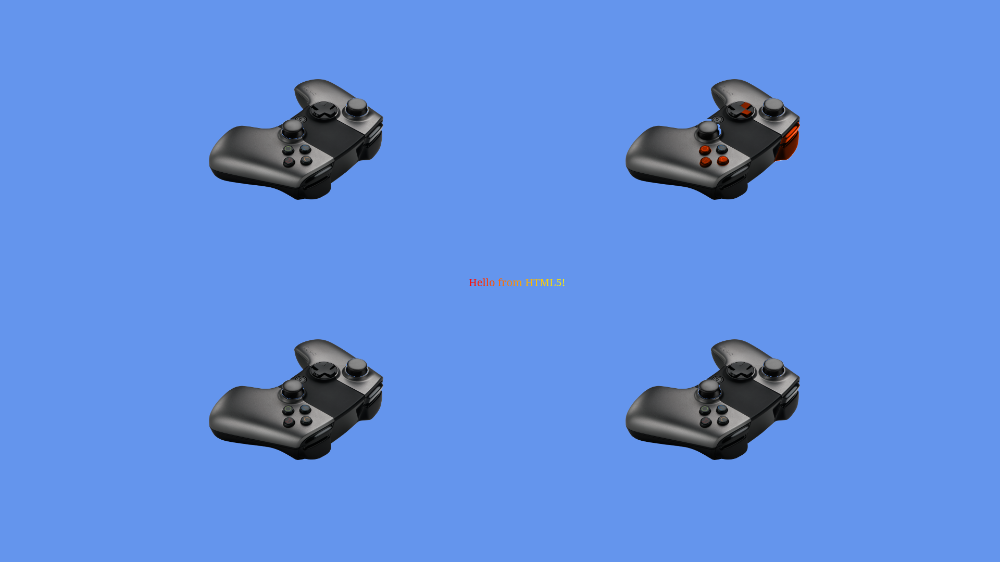

# Cordova

The [`Cordova`](https://cordova.apache.org/) engine provides a hardware-accelerated wrapper around HTML5.

## Resources

* [Cordova Android Platform Guide](http://cordova.apache.org/docs/en/5.0.0/guide_platforms_android_index.md.html)

* [Cordova Command-Line-Interface Guide](http://cordova.apache.org/docs/en/5.0.0/guide_cli_index.md.html#The%20Command-Line%20Interface)

* [Cordova Android Plugins](http://cordova.apache.org/docs/en/5.0.0/guide_platforms_android_plugin.md.html#Android%20Plugins)

## Examples

* Be sure to update to the latest version of `Android Studio`.

### Virtual Controller

The [Virtual Controller](https://github.com/ouya/ouya-sdk-examples/tree/master/Cordova/VirtualController) example shows 4 images of the OUYA Controller which moves axises and highlights buttons when the physical controller is manipulated.



The initial `Cordova` project was created with the command-line from the `Cordova` folder.

```
cordova create VirtualController tv.ouya.sdk.examples.cordova.virtualcontroller VirtualController
```

`Android` support is added to the `Cordova` project with the following command-line.

```
cordova platform add android
```

To build and run the `Virtual Controller Example` run the following command from the `Cordova/VirtualController` folder.

```
cordova run android
```
