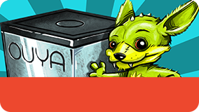
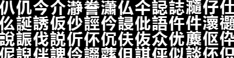

# Enabling Xiaomi Support

While being included in the Xiaomi market is currently an invite-only process, making your app Xiaomi-Enabled is a relatively simple affair. To ensure your app/game is ready for Xiaomi, be sure to update to the latest OUYA-Everywhere  plugin and publish to the OUYA Store targeting the OUYA. After passing review, your app/game is ready for Xiaomi. 

## Xiaomi Target Hardware

* [MiBox(Enhanced)](http://dev.xiaomi.com/doc/p=3838/index.html) [[XiaomiShop]](http://www.xiaomishop.com/116-original-mi-box-proenhanced-3rd-quad-core-smart-tv-4k-hd-box.html)

## Update to the latest ODK

Download latest ODK ([ODK-1.2.1494](https://ouya-sdks.s3.amazonaws.com/xiaomi/odk-1.2.1494.zip)) from the OUYA [Developer portal](http://devs.ouya.tv) and setup your game to use it.

Engine specific details:

* [Java](java.md#releases)
* [Unity](unity.md#releases)

## Review the OUYA Everywhere Documentation ##

* Be sure to review the [OUYA Everywhere Documentation](ouya-everywhere.md) for your engine.
The next initialization steps may integrate differently for your particular engine.

Engine specific details:

* [OUYA Everywhere on Construct 2](construct_2.md#ouya-everywhere)
* [OUYA Everywhere on Corona](corona.md#ouya-everywhere)
* [OUYA Everywhere on GameMaker](game-maker.md#ouya-everywhere)
* [OUYA Everywhere on HTML5](html5.md#ouya-everywhere)
* [OUYA Everywhere on Java](java.md#ouya-everywhere)
* [OUYA Everywhere on Marmalade](marmalade.md#ouya-everywhere)
* [OUYA Everywhere on MonoGame](mono-game.md#ouya-everywhere)
* [OUYA Everywhere on Unity](unity.md#ouya-everywhere)
* [OUYA Everywhere on Unreal](unreal.md#ouya-everywhere)

## Xiaomi Libraries

* Download and extract [SDK_MIBOX_2.0.1](https://ouya-sdks.s3.amazonaws.com/xiaomi/SDK_MIBOX_2.0.1.zip)
* Place **SDK_MIBOX_2.0.1.jar** with the libraries of your game
* Place **MiGameCenterSDKService.apk** in your <game>/assets directory.

Engine specific details:

* [GameMaker](game-maker.md#xiaomi-libraries)
* [Java](java.md#xiaomi-libraries)
* [Unity](unity.md#xiaomi-libraries)

## Xiaomi required permissions

Xiaomi's SDK requires several additional permissions in `AndroidManifest.xml` in order to work.
```java
	<uses-permission android:name="com.xiaomi.sdk.permission.PAYMENT"/>
    <uses-permission android:name="android.permission.GET_TASKS"/>
    <uses-permission android:name="android.permission.READ_PHONE_STATE"/>
```

Engine specific details:

* [GameMaker](game-maker.md#xiaomi-required-permissions)
* [Java](java.md#xiaomi-required-permissions)
* [MonoGame](mono-game.md#xiaomi-required-permissions)
* [Unity](unity.md#xiaomi-required-permissions)

## Receipt Checking ##

* If your game has in-app-purchases, be sure to check for receipts when the application starts.
This is important to verify entitlement purchases for premium games and demo games with paid unlock.

## Xiaomi Initialization

The Xiaomi market requires a special application key and ID.  Contact the [OUYA team](mailto:xiaomisupport@ouya.tv) to get these values.

Additionally, non-OUYA markets require being pre-informed about all possible product IDs that might be used during the game's run.  This is so the SDK can do any transforms that are specific to the market that the game is connecting to.

The following initialization strings must be set.

* `tv.ouya.developer_id` - The developer UUID available after signing into the [developer portal](http://devs.ouya.tv)
 
* `signing key` - The signing key is created when a game entry is entered in the developer portal. Each game entry in the games list has a signing key available for download.
		
* `com.xiaomi.app_id` - The Xiaomi Application Identifier

* `com.xiaomi.app_key` - The Xiaomi Application Key

* `tv.ouya.product_id_list` - The list of entitlements available for purchase within the app/game

Engine specific details:

* [Construct 2](construct_2.md#xiaomi-initialization)
* [Corona](corona.md#xiaomi-initialization)
* [GameMaker](game-maker.md#xiaomi-initialization)
* [HTML5](html5.md#xiaomi-initialization)
* [Marmalade](marmalade.md#xiaomi-initialization)
* [MonoGame](mono-game.md#xiaomi-initialization)
* [Java](java.md#xiaomi-initialization)
* [Unreal](unreal.md#xiaomi-initialization)
* [Unity](unity.md#xiaomi-initialization)

## Is Running on OUYA Hardware

Be sure to check that `OuyaFacade.isInitialized()` returns `true` before checking `OuyaFacade.isRunningOnOUYASupportedHardware()`, otherwise the call will fail if the `OUYA Framework` is not present.

## Disable Xiaomi Screensaver

* The Xiaomi screensaver should be disabled while your game is running.

Engine specific details:

* [GameMaker](game-maker.md#disable-xiaomi-screensaver)
* [Java](java.md#disable-xiaomi-screensaver)
* [Unity](unity.md#disable-xiaomi-screensaver)

## Exit Button on Main Menu

Typically games have a main menu, and the menu should have an exit button to quit the game. Alternatively, pressing the OUYA `A` button on the main menu should prompt to exit the game.

## Create a Xiaomi-specific icon

The application icon on Xiaomi is a little unusual.  It will exist in the xhdpi resolution, but it is not a standard Android icon.

* **res/drawable-xhdpi**:
	* File must be named "ouya_xiaomi_icon.png"
    * 284x160, 32-bit
    * 15px rounded corners 
    * Hero element
    	* Size 284x110
    * Game name
    	* Bottom 50px
    	* Background should be a solid color
    	* No actual text - will be inserted by system at runtime.
    * NOTE: Do NOT update your AndroidManifest.xml to reference ouya_xiaomi_icon - you only need to place the asset in the correct location.
    * See [this example](enable_xiaomi_support/image_1.png)

	

Engine specific details:

* [Java](java.md#create-a-xiaomi-specific-icon)
* [Unity](unity.md#create-a-xiaomi-specific-icon)

## Xiaomi requires a .psd image.

* Xiaomi also requires a 800x800 image of the protagonist character(s), or something showing what the game is about.

* Must be in PSD format.

* Should be sent directly to the [OUYA team](mailto:xiaomisupport@ouya.tv)

## Localization Resources

Xiaomi requires that the app/game has been localized for `Simplified Chinese`. 

Engine specific details:

* [Java](java.md#localization-resources)
* [Unity](unity.md#localization-resources)

## Fonts

* In order to support `Simplified Chinese` text, some engines use [true type fonts](http://en.wikipedia.org/wiki/TrueType) and others use [bitmap fonts](http://en.wikipedia.org/wiki/Computer_font#BITMAP).

* [`bmfont`](http://www.angelcode.com/products/bmfont/) is a free bitmap font generation tool that can convert `true type fonts` into `bitmap fonts`.



Engine specific details:

* [Unity](unity.md#fonts)

## Versioning

Builds need to use standard [Android versioning](http://developer.android.com/tools/publishing/versioning.html).
Each time a build is submitted to Xiaomi, the `version name` and `version code` need to be incremented.
In most cases the version can be changed in the `AndroidManifest.xml`. 

## Submission

Once the above changes have been made, your updated APK should be submitted via the OUYA Developer portal.  You'll then need to email OUYA at [xiaomisupport@ouya.tv](mailto:xiaomisupport@ouya.tv) to let us know it's ready.  Once you've done that, we'll take a snapshot of the in-app-purchase products that you have and send them to Xiaomi.  Please make sure that you've created any necessary in-app-purchase products **BEFORE** telling us your submission is ready.  This email is also when you should send OUYA your protagonist PSD file.

## TL;DR

* Update to the latest ODK ([ODK-1.2.1494](https://ouya-sdks.s3.amazonaws.com/xiaomi/odk-1.2.1494.zip)).
* Add files to your game project - Xiaomi SDK and Xiaomi's game service apk.
* Add required permissions to your manifest.
* Update OuyaFacade's initialization bundle.
* Create new icon per Xiaomi's requirements
* Create 800x800 PSD of protagonist.
* Submit updated apk to OUYA's dev portal
* Email OUYA to let us know it's ready; include your protagonist PSD.

## That's it!

Wasn't that easy?  :)

## Questions?

If it actually wasn't that easy and you have questions, please don't hesitate to email us at [xiaomisupport@ouya.tv](mailto:xiaomisupport@ouya.tv).
