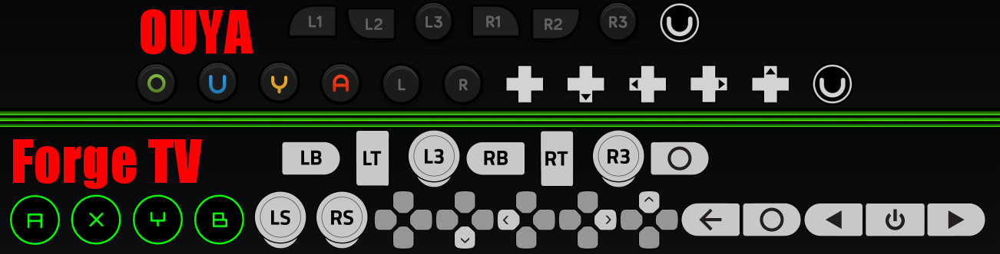
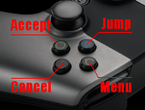
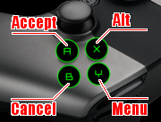
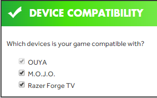
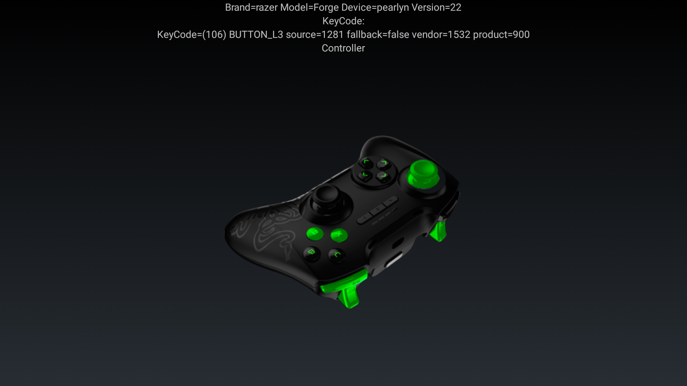

# Put Your Game on `Razer Cortex`

`OUYA Publishing` is in the process of testing games in the `OUYA Store` for compatibility on `Cortex`, Razer's appstore for `Forge TV`.

Some games are perfectly functional, whereas other games may have issues with input, and other games may have cosmetic issues with button images.

This document will help you put your game on `Razer Cortex` (the storefront for the Forge TV) by making your game `OUYA Everywhere` compliant.

## Table of Contents

[Audience](forge_tv.md#user-content-audience)

[Specifications](forge_tv.md#user-content-specifications)

[Notes](forge_tv.md#user-content-notes)

[Engines That Support Forge TV](forge_tv.md#user-content-engines-that-support-forge-tv)

[Step 1. Upgrade the OUYA-Everywhere Plugin](forge_tv.md#user-content-step-1-upgrade-the-ouya-everywhere-plugin)

[Step 2. Fix Button Images](forge_tv.md#user-content-step-2-fix-button-images)

[Step 3. Menu Button Handling](forge_tv.md#user-content-step-3-menu-button-handling)

[Step 4. Signing](forge_tv.md#user-content-step-4-signing)

[Disable Screensaver](forge_tv.md#user-content-disable-screensaver)

[Icons](forge_tv.md#user-content-icons)

[Controller Image](forge_tv.md#user-content-controller-image)

[ADB Debugging](forge_tv.md#user-content-adb-debugging)

[Pairing Serval](forge_tv.md#user-content-pairing-serval)

## Audience

`OUYA Developers` wanting to publish to the `Forge TV` console.

## Specifications

The `Forge TV` runs the `Android 5.0` OS (API 22).

* [Forge TV](http://www.razerzone.com/gaming-systems/razer-forge-tv) - Spec details

The `Razer Serval` controller is supported by [`OUYA-Everywhere`](ouya-everywhere.md) on `Forge TV`.

* [Razer Serval Controller](http://www.razerzone.com/gaming-controllers/razer-serval) - Spec Details

The OUYA Controller is supported by [`OUYA-Everywhere`](ouya-everywhere.md) on `Forge TV`.

## Notes

* An upcoming `Forge TV` OTA update will include new support for many controllers.

* An upcoming `Forge TV` OTA update will also include the `OUYA Framework` and `store launcher` which makes [`OUYA-Everywhere`](ouya-everywhere.md) possible.

* The `review team` can now test [`OUYA-Everywhere`](ouya-everywhere.md) on `Forge TV` given a download link to the game build.

* Be sure to update 3rd party libraries related to input to ensure `Forge TV` compatibility. (i.e. `InControl`*)

## Engines That Support Forge TV

The latest [`OUYA-Everywhere`](ouya-everywhere.md) adds support for many controllers on the `Forge TV` device. The following engines have `Forge TV` support and more will be added to this list:

* [Adobe Air](adobe-air.md)
* [Construct 2](construct_2.md)
* [Cordova](cordova.md) - `Accelerated HTML5 wrapper`
* [Corona](corona.md)
* [GameMaker](game-maker.md)
* [Java](java.md)
* [Marmalade](marmalade.md)
* [MonoGame](mono-game.md#user-content-forge-tv)
* [Unity](unity.md)
	* *InControl -- If you use InControl for Unity3D, be sure to update your InControl library. For more information, read the [InControl documentation on their website.](http://www.gallantgames.com/pages/incontrol-ouya)
* [Unreal](unreal.md#user-content-forge-tv)

## Step 1. Upgrade the OUYA-Everywhere Plugin

Applications and games should use the latest [`OUYA-Everywhere`](ouya-everywhere.md) Plugin for their particular game engine to publish in the [developer portal](http://devs.ouya.tv).

Locate the appropriate engine documentation from the above list in order to the newest plugin.

## Step 2. Fix Button Images

[Button images](https://github.com/ouya/docs/blob/master/ouya-everywhere.md#user-content-controller-images) vary on each device. Games can use [`OUYA-Everywhere`](ouya-everywhere.md) to get the correct button images at run-time. The submission review process checks to see that the correct button images are used.

Developers can also design custom button images, as long as  images reflect `Forge TV` A,B,X,Y formatting (see below).



Games need to be updated to use `Cortex` button images that had previously used `OUYA` or `non-Cortex` button images.



Button legends should show the `Forge TV` button images. It's best to use the `Cortex` API to get the button images at runtime. Alternatively, the button images can be baked or hardcoded into the game.



## Step 3. Menu Button Handling

Some games use the OUYA `BUTTON_MENU` to start or pause games. On `Forge TV` the `OUYA` button maps to the `HOME` button which opens the `Guide` instead. For standard `Android TV` controllers the `START` and `SELECT` buttons have been remapped to the `BUTTON_MENU` so games can continue to use the menu button without changing the code. Controllers that don't have a `SELECT` or `START` button won't be able to trigger a `BUTTON_MENU` press in the game (like the `OUYA` controller). Games can detect the `onPause` event to pause the game which is triggered with the `Guide` is opened. Games should make sure they can be started without using the `BUTTON_MENU` to maximize controller support.

## Step 4. Signing

Before submitting your game to the [developer portal](http://devs.ouya.tv), be sure to sign your `APK` with the [keystore](content-review-guidelines.md#user-content-keystore).

Be sure to indicate that the game is compatible on `Forge` before submitting.



## Disable Screensaver

* The `screensaver` should be disabled while your game is running.

Engine specific details:

* [MonoGame](mono-game.md#user-content-disable-forge-screensaver)
* [Unity](unity.md#user-content-disable-forge-screensaver)

## Icons

Be sure to prepare `default`, `store`, and `leanback` icons for your game. Check out the [content review guidelines](content-review-guidelines.md#user-content-icons) for details.

On Forge TV, the [leanback intent-filter](http://developer.android.com/training/tv/start/start.html) is automatically added to show on the `Android TV` launcher.

```
    <intent-filter>
      <action android:name="android.intent.action.MAIN" />
      <category android:name="android.intent.category.LEANBACK_LAUNCHER" />
    </intent-filter>
```

By default, the application will appear in the `Apps` category. To appear in the `Games` category, [edit](http://developer.android.com/training/tv/games/index.html) the `AndroidManifest.xml` and assign the `isGame` attribute on the `Application` element.

```
android:isGame="true"
```

API target level 21 or better is [needed](http://developer.android.com/guide/topics/manifest/application-element.html#isGame) to assign the `inGame` attribute on the application element.

## Controller Image

The `RazerVirtualController` example includes controller images for the `Razer Serval Controller`. The `RazerVirtualController` image resources can be found within the [ouya-sdk-examples](https://github.com/ouya/ouya-sdk-examples/tree/master/Android/RazerVirtualController).



## ADB Debugging

The [Razer Developer Portal](http://developer.razerzone.com/forge-tv/developer-setup/) will take you through the setup of `Forge TV` for ADB debugging. Debugging and side-loading apps to the `Forge TV` requires a male-to-male USB cable.

## Pairing Serval

* With `Settings->Add accessory` open, hold `HOME`, `BACK`, and `POWER` buttons `pressed` down to put the `Serval` in pairing mode.

## Forums

[Forge TV on Razer Forums](https://insider.razerzone.com/index.php?forums/razer-forge-tv.126/)
