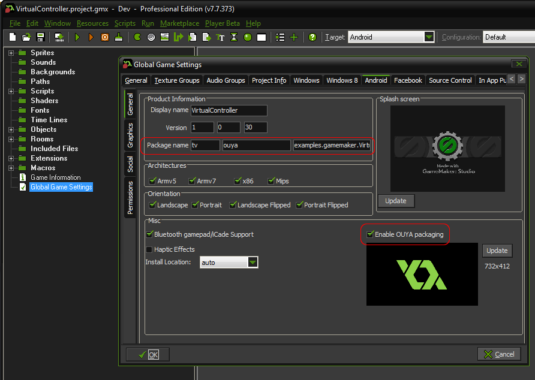
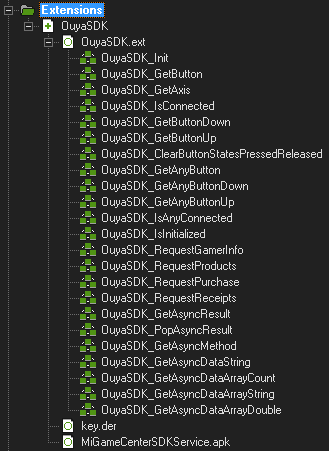
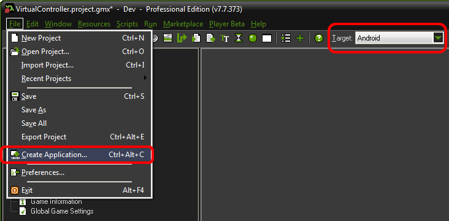
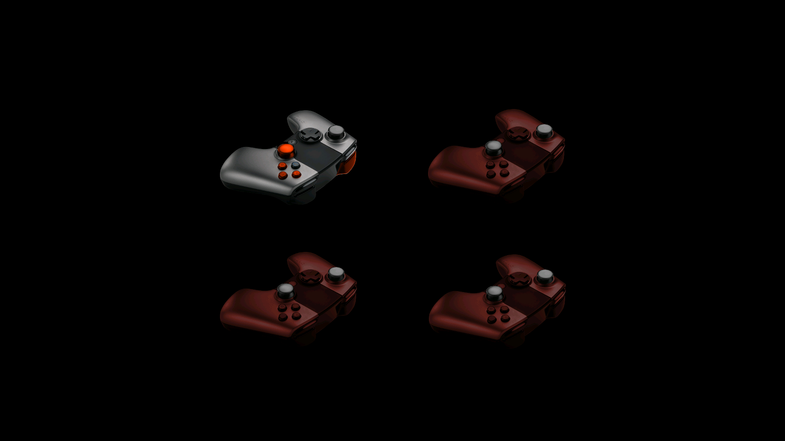
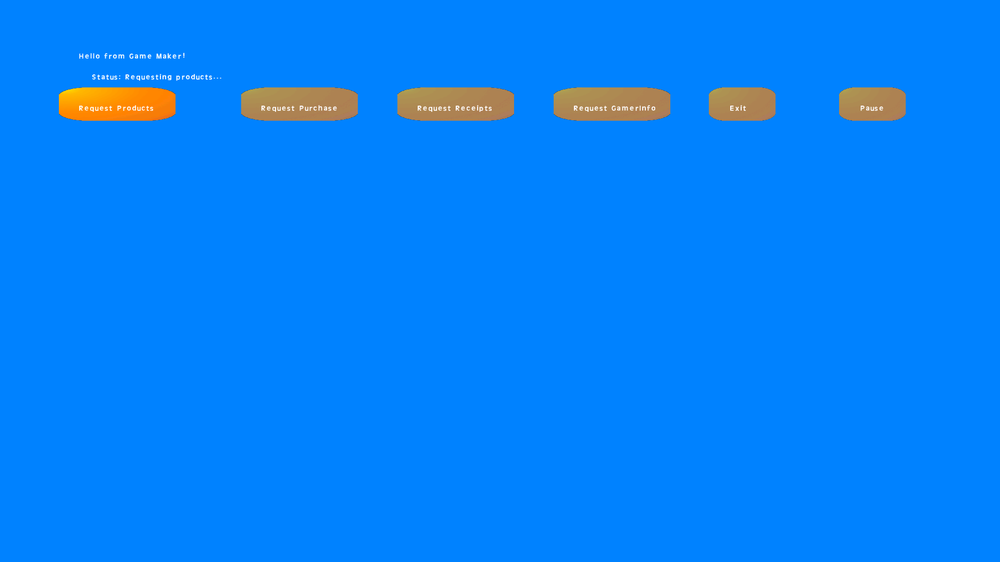
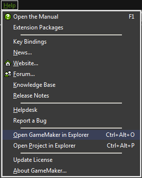

## Game Maker Engine

### Downloads

[Example Source](https://github.com/ouya/ouya-sdk-examples/tree/master/GameMaker)

### Forums

[Forge TV on Razer Forums](https://insider.razerzone.com/index.php?forums/razer-forge-tv.126/)

[Game Maker on OUYA Forums](http://forums.ouya.tv/categories/gamemaker-on-ouya)

### Developer Support Hangouts

2013:

<table border=1>
<tr><td>Razer Hangout July 15th (1:00:00)<br/>
<a href="http://www.youtube.com/watch?feature=player_embedded&v=zWYVYmk6luc" target="_blank">
</a></td> 
<td></td></tr></table>

# Releases #

* [GameMaker-OuyaSDK-Extension](https://github.com/ouya/ouya-sdk-examples/releases/tag/GameMaker-OuyaSDK-Extension) - Enable `OUYA` Everywhere Input and In-App-Purchases in GameMaker Studio.

## Guide

* In your project's `Global Game Settings`, on the `Android` tab enter your `Package name` matching the [developer portal](http://devs.ouya.tv) and check `Enable OUYA packaging`.



* Import the `OuyaSDK Extension` and be sure to download your `signing key` from the [developer portal](http://devs.ouya.tv) and place into the `extensions/OuyaSDK/key.der` project subfolder.



* Select the `Android` target and use the `File` menu and select the `Create Application` menu item to build and deploy to the connected `ADB` device.



## Resources

* Game Maker - http://yoyogames.com/gamemaker/download

* Game Maker Wiki - http://wiki.yoyogames.com/index.php

* Game Maker Studio Setup for Android - http://wiki.yoyogames.com/index.php/GameMaker:Studio_Settings_for_Android

* Create a [Native Extension](http://help.yoyogames.com/entries/30690273) For Android

## Video Tutorials

<b>GameMaker Studio Tutorials</b> - http://www.youtube.com/playlist?list=PLUYhFCYb2qeOBR9AVERSimlZEN-dXCoOW

## OUYA Extension

The `Ouya-GameMaker-Extension` is available in the [`releases section`](game-maker.md#user-content-user-content-releases).
GameMaker extension methods only use `String` and `double` for parameters and return types.

### Signing key

The signing key from the [developer portal](http://devs.ouya.tv) should be placed in the `extensions/OuyaSDK/key.der` project subfolder.

### OUYA Everywhere

The `OuyaSDK extension` uses `OUYA-Everywhere Input` which gets the input remapping for supported and future devices.

### OuyaSDK_IsInitialized

`OuyaSDK_IsInitialized` returns true if the `OuyaSDK` extension has been initialized.

### OuyaSDK_GetAxis

Axis input can be obtained through `OuyaSDK_GetAxis`. 

The `playerNumber` values "0", "1", "2", and "3" are expected for the first `String` parameter.

The `axis` values from below are expected for the second `String` parameter.

```
AXIS_LS_X = "0";
AXIS_LS_Y = "1";
AXIS_RS_X = "11";
AXIS_RS_Y = "14";
AXIS_L2 = "17";
AXIS_R2 = "18";
```

All the axis values for `Controller #1 (0)` can be obtained with the following code.

```
var lsX = OuyaSDK_GetAxis("0", AXIS_LS_X);
var lsY = OuyaSDK_GetAxis("0", AXIS_LS_Y);
var rsX = OuyaSDK_GetAxis("0", AXIS_RS_X);
var rsY = OuyaSDK_GetAxis("0", AXIS_RS_Y);
var l2 = OuyaSDK_GetAxis("0", AXIS_L2);
var r2 = OuyaSDK_GetAxis("0", AXIS_R2);
```

### OuyaSDK_GetButton

Button input can be obtained through `OuyaSDK_GetButton`.

The `playerNumber` values "0", "1", "2", and "3" are expected for the first `String` parameter.

The `button` values from below are expected for the second `String` parameter.

```
BUTTON_O = "96";
BUTTON_U = "99";
BUTTON_Y = "100";
BUTTON_A = "97";
BUTTON_L1 = "102";
BUTTON_R1 = "103";
BUTTON_L3 = "106";
BUTTON_R3 = "107";
BUTTON_DPAD_UP = "19";
BUTTON_DPAD_DOWN = "20";
BUTTON_DPAD_RIGHT = "22";
BUTTON_DPAD_LEFT = "21";
BUTTON_MENU = "82";
```

All the button values for `Controller #1 (0)` can be obtained with the following code.

```
if (OuyaSDK_GetButton("0", BUTTON_O)) {
}

if (OuyaSDK_GetButton("0", BUTTON_U)) {
}

if (OuyaSDK_GetButton("0", BUTTON_Y)) {
}

if (OuyaSDK_GetButton("0", BUTTON_A)) {
}

if (OuyaSDK_GetButton("0", BUTTON_L1)) {
}

if (OuyaSDK_GetButton("0", BUTTON_R1)) {
}

if (OuyaSDK_GetButton("0", BUTTON_L3)) {
}

if (OuyaSDK_GetButton("0", BUTTON_R3)) {
}

if (OuyaSDK_GetButton("0", BUTTON_DPAD_UP)) {
}

if (OuyaSDK_GetButton("0", BUTTON_DPAD_DOWN)) {
}

if (OuyaSDK_GetButton("0", BUTTON_DPAD_RIGHT)) {
}

if (OuyaSDK_GetButton("0", BUTTON_DPAD_LEFT)) {
}
```

### OuyaSDK_GetButtonDown and OuyaSDK_GetButtonUp

Detecting the `Menu` button should use `OuyaSDK_GetButtonDown` or `OuyaSDK_GetButtonUp`.

```
if (OuyaSDK_GetButtonDown("0", BUTTON_MENU)) {
}

if (OuyaSDK_GetButtonUp("0", BUTTON_MENU)) {
}
```

The `playerNumber` values "0", "1", "2", and "3" are expected for the first `String` parameter.

The `button` values from above are expected for the second `String` parameter.

`OuyaSDK_GetButtonDown` returns `true` when the button detected a `pressed` event.

`OuyaSDK_GetButtonUp` returns `true` when the button detected a `released` event.

`OuyaSDK_ClearButtonStatesPressedReleased` should be called at the end of the `Update` event each frame to clear the detected `pressed` and `released` states.

### OuyaSDK_GetAnyButton

`OuyaSDK_GetAnyButton` returns `true` if `any` controller is in the `pressed` state for the button `String` parameter.

```
if (OuyaSDK_GetAnyButton(BUTTON_O)) {
}

if (OuyaSDK_GetAnyButton(BUTTON_U)) {
}

if (OuyaSDK_GetAnyButton(BUTTON_Y)) {
}

if (OuyaSDK_GetAnyButton(BUTTON_A)) {
}

if (OuyaSDK_GetAnyButton(BUTTON_L1)) {
}

if (OuyaSDK_GetAnyButton(BUTTON_R1)) {
}

if (OuyaSDK_GetAnyButton(BUTTON_L3)) {
}

if (OuyaSDK_GetAnyButton(BUTTON_R3)) {
}

if (OuyaSDK_GetAnyButton(BUTTON_DPAD_UP)) {
}

if (OuyaSDK_GetAnyButton(BUTTON_DPAD_DOWN)) {
}

if (OuyaSDK_GetAnyButton(BUTTON_DPAD_RIGHT)) {
}

if (OuyaSDK_GetAnyButton(BUTTON_DPAD_LEFT)) {
}
```

### OuyaSDK_GetAnyButtonDown

`OuyaSDK_GetAnyButtonDown` returns `true` if `any` controller had a `pressed` state event in the last update frame for the button `String` parameter.

### OuyaSDK_GetAnyButtonUp

`OuyaSDK_GetAnyButtonUp` returns `true` if `any` controller had a `released` state event in the last update frame for the button `String` parameter.

### OuyaSDK_IsConnected

`OuyaSDK_IsConnected` returns `true` if the `playerNum` first `String` parameter is connected.

### OuyaSDK_IsAnyConnected

`OuyaSDK_IsAnyConnected` returns `true` if any controller is connected.

### Async calls

`OuyaSDK_GetAsyncMethod` is used to get the async completion result from async methods called in the `OuyaSDK extension`.
Async completion results sit on a stack and `OuyaSDK_GetAsyncMethod` gets the method name from the current completed result.

```
asyncMethod = OuyaSDK_GetAsyncMethod();
if (asyncMethod != undefined &&
    asyncMethod != "") {
    text_message = "Status: Method="+asyncMethod;
}
```

`OuyaSDK_GetAsyncResult` will return a JSON `string` about the `method` and `data` corresponding to the async completion result.

```
asyncResult = OuyaSDK_GetAsyncResult();
if (asyncResult != undefined &&
    asyncResult != "") {
    text_message = "Status: Method="+asyncMethod+" json="+asyncResult;
}
```

When all the details are extracted from the completion result, invoking `OuyaSDK_PopAsyncResult` will move on to the next completion item.

```
OuyaSDK_PopAsyncResult();
```

There are various helper methods for accessing the JSON data for the async completion result.
All async completion results have a `string` method and a `data` object. 

* `OuyaSDK_GetAsyncMethod` - Returns the `string` name of the async completion method

* `OuyaSDK_GetAsyncDataString` - Returns the `string` value for the completion data given the `string` field.

```
if (asyncMethod == "onFailureRequestPurchase") {
    var errorMessage = OuyaSDK_GetAsyncDataString("errorMessage");            
}
```

* `OuyaSDK_GetAsyncDataArrayCount` - Returns the `double` count of items in the `data` structure

```
if (asyncMethod == "onSuccessRequestReceipts") {
    var count = OuyaSDK_GetAsyncDataArrayCount();
    text_message = "Status: RequestReceipts count="+string(count);
}
```

* `OuyaSDK_GetAsyncDataArrayString` - Returns the `string` value of the given `field` for a given array `index` from the `data` structure

```
for (var index = 0; index < count; ++index)
{
    var identifier = OuyaSDK_GetAsyncDataArrayString(string(index), "identifier");
}
```

* `OuyaSDK_GetAsyncDataArrayDouble` - Returns the `double` value of the given `field` for a given array `index` from the `data` structure

```
for (var index = 0; index < count; ++index)
{
	var localPrice = OuyaSDK_GetAsyncDataArrayDouble(string(index), "localPrice");
}
```

### OuyaSDK_RequestGamerInfo

`OuyaSDK_RequestGamerInfo` is an async call that provides access to the `GamerInfo` which has the gamer's `uuid` and `username`.

`OuyaSDK_GetAsyncMethod` will return `onSuccessRequestGamerInfo` or `onFailureRequestGamerInfo` when the request has completed.

### OuyaSDK_RequestProducts

`OuyaSDK_RequestProducts` is an async call that provides access to the `Product` details.
The first parameter is a `string` comma separated list of identifiers.

`OuyaSDK_GetAsyncMethod` will return `onSuccessRequestProducts` or `onFailureRequestProducts` when the request has completed.

### OuyaSDK_RequestPurchase

`OuyaSDK_RequestPurchase` is an async call that requests purchase of a `Product`.
The first parameter is a `string` which is a `Product` identifier.

`OuyaSDK_GetAsyncMethod` will return `onSuccessRequestPurchase`, `onFailureRequestPurchase` or `onCancelRequestPurchase` when the request has completed.

### OuyaSDK_RequestReceipts

`OuyaSDK_RequestReceipts` is an async call that requests all the `entitlement` purchases on the server.

`OuyaSDK_GetAsyncMethod` will return `onSuccessRequestReceipts`, `onFailureRequestReceipts` or `onCancelRequestReceipts` when the request has completed.

## Examples

### Virtual Controller

The [Virtual Controller](https://github.com/ouya/ouya-sdk-examples/tree/master/GameMaker/VirtualController.gmx) example shows 4 images of the `OUYA` Controller which moves axises and highlights buttons when the physical controller is manipulated.



### In-App-Purchases

The [In-App-Purchase](https://github.com/ouya/ouya-sdk-examples/tree/master/GameMaker/InAppPurchases.gmx) example uses the ODK to access gamer info, purchasing, and receipts.



## Xiaomi Libraries

[Back to general info](enable_xiaomi_support.md#user-content-xiaomi-libraries)

Place the Xiaomi libraries in the following destinations:

* (Within your project folder) `extensions\OuyaSDK\MiGameCenterSDKService.apk`

* (Within your project folder) `extensions\OuyaSDK\AndroidSource\libs\SDK_MIBOX_2.0.1.jar`

## Xiaomi Required Permissions

[Back to general info](enable_xiaomi_support.md#user-content-xiaomi-required-permissions)

To edit the `AndroidManifest.xml` you'll need to open the folder using the `Help` menu and select `Open GameMaker in Explorer`. Navigate to `GameMaker-Studio-Dev\Android\runner\AndroidManifest.xml`.



Xiaomi's SDK requires several additional permissions in `AndroidManifest.xml` in order to work.

```java
<uses-permission android:name="com.xiaomi.sdk.permission.PAYMENT"/>
<uses-permission android:name="android.permission.GET_TASKS"/>
<uses-permission android:name="android.permission.READ_PHONE_STATE"/>
```

Make sure that the Android `android:targetSdkVersion` is set to `16`.

```java
<uses-sdk android:minSdkVersion="9" android:targetSdkVersion="16"/>
```

## Xiaomi Initialization

[Back to general info](enable_xiaomi_support.md#user-content-xiaomi-initialization)

`OuyaSDK_Init` supports initialization strings to make the game compatible with `OUYA` Everywhere devices.

* `tv.ouya.developer_id` - The developer UUID can be found in the [developer portal](http://devs.ouya.tv) after logging in.

* `com.xiaomi.app_id` - The Xiaomi App Id is provided by the content team, email `officehours@ouya.tv` to obtain your key.

* `com.xiaomi.app_key` - The Xiaomi App Key is provided by the content team, email `officehours@ouya.tv` to obtain your key.

* `tv.ouya.product_id_list` - The product id list is a comma separated list of product ids that can be purchased in the game.

```gml
purchasables[0] = "long_sword";
purchasables[1] = "sharp_axe";
purchasables[2] = "cool_level";
purchasables[3] = "awesome_sauce";
purchasables[4] = "__DECLINED__THIS_PURCHASE";

strPurchasables = purchasables[0];
for (index = 1; index < array_length_1d(purchasables); ++index)
{
    strPurchasables += ","+purchasables[index];
}

init_ouya_plugin_values = ds_map_create();
ds_map_add(init_ouya_plugin_values, "tv.ouya.developer_id", "00000000-0000-0000-0000-000000000000");
ds_map_add(init_ouya_plugin_values, "com.xiaomi.app_id", "0000000000000");
ds_map_add(init_ouya_plugin_values, "com.xiaomi.app_key", "000000000000000000");
ds_map_add(init_ouya_plugin_values, "tv.ouya.product_id_list", strPurchasables);
OuyaSDK_Init(json_encode(init_ouya_plugin_values));
ds_map_destroy(init_ouya_plugin_values);
```

## Disable Xiaomi Screensaver

[Back to general info](enable_xiaomi_support.md#user-content-disable-xiaomi-screensaver)

By using the `OuyaSDK Extension` the Xiaomi screensaver will be disabled automatically.
