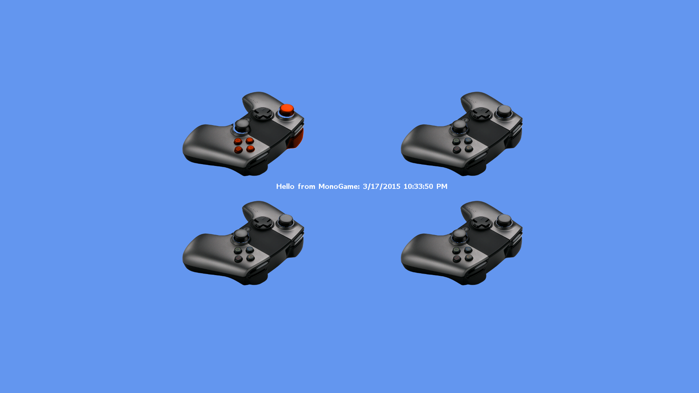
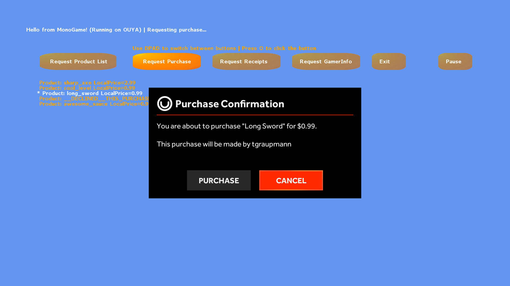
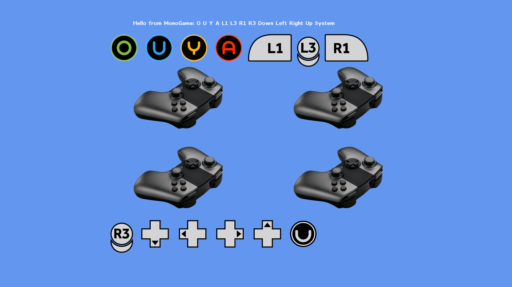
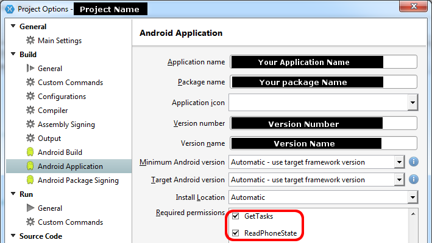

## MonoGame Engine

### Downloads
Open source, clone https://github.com/ouya/ouya-sdk-examples/tree/master/MonoGame

### Forums

@OUYA - (MonoGame on OUYA Forums) - http://forums.ouya.tv/categories/monogame-on-ouya

@MonoGame - (MonoGame Forums) - http://community.monogame.net/category/ouya

@MonoGame - (Archived MonoGame Forums) - http://monogame.codeplex.com/discussions/topics/5559/ouya

@Xamarin - (Xamarin Forums) - http://forums.xamarin.com

### Developer Support Hangouts

2013:

OUYA Hangout July 15th (1:00:00)<br/>
<a href="http://www.youtube.com/watch?feature=player_embedded&v=zWYVYmk6luc" target="_blank">
</a>

## Guide

### Examples

Examples are included at the base GIT path.

<table border=1>

 <tr>

 <td>Virtual Controller Example (41:37)<br/>
<a href="http://www.youtube.com/watch?feature=player_embedded&v=ultZwdGizqM" target="_blank">
</a>
 </td>
 
  <td></td>
 
 </tr> 

</table>

<b><a target=_blank href="https://github.com/ouya/ouya-sdk-examples/tree/master/MonoGame/InAppPurchases">InAppPurchases</a></b> - In-App-Purchase Example

<b><a target=_blank href="https://github.com/ouya/ouya-sdk-examples/tree/master/MonoGame/SetResolutions">SetResolutions</a></b> - Set Resolutions Example

<b><a target=_blank href="https://github.com/ouya/ouya-sdk-examples/tree/master/MonoGame/VirtualController">VirtualController</a></b> - Maps OUYA controllers to multiple virtual controllers

### Signing

The auto update process requires that you use the same keystore in your app and every update.

If you lose your keystore, it requires users to uninstall the game and redownload to get the next update.

If you keep using the same keystore after that, the auto updating will continue as intended.

In MonoGame, unload your project and edit the CSPROJ. Add the following settings to your valid keystore:

```xml
<AndroidKeyStore>True</AndroidKeyStore>   
<AndroidSigningKeyStore>PathToYourKeyStoreFile\key.keystore</AndroidSigningKeyStore>
<AndroidSigningStorePass>my_password_here</AndroidSigningStorePass>
<AndroidSigningKeyAlias>Aranda</AndroidSigningKeyAlias>
<AndroidSigningKeyPass>same_password_here</AndroidSigningKeyPass>
```

It's important that your key signing, your package name, bundle identifiers, developer id, and the account that submits the game all matches.

The above has to true for the in-app-purchases to function, since decryption depends on using the right signing key.

### Build environment setup

MonoGame has an environmental build settings for advanced users to configure.
```
ouya/Resources/environment.txt
```

These settings aren't for everygame, but the following environmental tweaks reduce the amount of garbage collection thrashing.

```
MONO_GC_PARAMS=soft-heap-limit=512m,nursery-size=64m,evacuation-threshold=66,major=marksweep,concurrent-sweep
```


### Resources

MonoGame Download - http://monogame.codeplex.com/<br/>
(old) ODK Bindings for C# - https://github.com/slygamer/ouya-csharp<br/>
Mono for Android - http://xamarin.com/monoforandroid<br/>
Installation Instructions - http://docs.xamarin.com/guides/android/getting_started/installation<br/>
MonoGame GIT for latest tools - https://github.com/mono/MonoGame<br/>
MonoGame OUYA Examples - https://github.com/ouya/ouya-sdk-examples<br/>
MonoGame Content Builder - https://github.com/mono/MonoGame/wiki/MonoGame-Content-Builder<br/>
Docs and Tutorials - http://www.monogame.net/documentation<br/>
Binding JARs - http://docs.xamarin.com/guides/android/advanced_topics/java_integration_overview/binding_a_java_library_(.jar)/<br/>

## Examples

### Virtual Controller

The [Virtual Controller](https://github.com/ouya/ouya-sdk-examples/tree/master/MonoGame/InputView) example shows 4 images of the OUYA Controller which moves axises and highlights buttons when the physical controller is manipulated.



### In-App-Purchases

The [In-App-Purchase](https://github.com/ouya/ouya-sdk-examples/tree/master/MonoGame/InAppPurchases) example uses the ODK to access gamer info, purchasing, and receipts.



## OuyaInput

`OE-Input` remaps controllers as if they are an `OuyaController`.

### ClearButtonStates

After checking input, be sure to invoke `ClearButtonStates` at the end of the draw/update to clear the controller pressed/released states for the next frame.

```
		protected override void Draw(GameTime gameTime)
		{
			// draw things...
			base.Draw (gameTime);

			OuyaInput.ClearButtonStates();
		}
```

### Axises

`MonoGame` uses the same `axis` constants that are used in the `Java` OUYA SDK.

```
OuyaController.AXIS_LS_X
OuyaController.AXIS_LS_Y
OuyaController.AXIS_RS_X
OuyaController.AXIS_RS_Y
OuyaController.AXIS_L2
OuyaController.AXIS_R2
```

### Buttons

`MonoGame` uses the same `button` constants that are used in the `Java` OUYA SDK.

```
OuyaController.BUTTON_O
OuyaController.BUTTON_U
OuyaController.BUTTON_Y
OuyaController.BUTTON_A
OuyaController.BUTTON_L1
OuyaController.BUTTON_L3
OuyaController.BUTTON_R1
OuyaController.BUTTON_R3
OuyaController.BUTTON_DPAD_DOWN
OuyaController.BUTTON_DPAD_LEFT
OuyaController.BUTTON_DPAD_RIGHT
OuyaController.BUTTON_DPAD_UP
OuyaController.BUTTON_MENU
```

### GetAxis

`GetAxis` returns the axis value given the `playerNum` (0, 1, 2, or 3) and an `axis` constant. 

```
float GetAxis(int playerNum, int axis);

float lx = OuyaInput.GetAxis(0, OuyaController.AXIS_LS_X);
float ly = OuyaInput.GetAxis(0, OuyaController.AXIS_LS_Y);
float rx = OuyaInput.GetAxis(0, OuyaController.AXIS_RS_X);
float ry = OuyaInput.GetAxis(0, OuyaController.AXIS_RS_Y);
float l2 = OuyaInput.GetAxis(0, OuyaController.AXIS_L2);
float r2 = OuyaInput.GetAxis(0, OuyaController.AXIS_R2);
```

### GetButton

`GetButton` returns the button state given the `playerNum` (0, 1, 2, or 3) and an `axis` constant.
`GetButton` returns true if the `button` is currently `pressed` or returns false if the `button` is currently `released`.

```
bool GetButton(int playerNum, int button)

if (OuyaInput.GetButton(0, OuyaController.BUTTON_O))
{
}

if (OuyaInput.GetButton(0, OuyaController.BUTTON_U))
{
}

if (OuyaInput.GetButton(0, OuyaController.BUTTON_Y))
{
}

if (OuyaInput.GetButton(0, OuyaController.BUTTON_A))
{
}

if (OuyaInput.GetButton(0, OuyaController.BUTTON_L1))
{
}

if (OuyaInput.GetButton(0, OuyaController.BUTTON_L3))
{
}

if (OuyaInput.GetButton(0, OuyaController.BUTTON_R1))
{
}

if (OuyaInput.GetButton(0, OuyaController.BUTTON_R3))
{
}

if (OuyaInput.GetButton(0, OuyaController.BUTTON_DPAD_DOWN))
{
}

if (OuyaInput.GetButton(0, OuyaController.BUTTON_DPAD_LEFT))
{
}

if (OuyaInput.GetButton(0, OuyaController.BUTTON_DPAD_RIGHT))
{
}

if (OuyaInput.GetButton(0, OuyaController.BUTTON_DPAD_UP))
{
}
```

### GetButtonDown

`GetButtonDown` returns true if the last frame detected a `pressed` event.
`BUTTON_MENU` should be detected using `GetButtonDown`.

```
if (OuyaInput.GetButtonDown(0, OuyaController.BUTTON_MENU))
{
}
```

### GetButtonUp

`GetButtonUp` returns true if the last frame detected a `released` event.
`BUTTON_MENU` should be detected using `GetButtonUp`.

```
if (OuyaInput.GetButtonDown(0, OuyaController.BUTTON_MENU))
{
}
```

## GetButtonData

`ButtonData` gives you button names and button textures for the OuyaController button codes on the `OUYA`, `MOJO`, and `Xiaomi` consoles.

 

```
		public OuyaController.ButtonData GetButtonData(int button)
		{
			return OuyaController.GetButtonData(button);
		}
```

### GetButtonName

`ButtonData` has a `string` name that returns the console specific button name. I.e. on OUYA the `OuyaController.BUTTON_O` name is `O` versus on the `Xiaomi` console as `A`.

```
		public string GetButtonName(int button)
		{
			OuyaController.ButtonData buttonData = OuyaController.GetButtonData(button);
			if (null == buttonData) {
				return string.Empty;
			}
			return buttonData.ButtonName;
		}
```

### GetButtonTexture

`ButtonData` has a `BitmapDrawable` that can be converted to a `Texture2D` to be drawn in a `SpriteBatch`.

```
		public Texture2D GetButtonTexture(int button)
		{
			OuyaController.ButtonData buttonData = OuyaController.GetButtonData(button);
			if (null == buttonData)
			{
				return null;
			}
			BitmapDrawable drawable = (BitmapDrawable)buttonData.ButtonDrawable;
			if (null == drawable)
			{
				return null;
			}
			Bitmap bitmap = drawable.Bitmap;
			if (null == bitmap)
			{
				return null;
			}
			using (MemoryStream ms = new MemoryStream ())
			{
				bitmap.Compress (Bitmap.CompressFormat.Png, 100, ms);
				ms.Position = 0;
				return Texture2D.FromStream (GraphicsDevice, ms);
			}
		}
```

## IAP

The following examples are within the context of a class that extends `Microsoft.Xna.Framework.AndroidGameActivity`.

### OnActivityResult

Your game `Activity` will need to pass `OnActivityResult` events to the `OuyaFacade`.

```
		protected override void OnActivityResult (int requestCode, Result resultCode, Intent data)
		{
			if (null != ouyaFacade) {
				ouyaFacade.ProcessActivityResult (requestCode, (int)resultCode, data);
			}
		}
```

### RequestGamerInfo

By extending `RequestGamerInfoListener`, the `OnSuccess` and `OnFailure` events can be overloaded and will be invoked when the asynchronous `RequestGamerInfo` method completes.  

```
		public class CustomRequestGamerInfoListener : RequestGamerInfoListener
		{
			private const string TAG = "CustomRequestGamerInfoListener";
			public override void OnSuccess(Java.Lang.Object jObject) {
				GamerInfo gamerInfo = jObject.JavaCast<GamerInfo>();
				if (null == gamerInfo) {
					Log.Error (TAG, "GamerInfo is null!");
				} else {
					Log.Info (TAG, "OnSuccess uuid=" + gamerInfo.Uuid + " username=" + gamerInfo.Username);
				}
			}
			public override void OnFailure(int errorCode, String errorMessage, Bundle optionalData) {
				Log.Error (TAG, "OnFailure errorCode=" + errorCode + " errorMessage=" + errorMessage);
			}
		}

		RequestGamerInfoListener requestGamerInfoListener = new CustomRequestGamerInfoListener();

		// first parameter is a reference to the Activity
		ouyaFacade.RequestGamerInfo(this, requestGamerInfoListener);
```

### RequestProducts

By extending `RequestProductsListener`, the `OnSuccess` and `OnFailure` events can be overloaded and will be invoked when the asynchronous `RequestProductList` method completes.

```
		public class CustomRequestProductsListener : RequestProductsListener
		{
			private const string TAG = "CustomRequestProductsListener";
			public override void OnSuccess(Java.Lang.Object jObject) {
				JavaList<Product> products = jObject.JavaCast<JavaList<Product>> ();
				if (null == products) {
					Log.Error (TAG, "Products are null!");
				} else {
					Log.Info (TAG, "OnSuccess Count="+products.Count);
				}
			}
			public override void OnFailure(int errorCode, String errorMessage, Bundle optionalData) {
				Log.Error (TAG, "OnFailure errorCode=" + errorCode + " errorMessage=" + errorMessage);
			}
		}

		RequestProductsListener requestProductsListener = new CustomRequestProductsListener();

		// sample purchasables
		string[] purchasables =
		{
			"long_sword",
			"sharp_axe",
			"cool_level",
			"awesome_sauce",
			"__DECLINED__THIS_PURCHASE",
		};

		List<Purchasable> products = new List<Purchasable>();
		foreach (string identifier in purchasables)
		{
			Purchasable purchasable = new Purchasable(identifier);
			products.Add(purchasable);
		}

		// first parameter is a reference to the Activity
		ouyaFacade.RequestProductList(this, products, requestProductsListener);
```

### RequestPurchase

By extending `RequestPurchaseListener`, the `OnSuccess`, `OnFailure`, and `OnCancel` events can be overloaded and will be invoked when the asynchronous `RequestPurchase` method completes.

```
		public class CustomRequestPurchaseListener : RequestPurchaseListener
		{
			private const string TAG = "CustomRequestPurchaseListener";
			public override void OnSuccess(Java.Lang.Object jObject) {
				PurchaseResult purchaseResult = jObject.JavaCast<PurchaseResult>();
				if (null == purchaseResult) {
					Log.Error (TAG, "PurchaseResult is null!");
				} else {
					Log.Info (TAG, "OnSuccess identiifer"+purchaseResult.ProductIdentifier);
				}
			}
			public override void OnFailure(int errorCode, String errorMessage, Bundle optionalData) {
				Log.Error (TAG, "OnFailure errorCode=" + errorCode + " errorMessage=" + errorMessage);
			}
			public override void OnCancel() {
				Log.Error (TAG, "Purchase was cancelled");
			}
		}

		RequestPurchaseListener requestPurchaseListener = new CustomRequestPurchaseListener();

		Purchasable purchasable = new Purchasable("long_sword"); // the identifier being purchased

		// first parameter is a reference to the Activity
		ouyaFacade.RequestPurchase(this, purchasable, requestPurchaseListener);
```

### RequestReceipts

By extending `RequestReceiptsListener`, the `OnSuccess`, `OnFailure`, and `OnCancel` events can be overloaded and will be invoked when the asynchronous `RequestReceipts` method completes.

```
		public class CustomRequestReceiptsListener : RequestReceiptsListener
		{
			private const string TAG = "CustomRequestReceiptsListener";
			public override void OnSuccess(Java.Lang.Object jObject) {
				JavaCollection<Receipt> receipts = jObject.JavaCast<JavaCollection<Receipt>> ();
				if (null == receipts) {
					Log.Error (TAG, "Receipts are null!";
				} else {
					Log.Info (TAG, "Request Receipts: OnSuccess Count="+receipts.Count);
				}
			}
			public override void OnFailure(int errorCode, String errorMessage, Bundle optionalData) {
				Log.Error (TAG, "OnFailure errorCode=" + errorCode + " errorMessage=" + errorMessage);
			}
			public override void OnCancel() {
				Log.Error (TAG, "Receipt request was cancelled");
			}
		}

		RequestReceiptsListener requestReceiptsListener = new CustomRequestReceiptsListener();

		// first parameter is a reference to the Activity
		ouyaFacade.RequestReceipts(this, requestReceiptsListener);
```

## Playing Music After Exit

A common mistake is to leave sounds and music playing after the application has ended.

If you used the XNA `MediaPlayer` object, be sure to `Stop()` when the user `quits` the application.

```
Microsoft.Xna.Framework.Media.MediaPlayer.Stop();
```

## Xiaomi Required Permissions

[Back to general info](enable_xiaomi_support.md#xiaomi-required-permissions)

Some of the `AndroidManifest.xml` options can be edited in the `Project Options` on your MonoGame project. To add all the permissions, browse to your project `Properties` folder to edit the raw `AndroidManifest.xml`.



## Xiaomi Initialization

[Back to general info](enable_xiaomi_support.md#xiaomi-initialization)

`MonoGame` supports initialization strings similar to `Java` syntax to make the game compatible with OUYA Everywhere devices.

* `tv.ouya.developer_id` - The developer UUID can be found in the [developer portal](http://devs.ouya.tv) after logging in.

* `com.xiaomi.app_id` - The Xiaomi App Id is provided by the content team, email `officehours@ouya.tv` to obtain your key.

* `com.xiaomi.app_key` - The Xiaomi App Key is provided by the content team, email `officehours@ouya.tv` to obtain your key.

* `tv.ouya.product_id_list` - The product id list is a comma separated list of product ids that can be purchased in the game.

```c#
			Bundle developerInfo = new Bundle();

			byte[] applicationKey = null;

			// load the application key from assets
			try {
				AssetManager assetManager = ApplicationContext.Assets;
				AssetFileDescriptor afd = assetManager.OpenFd("key.der");
				int size = 0;
				if (null != afd) {
					size = (int)afd.Length;
					afd.Close();
					using (Stream inputStream = assetManager.Open("key.der", Access.Buffer))
					{
						applicationKey = new byte[size];
						inputStream.Read(applicationKey, 0, size);
						inputStream.Close();
					}
				}
			} catch (Exception e) {
				Log.Error (TAG, string.Format("Failed to read application key exception={0}", e));
			}

			if (null != applicationKey) {
				Log.Debug (TAG, "Read signing key");
				developerInfo.PutByteArray (OuyaFacade.OUYA_DEVELOPER_PUBLIC_KEY, applicationKey);
			} else {
				Log.Error (TAG, "Failed to authorize with signing key");
				Finish ();
				return;
			}

			string[] purchasables =
			{
				"long_sword",
				"sharp_axe",
				"cool_level",
				"awesome_sauce",
				"__DECLINED__THIS_PURCHASE",
			};

			developerInfo.PutString(OuyaFacade.OUYA_DEVELOPER_ID, "00000000-0000-0000-0000-000000000000");
			developerInfo.PutString(OuyaFacade.XIAOMI_APPLICATION_ID, "0000000000000");
			developerInfo.PutString(OuyaFacade.XIAOMI_APPLICATION_KEY, "000000000000000000");
			developerInfo.PutStringArray(OuyaFacade.OUYA_PRODUCT_ID_LIST, purchasables);

			_ouyaFacade = OuyaFacade.Instance;
			_ouyaFacade.Init(this, developerInfo);
```
