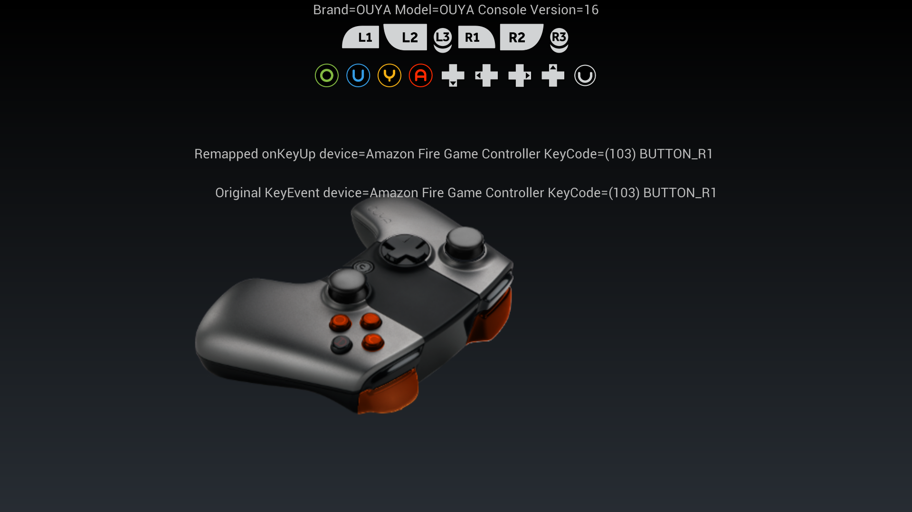
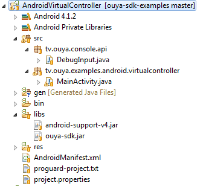

[Back to OUYA-Everywhere overview](../ouya-everywhere.md)


OUYA-Everywhere INPUT Documentation on Android Java

# Audience #

This document is for Android Java developers that want to use the OUYA SDK to access API functions and publish to the OUYA Android Console.

# Overview #

This document covers OUYA-Everywhere input, getting the console button names and console button images.

# Intro #

The Android Java source uses the ouya-sdk.jar directly and with minimal code can directly access input, button names, and button images.

# Source #

The source code for OUYA-Everywhere with Android Java can be found within the [ouya-sdk-examples for Android](https://github.com/ouya/ouya-sdk-examples/tree/master/Android/AndroidVirtualController).

# Virtual Controller Example #

The virtual controller example exercises the new OUYA-Everywhere input. The button names and images are now accessible from the API. And the virtual controller buttons highlight with multiple controllers for supported controllers. TextViews display the incoming keycode values and the remapped keycodes after the OuyaInputMapper has remapped the input.



# Android Virtual Controller Project #

The project has a small number of key files that makes the example work.



## AndroidManifest.xml ##

Specifies the target Android API level of 16 and the starting activity.

## MainActivity.java ##

The starting and only activity in the project responsible for the logic to display text, buttons, and toggle image visibility based on input.

## DebugInput.java ##

A debug class for displaying keycode and axis value input in human-readable format in the logcat.

## ouya-sdk.jar ##

The Java library released through the ODK in the developer portal which provides access to the OUYA SDK.

## activity_main.xml ##

The Android layout that specifies the position and content that displays text and images.

## drawables ##

The drawable resources hold the icons and controller images used in the example.

# Example Code #

## MainActivity ##

The MainActivity extends the OuyaActivity from the ouya-sdk.jar for the easiest way to add OUYA-Everywhere input.

```
public class MainActivity extends OuyaActivity {
```

## setDrawable ##

Accepts the ImageView that will display the button image and the keyCode id for the corresponding button image.

```
	private void setDrawable(ImageView imageView, int keyCode) {
		ButtonData data = OuyaController.getButtonData(keyCode);
		if (null != data) {
			imageView.setImageDrawable(data.buttonDrawable);
		}
	}
``` 

## onStart ##

Initialization displays build information and sets the drawable button images from the new api.

```
	@Override
	protected void onStart() {
		super.onStart();
		txtSystem.setText("Brand=" + android.os.Build.BRAND + " Model=" + android.os.Build.MODEL + " Version=" + android.os.Build.VERSION.SDK_INT);
		
		setDrawable(imgControllerO, OuyaController.BUTTON_O);
		setDrawable(imgControllerU, OuyaController.BUTTON_U);
		setDrawable(imgControllerY, OuyaController.BUTTON_Y);
		setDrawable(imgControllerA, OuyaController.BUTTON_A);
		setDrawable(imgControllerL1, OuyaController.BUTTON_L1);
		setDrawable(imgControllerL2, OuyaController.BUTTON_L2);
		setDrawable(imgControllerL3, OuyaController.BUTTON_L3);
		setDrawable(imgControllerR1, OuyaController.BUTTON_R1);
		setDrawable(imgControllerR2, OuyaController.BUTTON_R2);
		setDrawable(imgControllerR3, OuyaController.BUTTON_R3);
		setDrawable(imgControllerDpadDown, OuyaController.BUTTON_DPAD_DOWN);
		setDrawable(imgControllerDpadLeft, OuyaController.BUTTON_DPAD_LEFT);
		setDrawable(imgControllerDpadRight, OuyaController.BUTTON_DPAD_RIGHT);
		setDrawable(imgControllerDpadUp, OuyaController.BUTTON_DPAD_UP);
		setDrawable(imgControllerMenu, OuyaController.BUTTON_MENU);
	}
```

## onGenericMotionEvent ##

The axis events arrive with onGenericMotionEvent after the OUYA-Everywhere has remapped the input.

```
	@Override
	public boolean onGenericMotionEvent(MotionEvent motionEvent) {
		float lsX = motionEvent.getAxisValue(OuyaController.AXIS_LS_X);
	    float lsY = motionEvent.getAxisValue(OuyaController.AXIS_LS_Y);
	    float rsX = motionEvent.getAxisValue(OuyaController.AXIS_RS_X);
	    float rsY = motionEvent.getAxisValue(OuyaController.AXIS_RS_Y);
	    float l2 = motionEvent.getAxisValue(OuyaController.AXIS_L2);
	    float r2 = motionEvent.getAxisValue(OuyaController.AXIS_R2);
```

## onKeyDown ##

When a button is pressed the corresponding image is highlighted. When the system button is detected, the image is highlighted for an interval.

```
	@Override
	public boolean onKeyDown(int keyCode, KeyEvent keyEvent) {
		switch (keyCode)
		{
		case OuyaController.BUTTON_L1:
			imgLeftBumper.setVisibility(View.VISIBLE);
			return true;
		case OuyaController.BUTTON_L3:
			imgLeftStick.setVisibility(View.INVISIBLE);
			imgLeftThumb.setVisibility(View.VISIBLE);
			return true;
		case OuyaController.BUTTON_R1:
			imgRightBumper.setVisibility(View.VISIBLE);
			return true;
		case OuyaController.BUTTON_R3:
			imgRightStick.setVisibility(View.INVISIBLE);
			imgRightThumb.setVisibility(View.VISIBLE);
			return true;
		case OuyaController.BUTTON_O:
			imgButtonO.setVisibility(View.VISIBLE);
			return true;
		case OuyaController.BUTTON_U:
			imgButtonU.setVisibility(View.VISIBLE);
			return true;
		case OuyaController.BUTTON_Y:
			imgButtonY.setVisibility(View.VISIBLE);
			return true;
		case OuyaController.BUTTON_A:
			imgButtonA.setVisibility(View.VISIBLE);
			return true;
		case OuyaController.BUTTON_DPAD_DOWN:
			imgDpadDown.setVisibility(View.VISIBLE);
			return true;
		case OuyaController.BUTTON_DPAD_LEFT:
			imgDpadLeft.setVisibility(View.VISIBLE);
			return true;
		case OuyaController.BUTTON_DPAD_RIGHT:
			imgDpadRight.setVisibility(View.VISIBLE);
			return true;
		case OuyaController.BUTTON_DPAD_UP:
			imgDpadUp.setVisibility(View.VISIBLE);
			return true;
		case OuyaController.BUTTON_MENU:
			imgButtonMenu.setVisibility(View.VISIBLE);
			mMenuDetected = System.nanoTime() + 1000000000;
			return true;
		}
		return true;
	}
```

## onKeyUp ##

When the button is no longer pressed the ImageView for the highlighted button is hidden.

```
	@Override
	public boolean onKeyUp(int keyCode, KeyEvent keyEvent) {
		switch (keyCode)
		{
		case OuyaController.BUTTON_L1:
			imgLeftBumper.setVisibility(View.INVISIBLE);
			return true;
		case OuyaController.BUTTON_L3:
			imgLeftStick.setVisibility(View.VISIBLE);
			imgLeftThumb.setVisibility(View.INVISIBLE);
			return true;
		case OuyaController.BUTTON_R1:
			imgRightBumper.setVisibility(View.INVISIBLE);
			return true;
		case OuyaController.BUTTON_R3:
			imgRightStick.setVisibility(View.VISIBLE);
			imgRightThumb.setVisibility(View.INVISIBLE);
			return true;
		case OuyaController.BUTTON_O:
			imgButtonO.setVisibility(View.INVISIBLE);
			return true;
		case OuyaController.BUTTON_U:
			imgButtonU.setVisibility(View.INVISIBLE);
			return true;
		case OuyaController.BUTTON_Y:
			imgButtonY.setVisibility(View.INVISIBLE);
			return true;
		case OuyaController.BUTTON_A:
			imgButtonA.setVisibility(View.INVISIBLE);
			return true;
		case OuyaController.BUTTON_DPAD_DOWN:
			imgDpadDown.setVisibility(View.INVISIBLE);
			return true;
		case OuyaController.BUTTON_DPAD_LEFT:
			imgDpadLeft.setVisibility(View.INVISIBLE);
			return true;
		case OuyaController.BUTTON_DPAD_RIGHT:
			imgDpadRight.setVisibility(View.INVISIBLE);
			return true;
		case OuyaController.BUTTON_DPAD_UP:
			imgDpadUp.setVisibility(View.INVISIBLE);
			return true;
		case OuyaController.BUTTON_MENU:
			//wait 1 second
			return true;
		}
		return true;
	}
```