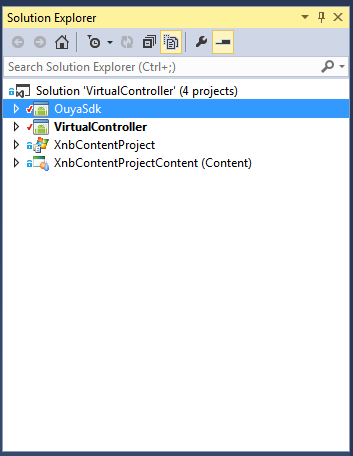
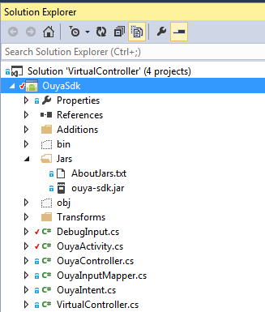
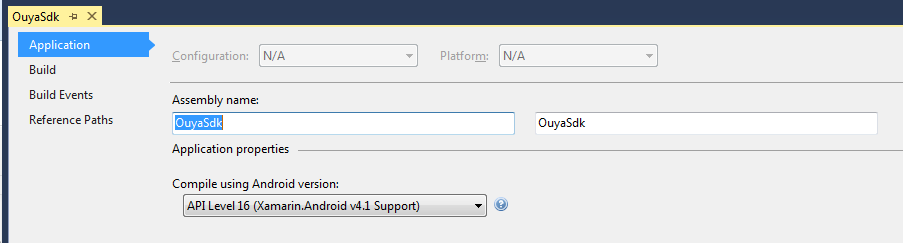
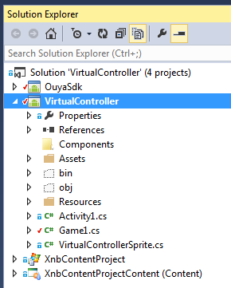
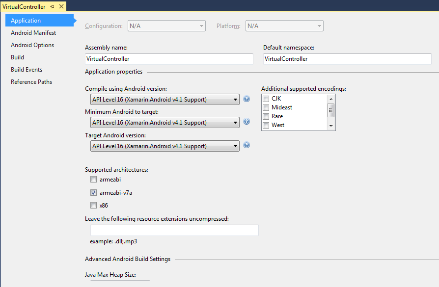
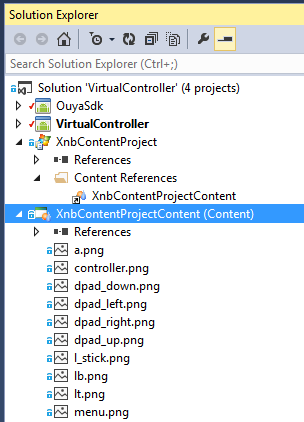

[Back to OUYA-Everywhere overview](https://github.com/ouya/docs/blob/1.0.12/ouya-everywhere.md)


OUYA-Everywhere INPUT Documentation for the MonoGame Game Engine

# Audience #

This document is for MonoGame developers that want to use the OUYA SDK to access API functions and publish to the OUYA Android Console.

# Overview #

This document covers OUYA-Everywhere input, getting the console button names and console button images.

# Intro #

The MonoGame API is very similar to the Java version with the JNI bindings most of the class names and methods are the same.

# Accessing Button Names #

MonoGame has an interface to retrieve button names.

```
OuyaController.ButtonData buttonData;
buttonData = OuyaController.getButtonData(OuyaController.BUTTON_O);
if (null == buttonData)
{
	return;
}
if (null == buttonData.buttonName)
{
	return;
}
string buttonName = buttonData.buttonName;
```

# Accessing Button Images #

MonoGame has an interface to retrieve button images as Texture2D images.

```
Texture2D buttonTexture;
OuyaController.ButtonData buttonData;
buttonData = OuyaController.getButtonData(OuyaController.BUTTON_O);
if (null == buttonData)
{
	return;
}
BitmapDrawable drawable = (BitmapDrawable)buttonData.buttonDrawable;
if (null == drawable)
{
	return;
}
Bitmap bitmap = drawable.Bitmap;
using (MemoryStream ms = new MemoryStream())
{
	bitmap.Compress(Bitmap.CompressFormat.Png, 100, ms);
	ms.Position = 0;
	buttonTexture = Texture2D.FromStream(GraphicsDevice, ms);
}
```

# Activity Setup #

MonoGame is very similar to the Java version. The easy option is to extend OuyaActivity. Or call the static methods on OuyaInputMapper in a custom Activity.

## Extending OuyaActivity ##

The easiest way to add OUYA-Everywhere input is extending the OuyaActivity.

```
using OuyaSdk;

namespace VirtualController
{
    public class Activity1 : OuyaActivity
    {
        protected override void OnCreate(Bundle bundle)
        {
            base.OnCreate(bundle);

            Game1.Activity = this;
            m_game = new Game1();
            SetContentView(m_game.Window);
            m_game.Run();
        }
    }
}


```

## Using Static OuyaInputMapper ##

If you aren't able to extend from OuyaActivity, invoke the static OuyaInputMapper methods.

```
using Android.OS;
using Android.Views;

namespace OuyaSdk
{
    public class CustomActivity : Microsoft.Xna.Framework.AndroidGameActivity
    {
        protected override void OnCreate(Bundle bundle)
        {
            base.OnCreate(bundle);
            OuyaInputMapper.init(this.Handle);
        }

        protected override void OnDestroy()
        {
            OuyaInputMapper.shutdown(this.Handle);
            base.OnDestroy();
        }

        public override bool DispatchGenericMotionEvent(MotionEvent motionEvent)
        {
            if (OuyaInputMapper.shouldHandleInputEvent(motionEvent.Handle))
            {
                return OuyaInputMapper.DispatchGenericMotionEvent(this.Handle, motionEvent);
            }
            else
            {
                return base.DispatchGenericMotionEvent(motionEvent);
            }
        }

        public override bool DispatchKeyEvent(KeyEvent keyEvent)
        {
            if (OuyaInputMapper.shouldHandleInputEvent(keyEvent.Handle))
            {
                return OuyaInputMapper.DispatchKeyEvent(this.Handle, keyEvent);
            }
            else
            {
                if (keyEvent.Action == KeyEventActions.Down)
                {
                    return OnKeyDown(keyEvent.KeyCode, keyEvent);
                }
                else if (keyEvent.Action == KeyEventActions.Up)
                {
                    return OnKeyUp(keyEvent.KeyCode, keyEvent);
                }
                else
                {
                    return base.DispatchKeyEvent(keyEvent);
                }
            }
        }
    }
}
```

# Virtual Controller Example #

The virtual controller example exercises the new OUYA-Everywhere input. The button names and images are now accessible from the API. And the virtual controller buttons highlight for multiple controllers for supported controllers.


# OuyaSDK #

The Virtual Controller example has several projects within the solution.



The OuyaSdk project embeds the ouya-sdk.jar and exposes methods to be called from C#.



The OuyaSdk project specifies API level 16.



The Virtual Controller project defines the activity and game logic.



The Virtual Controller example project specifies API level 16. You should only need to support the ARM-v7 architecture.



The content project and content project's content are created together with the new project template. Content projects are useful in order to convert the PNG images of the controller into the XNB images that MonoGame uses for resources. These XNB files are copied into the Virtual Controller project's assets.

