[Back to OUYA-Everywhere overview](../ouya-everywhere.md)


OUYA-Everywhere INPUT Documentation for the Unity Game Engine

# Audience #

This document is for Unity developers that want to import the OUYA SDK to access API functions and publish to the OUYA Android Console.

# Overview #

This document covers importing the core package, installing dependencies, building, and publishing your game to the OUYA.

# Intro #

The ouya-core.unitypackage contains a static access class for accessing input and the OUYA SDK API for the Unity game engine. The input API makes it possible to build your game and without needing to rebuild will automatically add future support for new controllers and devices while still correctly mapping for your game. The input API also adds new features like being able to consistently know which controller maps to a player number. And if a controller disconnects and reconnects it will maintain the same player number. The input API makes it possible to detect if a controller has been disconnected.

This input API is targeted at the OUYA Android Console and associated devices and is not maintained as a cross-platform input system.

# Source #

The source code for OUYA-Everywhere with Unity can be found within the [ouya-sdk-examples for Unity](https://github.com/ouya/ouya-sdk-examples/tree/master/Unity/OuyaSDK).

# Setup #

Open your game or a new project.


Download the OUYA Core package from from the [ouya-sdk-examples Unity releases](https://github.com/ouya/ouya-sdk-examples/releases/tag/1.0.12.2).

```
Note: Before importing ALWAYS make a backup of your game!
``` 

Import the Core package. From the menu item Assets->Import Package->Custom Package… and browse to the "ouya-core.unitypackage".


## Icons ##

On the first import you'll get the sample icons.
```
Assets/Plugins/Android/res/drawable-xhdpi/ouya_icon.png (732x412).
Assets/Plugins/Android/res/drawable/app_icon.png (96x96).
```

If the icons have already been customized, there's no need to import the icons and replace with the sample icons.

## InputManager.asset ##

The InputManager.asset is no longer needed to work on OUYA and supported devices. Importing this file is optional and will replace existing input mappings. InputManager.asset contains 20 axises and 20 buttons for the 4 supported controllers on Linux, Mac, and Windows.

```
ProjectSettings/InputManager.asset
```


# Dependencies #

The OUYA Plugin has dependencies on the Android SDK, Android NDK, and Java JDK.

Android SDK - [http://developer.android.com/sdk/index.html?hl=sk](http://developer.android.com/sdk/index.html?hl=sk)

Android NDK - [https://developer.android.com/tools/sdk/ndk/index.html](https://developer.android.com/tools/sdk/ndk/index.html)

Java6 (32-bit) - [http://www.oracle.com/technetwork/java/javasebusiness/downloads/java-archive-downloads-javase6-419409.html](http://www.oracle.com/technetwork/java/javasebusiness/downloads/java-archive-downloads-javase6-419409.html)

If you are on Windows if you install the [[Tegra Android Developer Pack]](https://developer.nvidia.com/tegra-resources), it comes with all of the needed dependencies and is the easiest way to set things up. Be sure to register for "NVIDIA GameWorks™ Registered Developer Program" to get access to the Tegra Android Developer Pack downloads.[ [Tegra Registered Developer Program]](https://developer.nvidia.com/registered-developer-programs)

Launch the SDK Manager within the Android SDK folder.

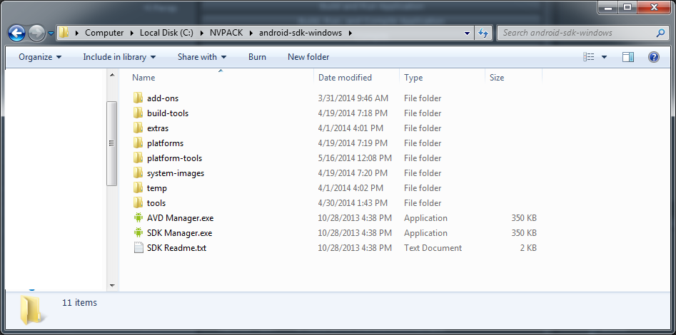

If you upgrade your Android SDK Platform-tools to 19 also be sure to install the Android SDK Build-tools as some tools have moved around.

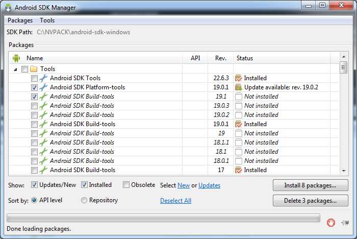

Install the SDK Platform for API 16.

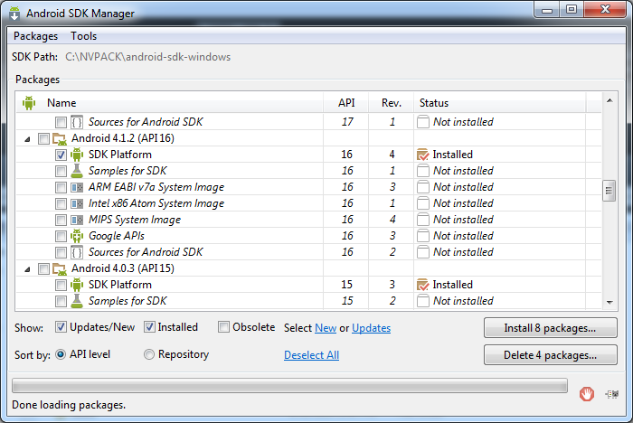

Any updates to the Android SDK will require to re-edit the adb_usb.ini to add 0x2836 so that the OUYA can be recognized over micro-usb cable.

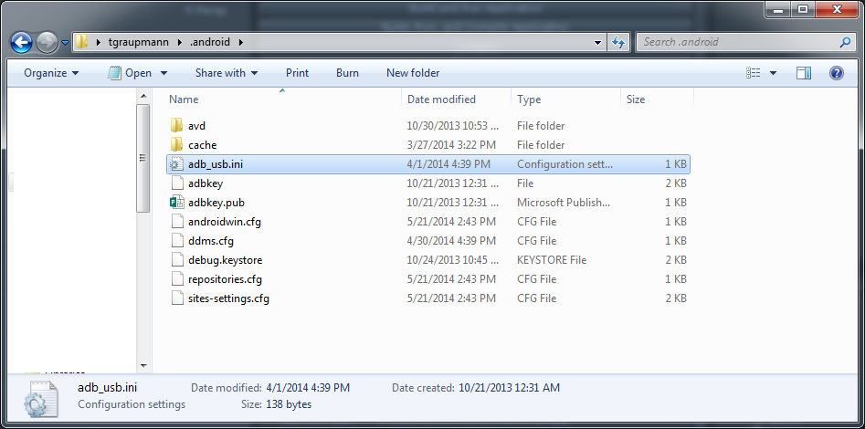

Make sure there’s no white space or empty lines after the last entry in the adb_usb.ini file.

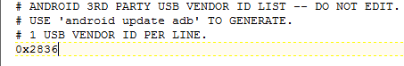

The OUYA Panel via the menu item Window->Open OUYA Panel.


On the Unity tab make sure that the Unity JAR is found and nothing is greyed out. Since you are running the Unity editor to access this panel it’s highly unlikely things would be grayed out unless there was a problem during install. In which case, reinstall your version of Unity.

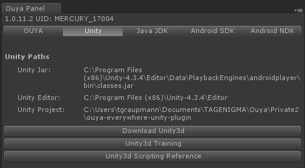

On the Java tab make sure the path to your Java JDK6 1.6 (32-bit) is found. Nothing should be grayed out. You may need to Select the SDK Path and browse to where you’ve installing the JDK. The tools may appear gray if the JDK cannot be found or if you are not pointed at the 32-bit version of JDK 6.

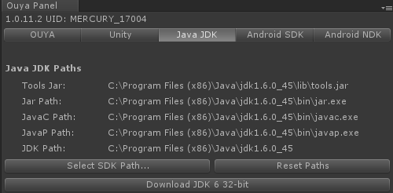

If you don’t have the JDK there’s a button that will take you to download the Oracle website. Sorry you have to create a login to download Java. Make sure it’s Java 6 in the older versions and that it is 32-bit.

On the Android SDK tab, make sure that nothing is grayed out. You can set the Android API-16 level in the player settings. You may need to browse to where you’ve downloaded the Android SDK. You may need to run the Android SDK in order to install the SDK platform-16.

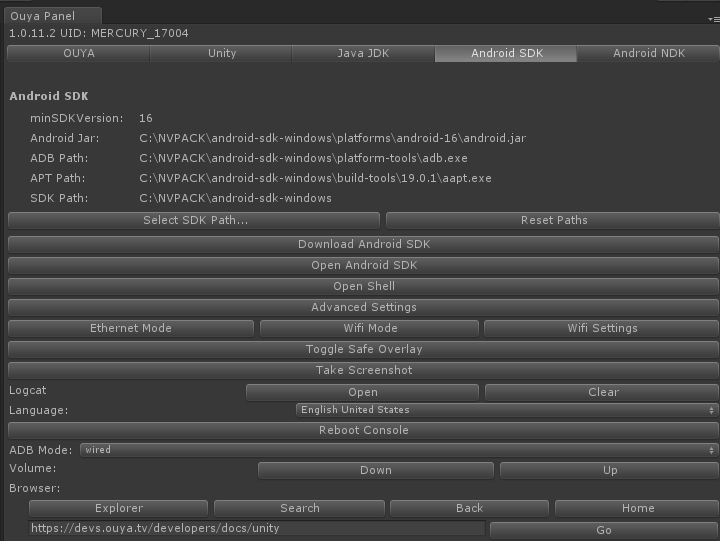

On the Android NDK tab, make sure nothing is grayed out. NDK is required this time to be setup. Click the download link if you don’t have the Android NDK.

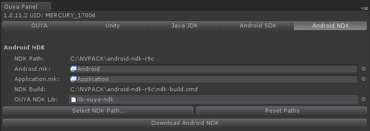

The OUYA menu still has the export options from the previous version. And Core is the only package that you need to get your game up and running.

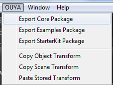

This time when you import core, it’s optional to import the ProjectSettings\InputManager.asset as the new input completely bypasses the Unity Input API. You might want these settings for the non-Android platforms.

FAQ: All the other ProjectSettings that are part of the original project that was opened are just the defaults. There’s no need to copy these to your game project and you probably shouldn’t.

FAQ: Which input system should I use. The legacy input system is still useful for non-OUYA platforms. [https://github.com/ouya/ouya-unity-plugin](https://github.com/ouya/ouya-unity-plugin) Where the new OUYA-Everywhere input system is great for the feature that you don’t need to rebuild your game to support new devices and controllers for the Android platform. The new OUYA-Everywhere input system keeps your game compatible with all officially supported OUYA devices in the future. The new OUYA-Everywhere input system is cleaner too. There’s no longer the need to have a massive C# script with tons of switch blocks and controller mappings. OUYA support handles adding support for new controllers so you don’t have to.

FAQ: Is there more info on non-OUYA platforms? Talking about Mac, Windows, Linux, XBOX, etc, you are free to use whatever input system you want to use. The new OuyaSDK.OuyaInput APIs are great for the Android platform and making everything appear as an OUYA controller. On the non-OUYA side there are projects dedicated to supporting hundreds of controllers on Mac, Windows, Linux and those are worth checking out. I say that because OUYA support is our primary focus and so that’s what this library is targeted at.

Okay back on the OUYA-Everywhere input.

First you want to click the Compile NDK button. If everything is working okay your console output in the editor should look like this.

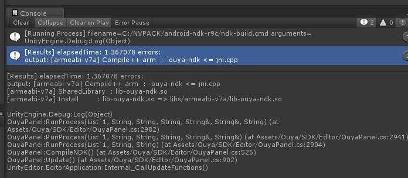

The next key things are in the OUYA Tab, make sure you’ve set a unique bundle identifier. And your main activity should be "MainActivity".

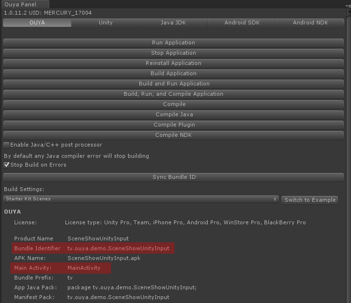

When you change the bundle identifier, you’ll see a popup. Where you just hit the "Sync Bundle Id" to make the android manifest and package name match. Keep in mind this is case sensitive and needs to match the bundle id that you will use in the developer portal when submitting your game. Case matters.

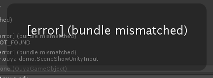

After syncing the bundle id, now the error warning should disappear.

Click the Compile Plugin button and that will compile the Java plugin. If successful you should see the editor console log print signatures for the compiled Java classes.

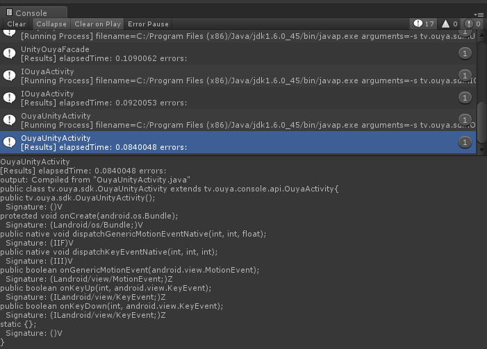

# Legacy #

If you have the legacy OuyaUnityApplication.jar file make sure that it’s removed. If you forget this step, you’ll get an DEX error when building the game.

# OUYA Panel #

Unity Free or Unity Pro

If you have the free version you’ll have to use the menu File->Build Settings or File->Build and Run.

If you have the pro version, you can hit the Build and Run Application button in the OUYA Panel.

FAQ: If you have the Android free version you won’t be able to use pro features like render textures.

The Run Application and Stop Application are convenient for relaunching or exiting your application while it’s running on the OUYA.

# OUYA Everywhere API #

Be sure to be on the Android platform before invoking the OUYA Everywhere API.

```
#if UNITY_ANDROID && !UNITY_EDITOR

	… make OUYA Everywhere API calls ...

#endif
```

# Accessing Button Names #

Unity has an interface to retrieve button names. A null button name means the button was not found.  

```
OuyaController.ButtonData buttonData;
buttonData = OuyaController.getButtonData(OuyaController.BUTTON_O);
if (null == buttonData)
{
	return;
}
if (null == buttonData.buttonName)
{
}
string buttonName = buttonData.buttonName;
```

# Accessing Button Images #

Unity has an interface to retrieve button images as Texture2D images. A null Texture2D image means the button was not found.

```
Texture2D buttonTexture = null;
OuyaController.ButtonData buttonData;
buttonData = OuyaController.getButtonData(OuyaController.BUTTON_O);
if (null == buttonData)
{
	return;
}
if (null == buttonData.buttonDrawable)
{
	return;
}
BitmapDrawable drawable = (BitmapDrawable)buttonData.buttonDrawable;
if (null == drawable)
{
	return;
}
Bitmap bitmap = drawable.getBitmap();
if (null == bitmap)
{
	return;
}
ByteArrayOutputStream stream = new ByteArrayOutputStream();
bitmap.compress(Bitmap.CompressFormat.PNG, 100, stream);
if (stream.size() > 0)
{
	buttonTexture = new Texture2D(0, 0);
	buttonTexture.LoadImage(stream.toByteArray());
}
stream.close();
```

# Accessing Axis Values #

```
// PlayerNm is zero based and must be less than OuyaController.MAX_CONTROLLERS.
// GetAxis, GetAxisRaw expects the following axis values:
OuyaController.AXIS_LS_X
OuyaController.AXIS_LS_Y
OuyaController.AXIS_RS_X
OuyaController.AXIS_RS_Y
OuyaController.AXIS_L2
OuyaController.AXIS_R2

// @result - Returns the value of the axis with smoothing
float OuyaSDK.OuyaInput.GetAxis(int playerNum, int axis);

// @result - Returns the value of the axis without smoothing
float OuyaSDK.OuyaInput.GetAxisRaw(int playerNum, int axis);
```

# Accessing Button States #

```
// GetButton, GetButtonDown, GetButtonUp expect the following button values:
// OuyaController.BUTTON_O
// OuyaController.BUTTON_U
// OuyaController.BUTTON_Y
// OuyaController.BUTTON_A
// OuyaController.BUTTON_L1
// OuyaController.BUTTON_R1
// OuyaController.BUTTON_L3
// OuyaController.BUTTON_R3
// OuyaController.BUTTON_DPAD_UP
// OuyaController.BUTTON_DPAD_DOWN
// OuyaController.BUTTON_DPAD_RIGHT
// OuyaController.BUTTON_DPAD_LEFT

// @result - true when the button is in the DOWN position
// @result - false when the button is in the UP position
bool OuyaSDK.OuyaInput.GetButton(int playerNum, int keyCode);

// @result - true if the button was in the DOWN position in the last frame
bool OuyaSDK.OuyaInput.GetButtonDown(int playerNum, int button);

// @result - true if the button was in the UP position in the last frame
bool OuyaSDK.OuyaInput.GetButtonUp(int playerNum, int button);
```

FAQ: How can I tell if a controller is connected?

The OuyaSDK.Joysticks static string array will have a null entry for the index of the player number if that player’s controller has disconnected.

# Examples #

Download the Examples package from github releases…

Import the Examples package. From the menu item Assets->Import Package->Custom Package… and browse to the "ouya-examples.unitypackage".


# Virtual Controller Example #

The virtual controller example exercises the new OUYA-Everywhere input. The button names and images are now accessible from the API. And the virtual controller buttons highlight for multiple controllers for supported controllers. The right-hand JOY buttons toggle input for specific player numbers.

