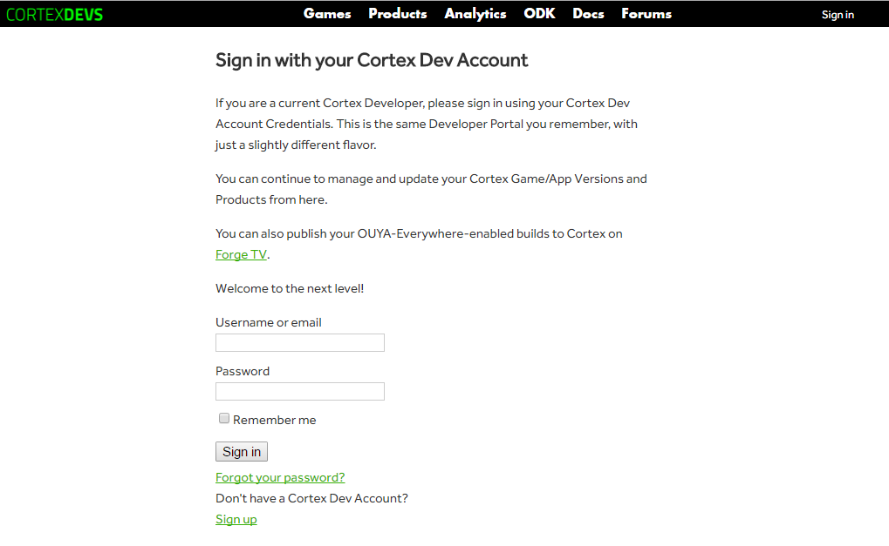
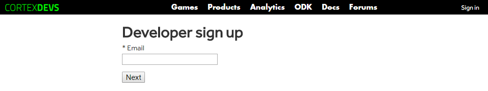
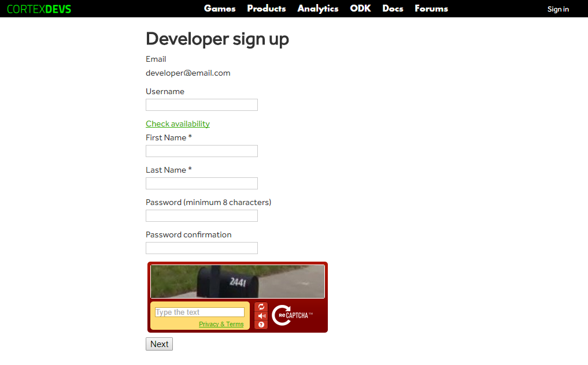
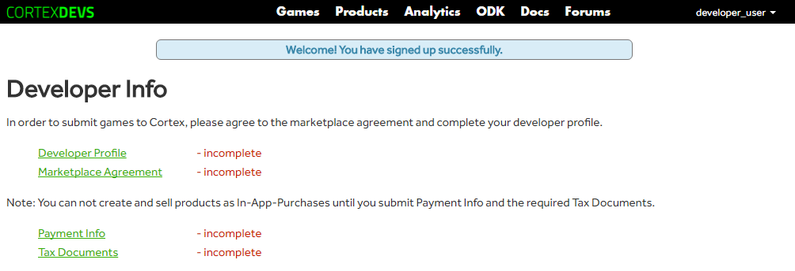
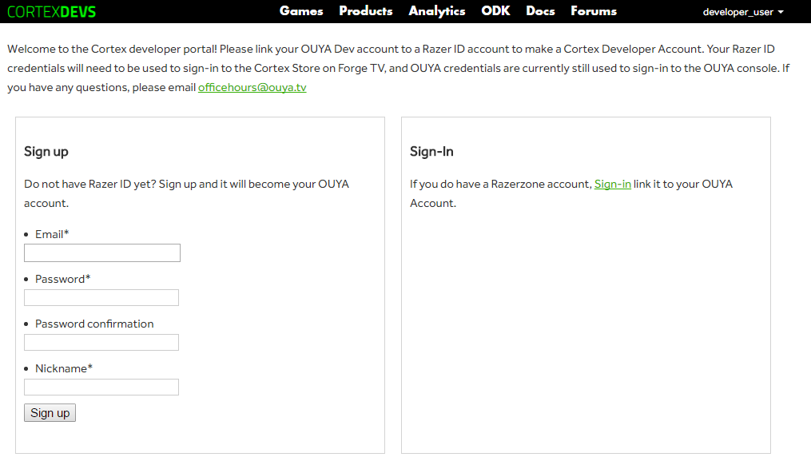
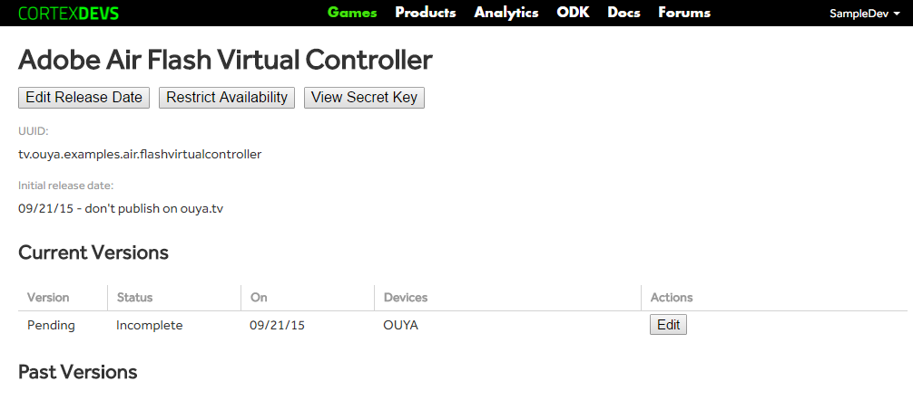
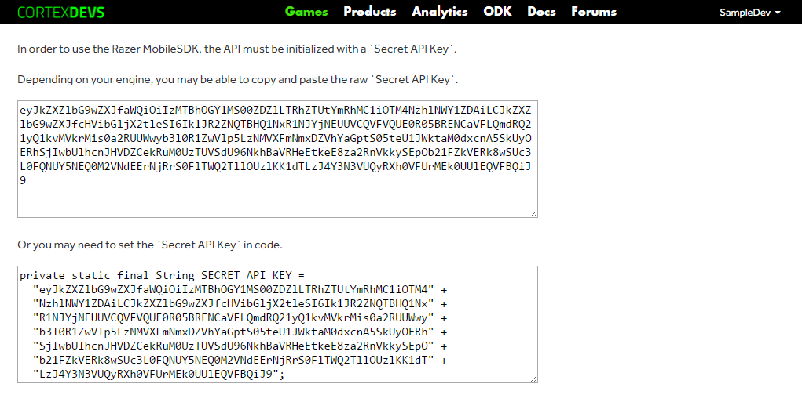

# Razer SDK

The `Razer SDK` provides an `API` to integrate controller input, access gamer info, request product information, check receipts, and trigger in-app-purchases.

## Create an account

In order to access the `RazerSDK`, a developer account must be created via the [developer portal](https://devs.ouya.tv). Click the `Sign up` link on the landing page or log in with an existing account.

## Developer Email

Sign up requires an email account.

## Create Username

Choose your developer username and login credentials.

## Sign In

In order to submit games for review, the developer info must be completed. 

## Razer Account

After signing up or logging in, the developer portal will prompt to link your developer account with a `Razer ID`.

## Add a New Game

The `Games` section will display a list of games associated with the developer account. `Add a New Game` will prompt to create a game entry which requires a `package name` and `game title`. Click the game title to display the game entry details.

## Game Entry

The game entry details displays the `package name` which must match with the game `package name` from the `AndroidManifest.xml`. Each game has a unique `Secret API Key` used to authorize access to the `RazerSDK`. The `View Secret Key` button will display the `Secret API Key`. 

## View Secret Key

The `Secret Key Page` displays the `API Key` in common formats so that it can be copied for the particular game engine.

## Engines

The following engines have support for the `RazerSDK`.

### Adobe Air

`Adobe Air` apps can be built from `Animate CC` or `Flash Develop`. Adobe recently renamed their `Flash` product as `Animate CC` part of the `Adobe Creative Cloud` suite. The `RazerSDK` can be accessed via the `RazerSDK Native Extension`. For details and samples visit [https://github.com/razerofficial/adobe-air-razer-sdk](https://github.com/razerofficial/adobe-air-razer-sdk).

### Java

`Java` is common language supported by most `Android` game engines. The `RazerSDK` can be accessed via an Android Library. For details and samples visit [https://github.com/razerofficial/java-razer-sdk](https://github.com/razerofficial/java-razer-sdk).

### Unity

`Unity` is a popular game engine. The `RazerSDK` can be accessed via the `RazerSDK Unity Plugin`. For details and samples visit [https://github.com/razerofficial/unity-plugin-razer-sdk](https://github.com/razerofficial/unity-plugin-razer-sdk).
