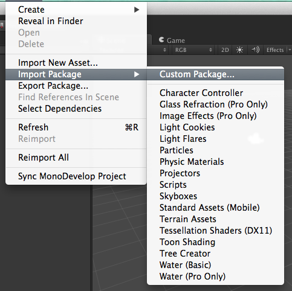
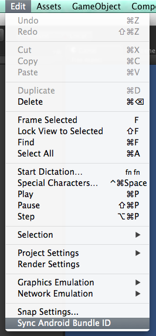

## Getting the Plugin

### [Download the latest OUYA Unity plugin](https://github.com/ouya/ouya-unity-plugin/releases/)

or check out [the source](https://github.com/ouya/ouya-unity-plugin) (Instructions for compiling the plugin can be found in the README)

## About

The OUYA Unity plugin provides an interface into the Input and In-App-Purchase APIs for the OUYA.  
**NOTE:** This plugin is targeted at OUYA Android Console and associated devices, and should only be used when targeting Android ([See: Targeting Android](#targeting-android)).


## Setup

### Dependencies

The OUYA Plugin (and any Unity Android development) depends on the Android SDK. For instructions on setting up your development environment, [see here](../env_setup.md)

### Step 1: Import plugin

Open or create your project and import the plugin package (Assets > Import Package > Custom Package)



Import the ouya-unity-plugin.unitypackage, selecting all files


### Step 2: Add OuyaGameObject

The OuyaGameObject handles communication between Java and C#. Drag a single instance of it to your initial scene, and set your developer ID using the Inspector.

**NOTE:** OuyaGameObject uses DontDestroyOnLoad, so only add the it to your initial scene; it will persist to any following scenes.


### Step 3: Icon

For your app to properly display in Discover and Play, you will need to add an icon, with the dimenions 732x412, named **ouya_icon.png** to your `Assets/Plugins/Android/res/drawable_xhdpi/` folder

### Step 4: Signing key

Another required file is the signing key, which is used in in-app-purchase encryption and decryption. This can be downloaded [from your games list](https://devs.ouya.tv/developers/games) after creating your game in the developer portal.

Place the file here:  
```
Assets/Plugins/Android/assets/key.der
```
### Step 5: Sync Bundle ID / Package Name

`Assets/Plugins/Android/AndroidManifest.xml` overwrites Unity's Player bundle ID, so you will need to make sure to make sure the package name it uses matches your actual bundle ID. The easiest way to do this is from the menu (Edit > Sync Android Bundle ID)



After building an Android player, our plugin will verify this and the other two files are set correctly and notify you if there are any issues.

## Using the API
### Targeting Android

The OUYA API is not cross platform. **ALWAYS** be sure to be on the Android platform before invoking any of the OUYA APIs. The cleanest way to do this is to add pre-processor filtering:

```
#if UNITY_ANDROID && !UNITY_EDITOR

	... make OUYA Everywhere API calls ...

#else

	... make calls to your preferred non-Android input system... (Linux/Mac/Windows/etc) 

#endif
```

### Initialization

Make sure that before invoking other OuyaSDK methods than isIAPInitComplete returns true. This gives time for the Java to initialize before accessing the controller, button names, button images, products, purchase, receipts, and toggling cursor visibility.

```
#if UNITY_ANDROID && !UNITY_EDITOR

void Start()
{
	while (!OuyaSDK.isIAPInitComplete())
	{
		yield return null;
	}
}

#endif
```

## Input

The API supports the following buttons:

```
OuyaController.BUTTON_O
OuyaController.BUTTON_U
OuyaController.BUTTON_Y
OuyaController.BUTTON_A
OuyaController.BUTTON_L1
OuyaController.BUTTON_R1
OuyaController.BUTTON_L3
OuyaController.BUTTON_R3
OuyaController.BUTTON_DPAD_UP
OuyaController.BUTTON_DPAD_DOWN
OuyaController.BUTTON_DPAD_RIGHT
OuyaController.BUTTON_DPAD_LEFT
OuyaController.BUTTON_MENU
```

and the following axes:

```
OuyaController.AXIS_LS_X
OuyaController.AXIS_LS_Y
OuyaController.AXIS_RS_X
OuyaController.AXIS_RS_Y
OuyaController.AXIS_L2
OuyaController.AXIS_R2
```

### Accessing Button Names

OuyaController has a static method to retrieve button names. A null button name means the button was not found.  

```
OuyaController.ButtonData buttonData;
buttonData = OuyaController.getButtonData(OuyaController.BUTTON_O);
if (null == buttonData)
{
	return;
}
if (null == buttonData.buttonName)
{
	return;
}
string buttonName = buttonData.buttonName;
```

### Accessing Button Images

OuyaController has a static method to retrieve button images as Texture2D images. A null Texture2D image means the button was not found.

```
Texture2D buttonTexture = null;
OuyaController.ButtonData buttonData;
buttonData = OuyaController.getButtonData(OuyaController.BUTTON_O);
if (null == buttonData)
{
	return;
}
if (null == buttonData.buttonDrawable)
{
	return;
}
BitmapDrawable drawable = (BitmapDrawable)buttonData.buttonDrawable;
if (null == drawable)
{
	return;
}
Bitmap bitmap = drawable.getBitmap();
if (null == bitmap)
{
	return;
}
ByteArrayOutputStream stream = new ByteArrayOutputStream();
bitmap.compress(Bitmap.CompressFormat.PNG, 100, stream);
if (stream.size() > 0)
{
	buttonTexture = new Texture2D(0, 0);
	buttonTexture.LoadImage(stream.toByteArray());
}
stream.close();
```

### Accessing Axis Values

```
// Returns the value of the axis with smoothing
// float OuyaSDK.OuyaInput.GetAxis(int playerNum, int axis);

OuyaSDK.OuyaInput.GetAxis(playerNum, OuyaController.AXIS_LS_X);


// Returns the value of the axis without smoothing
// float OuyaSDK.OuyaInput.GetAxisRaw(int playerNum, int axis);

OuyaSDK.OuyaInput.GetAxisRaw(playerNum, OuyaController.AXIS_LS_X);
```

### Accessing Button States

```
// Returns true when the button is in the DOWN position
// Returns false when the button is in the UP position
// bool OuyaSDK.OuyaInput.GetButton(int playerNum, int keyCode);

OuyaSDK.OuyaInput.GetButton(playerNum, OuyaController.BUTTON_O);


// Returns true if the button was in the DOWN position in the last frame
// bool OuyaSDK.OuyaInput.GetButtonDown(int playerNum, int button);

OuyaSDK.OuyaInput.GetButtonDown(playerNum, OuyaController.BUTTON_O);


// Returns true if the button was in the UP position in the last frame
// bool OuyaSDK.OuyaInput.GetButtonUp(int playerNum, int button);

OuyaSDK.OuyaInput.GetButtonUp(playerNum, OuyaController.BUTTON_O);
```

#### Handling OuyaController.BUTTON_MENU

**NOTE:** The MENU button events happen instantly. Make sure to check for button states with GetButtonDown and GetButtonUp. Just checking for the GetButton state will never catch the event in time because the down and up event fire within the same frame.

### Check if controller is connected

OuyaInput exposes a static method to check if the controller is connected.

```
// Returns true if the player number is connected
// Returns false if the player number is disconnected
// bool OuyaSDK.OuyaInput.IsControllerConnected(int playerNum);
```

### Hide the mouse cursor

In some cases you may want to hide or show the mouse cursor. The showCursor static method on OuyaController toggles cursor visibility.

```
// Hide the mouse cursor
OuyaController.showCursor(false);

// Show the mouse cursor
OuyaController.showCursor(true);
```

