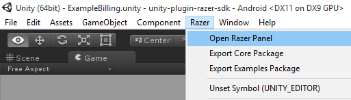
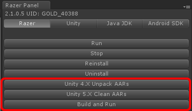
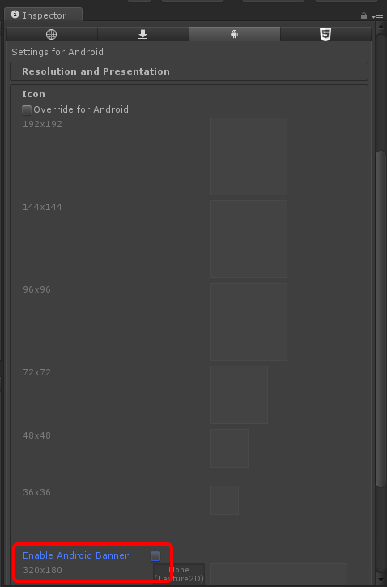
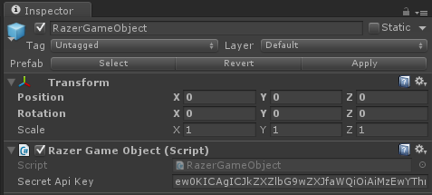
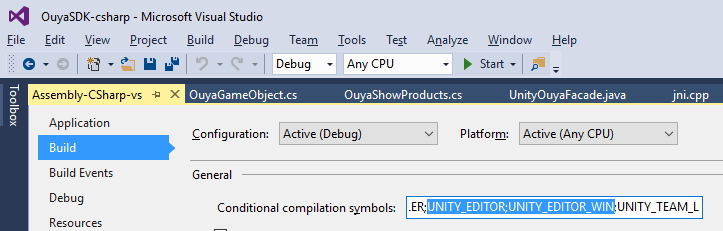
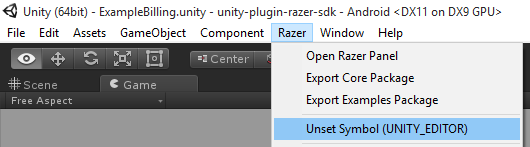

# Unity Game Engine #

# Forums

[Forge TV on Razer Forums](https://insider.razerzone.com/index.php?forums/razer-forge-tv.126/)

# Getting Started #

<table border=1>
 <tr>
 <td>Controller with NGUI (2:08)<br/>
<a href="http://www.youtube.com/watch?feature=player_embedded&v=pN9deVg4nd8" target="_blank">
</a>
 </td>
 <td></td>
 </tr>
</table>

# Releases #

Several Unity packages are available from the [ouya-sdk-examples releases](https://github.com/ouya/ouya-sdk-examples/releases/):

* [Unity-RazerSDK-Core.unitypackage](https://github.com/ouya/ouya-sdk-examples/releases/tag/Unity-RazerSDK-Core) - The Core package adds `OUYA-Everywhere` controller and `In-App-Purchase` support for OUYA, MOJO, and Razer Forge TV consoles

* [Unity-RazerSDK-Examples.unitypackage](https://github.com/ouya/ouya-sdk-examples/releases/tag/Unity-RazerSDK-Examples) - Package includes Billing, Virtual Controller, and Community Content examples 

* (Legacy) [Unity-OuyaSDK-Xiaomi.unitypackage](https://github.com/ouya/ouya-sdk-examples/releases/tag/Unity-OuyaSDK-Xiaomi) - Files and Android.manifest changes for publishing to Xiaomi

```
Note: Before importing packages ALWAYS make a backup of your game first!
``` 

**Note:** Make a backup of your `AndroidManifest.xml` in `Assets/Plugins/Android/AndroidManifest.xml` before importing packages.

**Note:** Make a backup of your `icons` in `Assets/Plugins/Android/res/drawable/app_icon.png`, `Assets/Plugins/Android/res/drawable/icon.png`, and `Assets/Plugins/Android/res/drawable-xhdpi/ouya_icon.png` before importing packages.

# Source #

The source code for the Unity Plugin can be found at [unity-plugin-razer-sdk](https://github.com/razerofficial/unity-plugin-razer-sdk).

# Overview #

This document covers importing the core package, installing dependencies, building, and publishing your game to `Cortex`.

# Intro #

The core package contains a static access class for accessing input and the `Cortex` SDK API for the Unity game engine. The input API makes it possible to build your game and without needing to rebuild will automatically add future support for new controllers and devices while still correctly mapping for your game. The input API also adds new features like being able to consistently know which controller maps to a player number. And if a controller disconnects and reconnects it will maintain the same player number. The input API makes it possible to detect if a controller has been disconnected.

This input API is targeted for `Cortex` and is not maintained as a cross-platform input system.

# Updating #

Download the core package from [Releases](https://github.com/ouya/ouya-sdk-examples/releases). Import the core package to update the plugin. In the import dialog uncheck the `AndroidManifest.xml` and `icons` if you don't want to replace your customizations. The imported plugin will be ready to `Build and Run` as recompiling the `Java` and `Native` plugins are no longer required now that the package includes the prebuilt libraries.

## Unity 4.X/5.X Compatibility ##

Importing the core package creates a `Razer` menu. The `Razer Panel` can be opened from the `Razer/Open Razer Panel` menu item. The `Razer Panel` requires that the `JDK` path needs to be set on the `Java` tab.



** Unity 4.X **

If your game still uses Unity 4.X or below, click the `Unity 4.X Unpack AARs` button on the `Razer` tab which will extract files to make the plugin compatible for lesser Unity versions. After unpacking the files, the `Build and Run` can be used to deploy and execute the game.

** Unity 5.X **

Unity 5.X added support for Android `AAR` packages. Clicking `Unity 5.X Clean AARs` will remove the unpacked files making it possible to build with Unity 5.X. After cleaning the unpacked files, the `Build and Run` can be used to deploy and execute the game.



# Setup #

Open your game or a new project.

Note: Make sure that your project path does not contain spaces in order to be compatible with the NDK compiler.


Import the Core package. From the menu item Assets->Import Package->Custom Package.


## `Unity-RazerSDK-Core.unitypackage` ##

Import the core package.

`Razer\SDK\Editor\RazerMenuAdmin.cs` - Adds Razer menu items for exporting packages for release

`Razer\SDK\Editor\RazerPanel.cs` - Provides example switcher to auto change package name and icons

`Razer\SDK\Prefabs\RazerGameObject.prefab` - Add the prefab to the initial scene for apps/games to enable the `Cortex` Plugin

`Razer\SDK\Scripts\RazerGameObject.cs` - Handles communication with the `Cortex` Plugin between C#, C++, and Java


### Android Customization ###

`Plugins\Android\AndroidManifest.xml` - Defines the package identifier and start activity.

`Plugins\Android\res\raw\drawable-xhdpi\ouya_icon.png` - The 732x412 `Cortex` Store icon

`Plugins\Android\res\raw\drawable\app_icon.png` - The 96x96 settings icon

`Plugins\Android\res\raw\drawable\icon.png` - The 320x180 leanback icon

** Unity 5.X **

`store-sdk-standard-release.aar` - The `Razer` SDK Java library

`UnityPluginStoreSDK.aar` - The `Razer` Unity Plugin Java library

** Unity 4.X **

The following files should be present only for Unity versions 4.X or below. In later versions, these files should be removed.

`store-sdk-standard-release.jar` - (Extracted) `Razer` SDK Java library

`UnityPluginStoreSDK.jar` - (Extracted) `Razer` Unity Plugin Java library

`Plugins\Android\libs\armeabi-v7a\lib-ndk-unity-store-sdk.so` - (Extracted) native library for the `Cortex`

### Plugin Scripts ###

Files within `Plugins` make scripts available to `C#` and `JavaScript` developers.

`Plugins\RazerSDK\Controller.cs` - JNI hooks for interacting with `Cortex` Controllers

`Plugins\RazerSDK\JSONArray.cs` - JNI hooks for using Android JSON Array parsing

`Plugins\RazerSDK\JSONObject.cs` - JNI hooks for using Android JSON Object parsing

`Plugins\RazerSDK\RazerSDK.cs` - The `Cortex` Plugin SDK methods for input and in-app-purchases

## Icons ##

On the first import you'll get the sample icons.
```
Assets/Plugins/Android/res/drawable-xhdpi/ouya_icon.png (732x412).
Assets/Plugins/Android/res/drawable/app_icon.png (96x96).
Assets/Plugins/Android/res/drawable/icon.png (320x180).
```

If the icons have already been customized, there's no need to import the icons and replace with the sample icons.

Be sure to edit the player settings for `Android` to disable the `Android Banner` checkbox which will default back to the provided leanback icon.



## Secret API Key ##

The `Secret API Key` can be copied from the [developer portal](https://devs.ouya.tv). Each game has it's own `Secret API Key` that should be set on the `RazerGameObject`.



## Orientation ##

On `Android TV` within the Player Settings, Android Tab, set the default orientation to Landscape Left.


## RazerGameObject.cs ##

Add the RazerGameObject to your initial loading scene. It uses DontDestroyOnLoad so you only want one instance of the RazerGameObject. The script handles communication between Java to C#. Select the `RazerGameObject` in the `SceneView` and in the inspector, add your `Secret API Key` that corresponds with the game entry from the [developer portal](http://devs.ouya.tv).


## Disable Forge Screensaver

[Back to Forge general info](forge_tv.md#user-content-disable-screensaver)

Updating to the latest Core plugin in [releases](#user-content-releases) will disable the `Forge` screensaver while the Unity app/game is running. 

## Xiaomi Libraries

[Back to Xiaomi general info](enable_xiaomi_support.md#user-content-xiaomi-libraries)

Place the `Xiaomi` libraries in the following destinations:

* `Assets/Plugins/Android/assets/MiGameCenterSDKService.apk`

* `Assets/Plugins/Android/libs/SDK_MIBOX_2.0.1.jar`

The [releases section](#user-content-releases) has a link to the `Unity-OuyaSDK-Xiaomi.unitypackage` which contains the files at the intended locations.

## Xiaomi Required Permissions

[Back to Xiaomi general info](enable_xiaomi_support.md#user-content-xiaomi-required-permissions)

Xiaomi's SDK requires several additional permissions in `AndroidManifest.xml` in order to work.
```java
	<uses-permission android:name="com.xiaomi.sdk.permission.PAYMENT"/>
    <uses-permission android:name="android.permission.GET_TASKS"/>
    <uses-permission android:name="android.permission.READ_PHONE_STATE"/>
```

The [releases section](#user-content-releases) has a link to the `Unity-OuyaSDK-Xiaomi.unitypackage` which contains the `AndroidManifest.xml` with the added permissions at the intended location.

* `Assets/Plugins/Android/AndroidManifest.xml`

## Xiaomi Initialization

[Back to Xiaomi general info](enable_xiaomi_support.md#user-content-xiaomi-initialization)

* `MiGameCenterSDKService.apk` should be placed in `Assets\Plugins\Android\assets`

* `ouya-sdk.jar` should be placed in `Assets\Plugins\Android\libs`

* `SDK_MIBOX_2.0.1.jar` should be placed in `Assets\Plugins\Android\libs`

* See the [Releases Section](#user-content-releases) to get the package for publishing to Xiaomi

## Disable Xiaomi Screensaver

[Back to Xiaomi general info](enable_xiaomi_support.md#user-content-disable-xiaomi-screensaver)

Updating to the latest Core plugin in [releases](#user-content-releases) will disable the `Xiaomi` screensaver while the unity app/game is running. 

## Create a Xiaomi-specific icon

[Back to Xiaomi general info](enable_xiaomi_support.md#user-content-create-a-xiaomi-specific-icon)

The `ouya_xiaomi_icon.png` 284x160 icon should be placed in `Assets/plugins/Android/res/drawable-xhdpi/ouya_xiaomi_icon.png`.

## Localization Resources

[Back to Xiaomi general info](enable_xiaomi_support.md#user-content-localization-resources)

Use [Android localization](http://developer.android.com/guide/topics/resources/localization.html) to include string resources for the languages supported by your game.

* `Assets/Plugins/Android/res/values/strings.xml` (Default)

* `Assets/Plugins/Android/res/values-de/strings.xml` (Dutch)

* `Assets/Plugins/Android/res/values-en/strings.xml` (English)

* `Assets/Plugins/Android/res/values-es/strings.xml` (Spanish) 

* `Assets/Plugins/Android/res/values-fr/strings.xml` (French)

* `Assets/Plugins/Android/res/values-it/strings.xml` (Italian)

* `Assets/Plugins/Android/res/values-zh-rCN/strings.xml` (Simplified Chinese)

Resource files contain `key/value` pairs for looking up localized strings given the `key` value.
Using the `RazerSDK` API, invoke `RazerSDK.getStringResource("app_name")` to return the localized string for the key `app_name` which in this example would return `安卓 出口` when the language is detected as `Simplified Chinese`, i.e. on the `Xiaomi` box.

```
<?xml version="1.0" encoding="utf-8"?>
<resources>
  <string name="app_name">安卓 出口</string>
  <string name="exit">出口</string>
</resources>
```

## Fonts

[Back to Xiaomi general info](enable_xiaomi_support.md#user-content-fonts)

Unity has a variety of GUI plugins which each handle fonts differently.

* For the [2D Toolkit](http://www.2dtoolkit.com) plugin, `TTF` fonts need to be converted to `Bitmap` fonts and then [import to a sprite collection](http://www.unikronsoftware.com/2dtoolkit/docs/latest/tutorial/importing_a_font_into_a_sprite_collection.html).

## Xiaomi Other Player Settings ##

In the Android `Player Settings` and within the `Other Settings` subgroup, here you can enter your package identifier from the [developer portal](http://devs.ouya.tv) into the `bundle id` field. Make sure the `minimum API level` field to 16.


# Dependencies #

The `Cortex` Plugin has dependencies on the Android SDK for packaging and deploying Android applications.

The `Cortex` Plugin includes prebuilt Java and Native plugins, recompiling the Java and Native plugin is no longer required.

Android SDK - [http://developer.android.com/sdk/index.html?hl=sk](http://developer.android.com/sdk/index.html?hl=sk)

# Cortex SDK API #

Be sure to be on the `Android` platform before invoking the `Cortex` SDK API.

```
#if UNITY_ANDROID && !UNITY_EDITOR

	... make OUYA Everywhere API calls ...

#else

	... make calls to your preferred non-Android input system... (Linux/Mac/Windows/etc) 

#endif
```

## Intellisense ##

To enable intellisense for `UNITY_ANDROID` and not `UNITY_EDITOR`, be sure to edit the project settings and remove the `UNITY_EDITOR` from the debug symbols.

If Unity regenerates the solution/project, the debug symbols will added back which will need to be removed to get intellisense again.



You can also use the `Razer/Unset Symbol (UNITY_EDITOR)` menu to automate this process. 



## Initialization ##

Initialization is handled by the `RazerGameObject` being placed in your initial scene.

Make sure that before invoking other RazerSDK methods than isIAPInitComplete returns true. This gives time for the Java to initialize before accessing the controller, button names, button images, products, purchase, receipts, and toggling cursor visibility.

```
// returns true when the Java in-app-purchase system has initialized.
// return false when in-app-purchase calls should not be invoked 
// bool RazerSDK.isIAPInitComplete();

#if UNITY_ANDROID && !UNITY_EDITOR

IEnumerator Start()
{
	while (!RazerSDK.isIAPInitComplete())
	{
		yield return null;
	}
	
	if (RazerSDK.isRunningOnSupportedHardware())
	{
		Debug.Log("Running on supported hardware!");
	}
	else
	{
		Debug.Log("Not running on supported hardware!");
	}
}

#endif
```

## Shutdown

The Shutdown event fires when the game can safely exit cleanly. Using the `shutdown` event is required and will be checked during review.

Extend the `IShutdownListener` interface to receive the callback for a shutdown event.

C#
```
public class MyScript : MonoBehaviour,
    RazerSDK.IShutdownListener
{
}
```

JavaScript
```
public class MyScript extends MonoBehaviour implements
	RazerSDK.IShutdownListener
{
}
```

Register the instance to receive the interface callback events.

C#
```
    void Awake()
    {
        RazerSDK.registerShutdownListener(this);
    }
    void OnDestroy()
    {
        RazerSDK.unregisterShutdownListener(this);
    }
```

JavaScript
```
    function Awake()
    {
        RazerSDK.registerShutdownListener(this);
    }

    function OnDestroy()
    {
        RazerSDK.unregisterShutdownListener(this);
    }
```

The shutdown event will fire after `RazerSDK.shutdown()` has been invoked.

C#
```
	public void OnSuccessShutdown()
	{
		Debug.Log("Shutdown Success!");
		Application.Quit();
	}

	public void OnFailureShutdown()
	{
		Debug.LogError("Failed to shutdown!");
	}
```

JavaScript
```
    public function OnSuccessShutdown()
    {
		Debug.Log("Shutdown Success!");
		Application.Quit();
    }
	
	public function OnFailureShutdown()
	{
		Debug.LogError("Failed to shutdown!");
	}
```

# Accessing Controller #

The namespace has to be added to find the Controller.

C#
```
#if UNITY_ANDROID && !UNITY_EDITOR
using com.razerzone.store.sdk;
using com.razerzone.store.sdk.engine.unity;
#endif
```

## Button Data ##

Before accessing ButtonData, make sure that `RazerSDK.isIAPInitComplete()` returns true.

## Accessing ButtonData / Button Names ##

Controller has a static method to retrieve button names. A null button name means the button was not found.  

C#
```
#if UNITY_ANDROID && !UNITY_EDITOR

Controller.ButtonData buttonData;
buttonData = Controller.getButtonData(Controller.BUTTON_O);
if (null == buttonData)
{
	return;
}
if (null == buttonData.buttonName)
{
	return;
}
string buttonName = buttonData.buttonName;

#endif
```

## Accessing ButtonData / Button Images ##

`Controller` has a static method to retrieve button images as Texture2D images. A null Texture2D image means the button was not found.

C#
```
#if UNITY_ANDROID && !UNITY_EDITOR

Texture2D buttonTexture = null;
Controller.ButtonData buttonData;
buttonData = Controller.getButtonData(Controller.BUTTON_O);
if (null == buttonData)
{
	return;
}
if (null == buttonData.buttonDrawable)
{
	return;
}
BitmapDrawable drawable = (BitmapDrawable)buttonData.buttonDrawable;
if (null == drawable)
{
	return;
}
Bitmap bitmap = drawable.getBitmap();
if (null == bitmap)
{
	return;
}
ByteArrayOutputStream stream = new ByteArrayOutputStream();
bitmap.compress(Bitmap.CompressFormat.PNG, 100, stream);
if (stream.size() > 0)
{
	buttonTexture = new Texture2D(0, 0);
	buttonTexture.LoadImage(stream.toByteArray());
}
stream.close();

#endif
```

# Accessing Axis Values #

C#
```
// PlayerNm is zero based and must be less than Controller.MAX_CONTROLLERS.
// GetAxis, GetAxisRaw expects the following axis values:
Controller.AXIS_LS_X
Controller.AXIS_LS_Y
Controller.AXIS_RS_X
Controller.AXIS_RS_Y
Controller.AXIS_L2
Controller.AXIS_R2

int playerNum = 0; //zero based

// @result - Returns the value of the axis with smoothing
float RazerSDK.ControllerInput.GetAxis(int playerNum, int axis);

#if UNITY_ANDROID && !UNITY_EDITOR

RazerSDK.ControllerInput.GetAxis(playerNum, Controller.AXIS_LS_X)
RazerSDK.ControllerInput.GetAxis(playerNum, Controller.AXIS_LS_Y)
RazerSDK.ControllerInput.GetAxis(playerNum, Controller.AXIS_RS_X)
RazerSDK.ControllerInput.GetAxis(playerNum, Controller.AXIS_RS_Y)
RazerSDK.ControllerInput.GetAxis(playerNum, Controller.AXIS_L2)
RazerSDK.ControllerInput.GetAxis(playerNum, Controller.AXIS_R2)

#endif

// @result - Returns the value of the axis without smoothing
float RazerSDK.ControllerInput.GetAxisRaw(int playerNum, int axis);

#if UNITY_ANDROID && !UNITY_EDITOR

RazerSDK.ControllerInput.GetAxisRaw(playerNum, Controller.AXIS_LS_X)
RazerSDK.ControllerInput.GetAxisRaw(playerNum, Controller.AXIS_LS_Y)
RazerSDK.ControllerInput.GetAxisRaw(playerNum, Controller.AXIS_RS_X)
RazerSDK.ControllerInput.GetAxisRaw(playerNum, Controller.AXIS_RS_Y)
RazerSDK.ControllerInput.GetAxisRaw(playerNum, Controller.AXIS_L2)
RazerSDK.ControllerInput.GetAxisRaw(playerNum, Controller.AXIS_R2)

#endif
```

# Accessing Button States #

C#
```
// GetButton, GetButtonDown, GetButtonUp expect the following button values:
Controller.BUTTON_O
Controller.BUTTON_U
Controller.BUTTON_Y
Controller.BUTTON_A
Controller.BUTTON_L1
Controller.BUTTON_R1
Controller.BUTTON_L3
Controller.BUTTON_R3
Controller.BUTTON_DPAD_UP
Controller.BUTTON_DPAD_DOWN
Controller.BUTTON_DPAD_RIGHT
Controller.BUTTON_DPAD_LEFT
Controller.BUTTON_MENU

// @result - true when the button is in the DOWN position
// @result - false when the button is in the UP position
bool RazerSDK.ControllerInput.GetButton(int playerNum, int keyCode);

#if UNITY_ANDROID && !UNITY_EDITOR

RazerSDK.ControllerInput.GetButton(playerNum, Controller.BUTTON_O)
RazerSDK.ControllerInput.GetButton(playerNum, Controller.BUTTON_U)
RazerSDK.ControllerInput.GetButton(playerNum, Controller.BUTTON_Y)
RazerSDK.ControllerInput.GetButton(playerNum, Controller.BUTTON_A)
RazerSDK.ControllerInput.GetButton(playerNum, Controller.BUTTON_L1)
RazerSDK.ControllerInput.GetButton(playerNum, Controller.BUTTON_R1)
RazerSDK.ControllerInput.GetButton(playerNum, Controller.BUTTON_L3)
RazerSDK.ControllerInput.GetButton(playerNum, Controller.BUTTON_R3)
RazerSDK.ControllerInput.GetButton(playerNum, Controller.BUTTON_DPAD_UP)
RazerSDK.ControllerInput.GetButton(playerNum, Controller.BUTTON_DPAD_DOWN)
RazerSDK.ControllerInput.GetButton(playerNum, Controller.BUTTON_DPAD_RIGHT)
RazerSDK.ControllerInput.GetButton(playerNum, Controller.BUTTON_DPAD_LEFT)

#endif

// @result - true if the button was in the DOWN position in the last frame
bool RazerSDK.ControllerInput.GetButtonDown(int playerNum, int button);

#if UNITY_ANDROID && !UNITY_EDITOR

RazerSDK.ControllerInput.GetButtonDown(playerNum, Controller.BUTTON_O)
RazerSDK.ControllerInput.GetButtonDown(playerNum, Controller.BUTTON_U)
RazerSDK.ControllerInput.GetButtonDown(playerNum, Controller.BUTTON_Y)
RazerSDK.ControllerInput.GetButtonDown(playerNum, Controller.BUTTON_A)
RazerSDK.ControllerInput.GetButtonDown(playerNum, Controller.BUTTON_L1)
RazerSDK.ControllerInput.GetButtonDown(playerNum, Controller.BUTTON_R1)
RazerSDK.ControllerInput.GetButtonDown(playerNum, Controller.BUTTON_L3)
RazerSDK.ControllerInput.GetButtonDown(playerNum, Controller.BUTTON_R3)
RazerSDK.ControllerInput.GetButtonDown(playerNum, Controller.BUTTON_DPAD_UP)
RazerSDK.ControllerInput.GetButtonDown(playerNum, Controller.BUTTON_DPAD_DOWN)
RazerSDK.ControllerInput.GetButtonDown(playerNum, Controller.BUTTON_DPAD_RIGHT)
RazerSDK.ControllerInput.GetButtonDown(playerNum, Controller.BUTTON_DPAD_LEFT)
RazerSDK.ControllerInput.GetButtonDown(playerNum, Controller.BUTTON_MENU)

#endif

// @result - true if the button was in the UP position in the last frame
bool RazerSDK.ControllerInput.GetButtonUp(int playerNum, int button);

#if UNITY_ANDROID && !UNITY_EDITOR

RazerSDK.ControllerInput.GetButtonUp(playerNum, Controller.BUTTON_O)
RazerSDK.ControllerInput.GetButtonUp(playerNum, Controller.BUTTON_U)
RazerSDK.ControllerInput.GetButtonUp(playerNum, Controller.BUTTON_Y)
RazerSDK.ControllerInput.GetButtonUp(playerNum, Controller.BUTTON_A)
RazerSDK.ControllerInput.GetButtonUp(playerNum, Controller.BUTTON_L1)
RazerSDK.ControllerInput.GetButtonUp(playerNum, Controller.BUTTON_R1)
RazerSDK.ControllerInput.GetButtonUp(playerNum, Controller.BUTTON_L3)
RazerSDK.ControllerInput.GetButtonUp(playerNum, Controller.BUTTON_R3)
RazerSDK.ControllerInput.GetButtonUp(playerNum, Controller.BUTTON_DPAD_UP)
RazerSDK.ControllerInput.GetButtonUp(playerNum, Controller.BUTTON_DPAD_DOWN)
RazerSDK.ControllerInput.GetButtonUp(playerNum, Controller.BUTTON_DPAD_RIGHT)
RazerSDK.ControllerInput.GetButtonUp(playerNum, Controller.BUTTON_DPAD_LEFT)
RazerSDK.ControllerInput.GetButtonUp(playerNum, Controller.BUTTON_MENU)

#endif
```

## Controller.BUTTON_MENU ##

Note: Be sure to check for button states with GetButtonDown and GetButtonUp. Just checking for the GetButton state will never catch the event in time because the down and up event fire within the same frame.

# Check if controller is connected #

OuyaInput exposes a static method to check if the controller is connected.

C#
```
#if UNITY_ANDROID && !UNITY_EDITOR

//@returns true if the player number is connected
//@returns false if the player number is disconnected
bool RazerSDK.ControllerInput.IsControllerConnected(int playerNum);

#endif
```

# Hide the mouse cursor #

In some cases you may want to hide or show the mouse cursor. The showCursor static method on Controller toggles cursor visibility.

C#
```
#if UNITY_ANDROID && !UNITY_EDITOR

// Hide the mouse cursor
Controller.showCursor(false);

// Show the mouse cursor
Controller.showCursor(true);

#endif
```

## Unity GUI Input

Unity 4.6 introduced `Unity GUI`. You will need to connect `OE-Input` with the `Unity GUI` using an `InputModule`.

### In Control

`InControl` is a 3rd party Unity package that works with OE-Input on the OUYA and controller support on non-OUYA platforms.

* The [InControl](http://www.gallantgames.com/pages/incontrol-new-unity-gui) Unity package provides an `InputModule` that will connect `OE-Input` with the `Unity GUI`.

* Be sure to add the [`INCONTROL_OUYA` define symbol](http://www.gallantgames.com/pages/incontrol-ouya) in your Android `player settings`.

* Setup the `Input Settings` by selecting the `Edit->Project Settings->InControl->Setup Input Manager` menu item.

* Be sure to update to the latest `InControl` package to ensure `Forge TV` compatibility.

<table border=1>
 <tr>
 <td>Setup InControl (3:55)<br/>
<a href="http://www.youtube.com/watch?feature=player_embedded&v=xlG1ulSghNw" target="_blank">
</a>
 </td>
 <td></td>
 </tr>
</table>

# Pause #

The Pause event fires when the game is paused which could mean that the purchase dialog is opening or that the game is exiting. This event gives you a chance to pause the game or to exit cleanly.

Extend the `IPauseListener` interface to receive the callback for a pause event.

C#
```
public class MyScript : MonoBehaviour,
    RazerSDK.IPauseListener
{
}
```

JavaScript
```
public class MyScript extends MonoBehaviour implements
	RazerSDK.IPauseListener
{
}
```

Register the instance to receive the interface callback events.

C#
```
    void Awake()
    {
        RazerSDK.registerPauseListener(this);
    }
    void OnDestroy()
    {
        RazerSDK.unregisterPauseListener(this);
    }
```

JavaScript
```
    function Awake()
    {
        RazerSDK.registerPauseListener(this);
    }

    function OnDestroy()
    {
        RazerSDK.unregisterPauseListener(this);
    }
```

The pause event will fire when the application is paused.

C#
```
    public void OnPause()
    {
		Debug.Log("The game is paused.");
    }
```

JavaScript
```
    public function OnPause()
    {
		Debug.Log("The game is paused.");
    }
```

# Resume #

The Resume event fires when the game returns from being paused. This event tells you it's time for gameplay to continue.

Extend the `IResumeListener` interface to receive the callback for a pause event.

C#
```
public class MyScript : MonoBehaviour,
    RazerSDK.IResumeListener
{
}
```

JavaScript
```
public class MyScript extends MonoBehaviour implements
	RazerSDK.IResumeListener
{
}
```

Register the instance to receive the interface callback events.

C#
```
    void Awake()
    {
        RazerSDK.registerResumeListener(this);
    }
    void OnDestroy()
    {
        RazerSDK.unregisterResumeListener(this);
    }
```

JavaScript
```
    function Awake()
    {
        RazerSDK.registerResumeListener(this);
    }

    function OnDestroy()
    {
        RazerSDK.unregisterResumeListener(this);
    }
```

The resume event will fire when the application has resumed.

C#
```
    public void OuyaOnResume()
    {
		Debug.Log("The game has resumed.");
    }
```

JavaScript
```
    public function OuyaOnResume()
    {
		Debug.Log("The game has resumed.");
    }
```

# Request Gamer Info #

Gamer Info provides access to the gamer username and uuid.

Extend the `IRequestGamerInfoListener` interface to receive the callbacks for invoking `RazerSDK.requestGamerInfo()`.

C#
```
public class MyScript : MonoBehaviour,
    RazerSDK.IRequestGamerInfoListener
{
}
```

JavaScript
```
public class MyScript extends MonoBehaviour implements
	RazerSDK.IRequestGamerInfoListener
{
}
```

Register the instance to receive the interface callback events.

C#
```
    void Awake()
    {
        RazerSDK.registerRequestGamerInfoListener(this);
    }
    void OnDestroy()
    {
        RazerSDK.unregisterRequestGamerInfoListener(this);
    }
```

JavaScript
```
    function Awake()
    {
        RazerSDK.registerRequestGamerInfoListener(this);
    }

    function OnDestroy()
    {
        RazerSDK.unregisterRequestGamerInfoListener(this);
    }
```

The success event will receive the gamer info.

C#
```
    public void RequestGamerInfoOnSuccess(string uuid, string username)
    {
    }
```

JavaScript
```
    public function RequestGamerInfoOnSuccess(uuid : String, username : String)
    {
    }
```

The failure event will receive an error code and error message.

C#
```
    public void RequestGamerInfoOnFailure(int errorCode, string errorMessage)
    {
    }
```

JavaScript
```
    public function RequestGamerInfoOnFailure(errorCode : int, errorMessage : String)
    {
    }
```

The cancel event indicates the request was canceled.

C#
```
    public void RequestGamerInfoOnCancel()
    {
    }
```

JavaScript
```
    public function RequestGamerInfoOnCancel()
    {
    }
```

# Request Products #

Product Info provides access to the product name, details, localPrice, and other information.

Prepare a list of Purchasables to request details for.

C#
```
string[] productItems =
{
	"YOUR_PRODUCT_ID_1",
	"YOUR_PRODUCT_ID_2",
	"YOUR_PRODUCT_ID_3",
};

List<RazerSDK.Purchasable> purchasables =
	new List<RazerSDK.Purchasable>();
	
foreach (string productId in productItems)
{
	RazerSDK.Purchasable purchasable = new RazerSDK.Purchasable();
	purchasable.productId = productId;
	purchasables.Add(purchasable);
}

RazerSDK.requestProducts(purchasables);
```

JavaScript
```
var productItems : String[] =
{
	"YOUR_PRODUCT_ID_1",
	"YOUR_PRODUCT_ID_2",
	"YOUR_PRODUCT_ID_3",
};

var purchasables : List<RazerSDK.Purchasable> =
	new List<RazerSDK.Purchasable>();
	
foreach (var productId : String in productItems)
{
	var purchasable : RazerSDK.Purchasable = new RazerSDK.Purchasable();
	purchasable.productId = productId;
	purchasables.Add(purchasable);
}

RazerSDK.requestProducts(purchasables);
```

Extend the `IRequestProductsListener ` interface to receive the callbacks for invoking `RazerSDK.requestProducts(purchasables)`.

C#
```
public class MyScript : MonoBehaviour,
    RazerSDK.IRequestProductsListener
{
}
```

JavaScript
```
public class MyScript extends MonoBehaviour implements
	RazerSDK.IRequestProductsListener
{
}
```

Register the instance to receive the interface callback events.

C#
```
    void Awake()
    {
        RazerSDK.registerRequestProductsListener(this);
    }
    void OnDestroy()
    {
        RazerSDK.unregisterRequestProductsListener(this);
    }
```

JavaScript
```
    function Awake()
    {
        RazerSDK.registerRequestProductsListener(this);
    }

    function OnDestroy()
    {
        RazerSDK.unregisterRequestProductsListener(this);
    }
```

The success event will receive a list of products.

C#
```
    public void RequestProductsOnSuccess(List<RazerSDK.Product> products)
    {
    }
```

JavaScript
```
    public function RequestProductsOnSuccess(products : List.<RazerSDK.Product>)
    {
    }
```

The failure event will receive an error code and error message.

C#
```
    public void RequestProductsOnFailure(int errorCode, string errorMessage)
    {
    }
```

JavaScript
```
    public function RequestProductsOnFailure(errorCode : int, errorMessage : String)
    {
    }
```

The cancel event indicates the request was cancelled.

C#
```
    public void RequestProductsOnCancel()
    {
    }
```

JavaScript
```
    public function RequestProductsOnCancel()
    {
    }
```

# Request Purchase #

A gamer can purchase an entitlement or consumable using `RazerSDK.requestPurchase`.

Prepare a `Purchasable` to initiate a purchase.

C#
```
RazerSDK.Purchasable purchasable = new RazerSDK.Purchasable();
purchasable.productId = "YOUR_PRODUCT_ID";
RazerSDK.requestPurchase(purchasable);
```

JavaScript
```
var purchasable : RazerSDK.Purchasable = new RazerSDK.Purchasable();
purchasable.productId = "YOUR_PRODUCT_ID";
RazerSDK.requestPurchase(purchasable);
```

Extend the `IRequestPurchaseListener ` interface to receive the callbacks for invoking `RazerSDK.requestPurchase(purchasable)`.

C#
```
public class MyScript : MonoBehaviour,
    RazerSDK.IRequestPurchaseListener
{
}
```

JavaScript
```
public class MyScript extends MonoBehaviour implements
	RazerSDK.IRequestPurchaseListener
{
}
```

Register the instance to receive the interface callback events.

C#
```
    void Awake()
    {
        RazerSDK.registerRequestPurchaseListener(this);
    }
    void OnDestroy()
    {
        RazerSDK.unregisterRequestPurchaseListener(this);
    }
```

JavaScript
```
    function Awake()
    {
        RazerSDK.registerRequestPurchaseListener(this);
    }

    function OnDestroy()
    {
        RazerSDK.unregisterRequestPurchaseListener(this);
    }
```

The success event will receive the purchased product.

C#
```
    public void RequestPurchaseOnSuccess(RazerSDK.Product product)
    {
    }
```

JavaScript
```
    public function RequestPurchaseOnSuccess(product : RazerSDK.Product)
    {
    }
```

The failure event will receive an error code and error message.

C#
```
    public void RequestPurchaseOnFailure(int errorCode, string errorMessage)
    {
    }
```

JavaScript
```
    public function RequestPurchaseOnFailure(errorCode : int, errorMessage : String)
    {
    }
```

The cancel event indicates the request was cancelled.

C#
```
    public void RequestPurchaseOnCancel()
    {
    }
```

JavaScript
```
    public function RequestPurchaseOnCancel()
    {
    }
```

# Request Receipts #

Receipts return all the `entitlements` that the `gamer` has purchased from the `developer`.

Extend the `IRequestReceiptsListener ` interface to receive the callbacks for invoking `RazerSDK.RazerSDK.requestReceipts()`.

C#
```
public class MyScript : MonoBehaviour,
    RazerSDK.IRequestReceiptsListener
{
}
```

JavaScript
```
public class MyScript extends MonoBehaviour implements
	RazerSDK.IRequestReceiptsListener
{
}
```

Register the instance to receive the interface callback events.

C#
```
    void Awake()
    {
        RazerSDK.registerRequestReceiptsListener(this);
    }
    void OnDestroy()
    {
        RazerSDK.unregisterRequestReceiptsListener(this);
    }
```

JavaScript
```
    function Awake()
    {
        RazerSDK.registerRequestReceiptsListener(this);
    }

    function OnDestroy()
    {
        RazerSDK.unregisterRequestReceiptsListener(this);
    }
```

The success event will receive a list of receipts.

C#
```
    public void RequestReceiptsOnSuccess(List<RazerSDK.Receipt> receipts)
    {
    }
```

JavaScript
```
    public function RequestReceiptsOnSuccess(receipts : List.<RazerSDK.Receipt>)
    {
    }
```

The failure event will receive an error code and error message.

C#
```
    public void RequestReceiptsOnFailure(int errorCode, string errorMessage)
    {
    }
```

JavaScript
```
    public function RequestReceiptsOnFailure(errorCode : int, errorMessage : String)
    {
    }
```

The cancel event indicates the request was cancelled.

C#
```
    public void RequestReceiptsOnCancel()
    {
    }
```

JavaScript
```
    public function RequestReceiptsOnCancel()
    {
    }
```

# Set Safe Area #

Part of the content submission guideline rules is that all important information needs to be in the safe zone. The safe area can be adjusted by passing an amount when calling `RazerSDK.setSafeArea(amount)`.

C#
```
float amount;
amount = 0f; //full border pdding
amount = 1f; //no border padding
RazerSDK.setSafeArea(amount);
```

JavaScript
```
var amount : float;
amount = 0; //full border pdding
amount = 1; //no border padding
RazerSDK.setSafeArea(amount);
```

# Community Content #

The [Community Content](https://github.com/ouya/docs/blob/master/community_content.md) documentation has a detailed overview of features.

If the Community Content is available the `CC Actions` are available.

* Create
* Delete
* Download
* Edit
* Search for installed items
* Search for published items
* Publish
* Unpublish

The general process for using the Community Content API is register listeners and wait for initialization.

## `IContentInitializedListener` ##

One way to check if Community Content has been initialized is to implement the `IContentInitializedListener` interface.
Be sure to register/unregister the listener during the `Awake` and `OnDestroy` events.
`ContentInitializedOnInitialized` is invoked when the  `GameModManager` becomes accessible.
`ContentInitializedOnDestroyed` is invoked when the `GameModManager` has been destroyed.

C#
```
public class MyScript : MonoBehaviour
#if UNITY_ANDROID && !UNITY_EDITOR
    ,
    RazerSDK.IContentInitializedListener
{
    private void Awake()
    {
        RazerSDK.registerContentInitializedListener(this);
    }
    private void OnDestroy()
    {
        RazerSDK.unregisterContentInitializedListener(this);
    }
    public void ContentInitializedOnInitialized()
    {
    }
    public void ContentInitializedOnDestroyed()
    {
    }
}
```

## `GameModManager` ##

`GameModManager` is the entry point for accessing the Community Content API.
`Plugin` provides a reference to the `GameModManager` object.
Make sure to wrap the `GameModManager` accessor with `using` to ensure the JNI reference is disposed.

C#
```
using (GameModManager gameModManager = Plugin.getGameModManager())
{
}
```

## `isAvailable` ##

Before accessing Community Content, make sure the API is available to the gamer.
The Community Content API won't be available if an `age gate` is active for the gamer. 

C#
```
bool isAvailable = gameModManager.isAvailable();
```

## `isInitialized` ##

One way to check if Community Content has been initialized is to invoke `isInitialized`.

C#
```
if (gameModManager.isInitialized())
{
}
```

## `IContentDeleteListener` ##

Implement the `IContentDeleteListener` interface to receive the callbacks from deleting an `GameMod` community content object.
Be sure to register/unregister the listener during the `Awake` and `OnDestroy` events.
`ContentDeleteOnDeleted` is invoked when the  `GameMod` has been deleted.
`ContentDeleteOnDeleteFailed` is invoked when the `GameMod` deletion has failed.
The listener callbacks occur after `Plugin.contentDelete` is invoked.

C#
```
public class MyScript : MonoBehaviour
#if UNITY_ANDROID && !UNITY_EDITOR
    ,
    RazerSDK.IContentDeleteListener
{
    private void Awake()
    {
        RazerSDK.registerContentDeleteListener(this);
    }
    private void OnDestroy()
    {
        RazerSDK.unregisterContentDeleteListener(this);
    }
    public void ContentDeleteOnDeleted(GameMod gameMod)
    {
    }
    public void ContentDeleteOnDeleteFailed(GameMod gameMod, int code, string reason)
    {
    }
    void Delete(GameMod gameMod)
    {
        Plugin.contentDelete(gameMod);
    }
}
```

## `IContentDownloadListener` ##

Implement the `IContentDownloadListener` interface to receive the callbacks from downloading an `GameMod` community content object.
Be sure to register/unregister the listener during the `Awake` and `OnDestroy` events.
`ContentDownloadOnComplete` is invoked when the `GameMod` has finished downloading.
`ContentDownloadOnProgress` is invoked when the `GameMod` download is in progress.
`ContentDownloadOnFailed` is invoked when the `GameMod` download has failed.
The listener callbacks occur after `Plugin.contentDownload` is invoked.

C#
```
public class MyScript : MonoBehaviour
#if UNITY_ANDROID && !UNITY_EDITOR
    ,
    RazerSDK.IContentDownloadListener
{
    private void Awake()
    {
        RazerSDK.registerContentDownloadListener(this);
    }
    private void OnDestroy()
    {
        RazerSDK.unregisterContentDownloadListener(this);
    }
    public void ContentDownloadOnComplete(GameMod gameMod)
    {
    }
    public void ContentDownloadOnProgress(GameMod gameMod, int progress)
    {
    }
    public void ContentDownloadOnFailed(GameMod gameMod)
    {
    }
    void Download(GameMod gameMod)
    {
        Plugin.contentDownload(gameMod);
    }
}
```

## `IContentInstalledSearchListener` ##

Implement the `IContentInstalledSearchListener` interface to receive the callbacks from searching for installed `GameMod` community content object.
Be sure to register/unregister the listener during the `Awake` and `OnDestroy` events.
`ContentInstalledSearchOnResults` is invoked when the search for `GameMod` installed content has finished.
`ContentInstalledSearchOnError` is invoked when the `GameMod` search has failed.
The listener callbacks occur after `Plugin.getGameModManagerInstalled` is invoked.

C#
```
public class MyScript : MonoBehaviour
#if UNITY_ANDROID && !UNITY_EDITOR
    ,
    RazerSDK.IContentDownloadListener
{
    private void Awake()
    {
        RazerSDK.registerContentInstalledSearchListener(this);
    }
    private void OnDestroy()
    {
        RazerSDK.unregisterContentInstalledSearchListener(this);
    }
    public void ContentInstalledSearchOnResults(List<GameMod> gameMods, int count)
    {
    }
    public void ContentInstalledSearchOnError(int code, string reason)
    {
    }
    void Search()
    {
        Plugin.getGameModManagerInstalled();
    }
}
```

## `IContentPublishedSearchListener` ##

Implement the `IContentPublishedSearchListener` interface to receive the callbacks from searching for published `GameMod` community content object.
Be sure to register/unregister the listener during the `Awake` and `OnDestroy` events.
`ContentPublishedSearchOnResults` is invoked when the search for `GameMod` published content has finished.
`ContentPublishedSearchOnError` is invoked when the `GameMod` search has failed.
The listener callbacks occur after `Plugin.getGameModManagerPublished` is invoked.

C#
```
public class MyScript : MonoBehaviour
#if UNITY_ANDROID && !UNITY_EDITOR
    ,
    RazerSDK.IContentPublishedSearchListener
{
    private void Awake()
    {
        RazerSDK.registerContentPublishedSearchListener(this);
    }
    private void OnDestroy()
    {
        RazerSDK.unregisterContentPublishedSearchListener(this);
    }
    public void ContentPublishedSearchOnResults(List<GameMod> gameMods, int count)
    {
    }
    public void ContentPublishedSearchOnError(int code, string reason)
    {
    }
    void Search(GameModManager.SortMethod sortMethod)
    {
        Plugin.getGameModManagerPublished(sortMethod);
    }
}
```

## `IContentPublishListener` ##

Implement the `IContentPublishListener` interface to receive the callbacks from publishing an `GameMod` community content object.
Be sure to register/unregister the listener during the `Awake` and `OnDestroy` events.
`ContentPublishOnSuccess` is invoked when the `GameMod` has published successfully.
`ContentPublishOnError` is invoked when the `GameMod` publish has failed.
The listener callbacks occur after `Plugin.contentPublish` is invoked.

C#
```
public class MyScript : MonoBehaviour
#if UNITY_ANDROID && !UNITY_EDITOR
    ,
    RazerSDK.IContentPublishListener
{
    private void Awake()
    {
        RazerSDK.registerContentPublishListener(this);
    }
    private void OnDestroy()
    {
        RazerSDK.unregisterContentPublishListener(this);
    }
    public void ContentPublishOnSuccess(GameMod gameMod)
    {
    }
    public void ContentPublishOnError(GameMod gameMod, int code, string reason)
    {
    }
    void Publish(GameMod gameMod)
    {
        Plugin.contentPublish(gameMod);
    }
}
```

## `IContentSaveListener` ##

Implement the `IContentSaveListener` interface to receive the callbacks from saving an `GameMod` community content object.
Be sure to register/unregister the listener during the `Awake` and `OnDestroy` events.
`ContentSaveOnSuccess` is invoked when the `GameMod` has saved successfully.
`ContentSaveOnError` is invoked when the `GameMod` save has failed.
The listener callbacks occur after `Plugin.saveGameMod` is invoked.
Saved GameMod content will return in the installed Community Content searches.
The saved GameMod content needs to be published to show in the published search results.

C#
```
public class MyScript : MonoBehaviour
#if UNITY_ANDROID && !UNITY_EDITOR
    ,
    RazerSDK.IContentSaveListener
{
    private void Awake()
    {
        RazerSDK.unregisterContentSaveListener(this);
    }
    private void OnDestroy()
    {
        RazerSDK.unregisterContentSaveListener(this);
    }
    public void ContentSaveOnSuccess(GameMod gameMod)
    {
    }
    public void ContentSaveOnError(GameMod gameMod, int code, string reason)
    {
    }
    void Save(GameMod gameMod, GameMod.Editor editor)
    {
        Plugin.saveGameMod(gameMod, editor);
    }
}
```

## `IContentUnpublishListener` ##

Implement the `IContentUnpublishListener` interface to receive the callbacks from unpublishing an `GameMod` community content object.
Be sure to register/unregister the listener during the `Awake` and `OnDestroy` events.
`ContentUnpublishOnSuccess` is invoked when the `GameMod` has unpublished successfully.
`ContentUnpublishOnError` is invoked when the `GameMod` unpublish has failed.
The listener callbacks occur after `Plugin.contentUnpublish` is invoked.

C#
```
public class MyScript : MonoBehaviour
#if UNITY_ANDROID && !UNITY_EDITOR
    ,
    RazerSDK.IContentUnpublishListener
{
    private void Awake()
    {
        RazerSDK.registerContentUnpublishListener(this);
    }
    private void OnDestroy()
    {
        RazerSDK.unregisterContentUnpublishListener(this);
    }
    public void ContentUnpublishOnSuccess(GameMod gameMod)
    {
    }
    public void ContentUnpublishOnError(GameMod gameMod, int code, string reason)
    {
    }
    void Unpublish(GameMod gameMod)
    {
        Plugin.contentUnpublish(gameMod);
    }
}
```

## `IResumeListener` ##

Implement the `IResumeListener` interface to receive the resume callback.
When the Community Content rate and flag dialogs are closed the resume callback will indicate the game can continue.
Be sure to register/unregister the listener during the `Awake` and `OnDestroy` events.
`OuyaOnResume` is invoked when the game has been resumed.

C#
```
public class MyScript : MonoBehaviour
#if UNITY_ANDROID && !UNITY_EDITOR
    ,
    RazerSDK.IResumeListener
{
    private void Awake()
    {
        RazerSDK.registerResumeListener(this);
    }
    private void OnDestroy()
    {
        RazerSDK.unregisterResumeListener(this);
    }
    public void OuyaOnResume()
    {
    }
}
```

## `Create` ##

The `GameModManager` object is used to create content.
The `GameMod` content must be saved before it will be returned by searching for installed content.
The `GameMod` content must be published before it will be returned by searching for published content.

C#
```
    using (GameModManager gameModManager = Plugin.getGameModManager())
    {
        if (gameModManager.isInitialized())
        {
            using (GameMod gameMod = gameModManager.create())
            {
            }
        }
    }

```

## `GameMod.Editor` ##

The `Editor` object is used to edit the `GameMod` fields.

C#
```
    using (GameModManager gameModManager = Plugin.getGameModManager())
    {
	    using (GameMod gameMod = gameModManager.create())
	    {
	        using (GameMod.Editor editor = gameMod.edit())
	        {
	        }
	    }
	}
```

Some fields are required.

C#
```
	void AddRequiredFields(GameMod gameMod)
	{
	    using (GameMod.Editor editor = gameMod.edit())
	    {
			editor.setTitle("Custom Level");
			editor.setCategory("level");
			editor.setDescription("This is my custom level");
	    }
	}
```

Files can be added to `GameMod` objects by passing a byte array.

C#
```
	void AddFile(GameMod gameMod, string filename, byte[] data)
	{
	    using (GameMod.Editor editor = gameMod.edit())
	    {
	        using (OutputStream os = editor.newFile(filename))
	        {
	            os.write(data);
	            os.close();
	        }
		}
	}
```

Screenshots can be added to `GameMod` objects by converting `Texture2D` to Android `Bitmap` objects.
Be sure to make the Texture readable and RGBA32 before attempting to convert to a `Bitmap` object.

C#
```
	void AddScreenshot(GameMod.Editor editor, Texture2D texture)
	{
		byte[] buffer = texture.EncodeToPNG();
		if (null != buffer &&
		    buffer.Length >= 0)
		{
		    Bitmap bitmap = BitmapFactory.decodeByteArray(buffer, 0, buffer.Length);
			editor.addScreenshot(bitmap);
		}
	}
```

The `Editor` object also sets optional fields.

C#
```
	void AddOptionalData(GameMod gameMod)
	{
	    using (GameMod.Editor editor = gameMod.edit())
	    {
			editor.addTag("space");
			editor.addTag("king of the hill");
			
			editor.setMetadata("difficulty=4;theme=space;mode=koth");
		}
	}
```

After editing fields be sure to save the changes.

C#
```
	void Save(GameMod gameMod)
	{
	    using (GameMod.Editor editor = gameMod.edit())
	    {
			Plugin.saveGameMod(gameMod, editor);
		}
	}
```

# Examples #

Download the Examples package from github releases...

Import the Examples package. From the menu item Assets->Import Package->Custom Package... and browse to the "ouya-examples.unitypackage".


## Razer Panel ##

Open the `Razer Panel` from the `Razer->Open Razer Panel` menu item.


The `Razer Panel` provides a quick way to switch between examples.


Use the drop down to select the example and then click the `Switch to Example` button which updates the icons and package name.

# Example Virtual Controller #

The virtual controller example exercises the new OUYA-Everywhere input. The button names and images are now accessible from the API. And the virtual controller buttons highlight for multiple controllers for supported controllers. The right-hand JOY buttons toggle input for specific player numbers.


The [Example Virtual Controller](https://github.com/razerofficial/unity-plugin-razer-sdk/blob/master/Assets/Razer/Examples/Scripts/ExampleVirtualController.cs) script displays a 2D controller with axis and buttons that highlight when the physical controller is used.

## Example Input Test ##

The [Example Input Test](https://github.com/razerofficial/unity-plugin-razer-sdk/blob/master/Assets/Razer/Examples/Scripts/ExampleInputTest.cs) script displays all the axis, button up, and button down states to verify that input is correctly setup.


## Example Billing ##

The `BillingExample` scene is an in-app-purchase example that uses the `OuyaSDK` to access gamer info, purchasing, and receipts.


## Example Safe Area ##

The [Example Safe Area](https://github.com/razerofficial/unity-plugin-razer-sdk/blob/master/Assets/Razer/Examples/Scripts/ExampleSafeArea.cs) script uses the DPAD left and right to invoke `OuyaSDK.setSafeArea(float amount)`. Using 0.0 for the amount uses full border padding. Using 1.0 for the amount uses no border padding.


## Example Community Content ##

The [Example Community Content](https://github.com/razerofficial/unity-plugin-razer-sdk/blob/master/Assets/Razer/Examples/Scripts/ExampleCommunityContent.cs) script shows how to create, edit, publish, unpublish, download, and delete Community Content.


<hr>

# Customization #

The Razer Plugin remains customizable and if you want to extend the Java and Native plugins there are dependencies on the Android SDK, Android NDK, and Java JDK.

Android NDK - [https://developer.android.com/tools/sdk/ndk/index.html](https://developer.android.com/tools/sdk/ndk/index.html)

Java6 (32-bit/64-bit) - [http://www.oracle.com/technetwork/java/javasebusiness/downloads/java-archive-downloads-javase6-419409.html](http://www.oracle.com/technetwork/java/javasebusiness/downloads/java-archive-downloads-javase6-419409.html)

If you are on Windows if you install the [[Tegra Android Developer Pack]](https://developer.nvidia.com/tegra-resources), it comes with all of the needed dependencies and is the easiest way to set things up. Be sure to register for "NVIDIA GameWorks™ Registered Developer Program" to get access to the Tegra Android Developer Pack downloads.[ [Tegra Registered Developer Program]](https://developer.nvidia.com/registered-developer-programs)

<hr>
