# OUYA-Everywhere Documentation for the Unity Game Engine #

# Forums #

[Unity on OUYA Forums](http://forums.ouya.tv/categories/unity-on-ouya)

# Getting Started #

<table border=1>
 <tr>
 <td>Controller with NGUI (2:08)<br/>
<a href="http://www.youtube.com/watch?feature=player_embedded&v=pN9deVg4nd8" target="_blank">
</a>
 </td>
 <td></td>
 </tr>
</table>

# Releases #

Several Unity packages are available from the [ouya-sdk-examples releases](https://github.com/ouya/ouya-sdk-examples/releases/):

* [Unity OuyaSDK-Core.unitypackage](https://github.com/ouya/ouya-sdk-examples/releases/tag/Unity-OuyaSDK-Core) - Most packages require the OUYA Core package

* [Unity OuyaSDK-Examples.unitypackage](https://github.com/ouya/ouya-sdk-examples/releases/tag/Unity-OuyaSDK-Examples) - Package includes Virtual Controller, InAppPurchase, Safe Area, and Community Content examples 

* [Unity OuyaSDK-StarterKit.unitypackage](https://github.com/ouya/ouya-sdk-examples/releases/tag/Unity-OuyaSDK-StarterKit) - Starter Kit for jumping into OUYA programming

* [Unity-OuyaSDK-Xiaomi.unitypackage](https://github.com/ouya/ouya-sdk-examples/releases/tag/Unity-OuyaSDK-Xiaomi) - Files and Android.manifest changes for publishing to Xiaomi

```
Note: Before importing ALWAYS make a backup of your game!
``` 

**Note:** Make a backup of your `AndroidManifest.xml` in `Assets/Plugins/Android/AndroidManifest.xml` before importing the `OuyaSDK-Core.unitypackage`.

**Note:** Make a backup of your `signing key` in `Assets/Plugins/Android/assets/key.der` before importing the `OuyaSDK-Core.unitypackage`.

**Note:** Make a backup of your `icons` in `Assets/Plugins/Android/res/drawable/app_icon.png` and `Assets/Plugins/Android/res/drawable-xhdpi/ouya_icon.png` before importing the `OuyaSDK-Core.unitypackage`.

# Source #

The source code for OUYA-Everywhere with Unity can be found within the [ouya-sdk-examples for Unity](https://github.com/ouya/ouya-sdk-examples/tree/master/Unity/OuyaSDK).

# Overview #

This document covers importing the core package, installing dependencies, building, and publishing your game to the OUYA.

# Intro #

The ouya-core.unitypackage contains a static access class for accessing input and the OUYA SDK API for the Unity game engine. The input API makes it possible to build your game and without needing to rebuild will automatically add future support for new controllers and devices while still correctly mapping for your game. The input API also adds new features like being able to consistently know which controller maps to a player number. And if a controller disconnects and reconnects it will maintain the same player number. The input API makes it possible to detect if a controller has been disconnected.

This input API is targeted at the OUYA Android Console and associated devices and is not maintained as a cross-platform input system.

# Updating #

Download `OuyaSDK-Core.unitypackage` from [Releases](https://github.com/ouya/ouya-sdk-examples/releases). Import the `OuyaSDK-Core.unitypackage` to update the plugin. In the import dialog uncheck the `AndroidManifest.xml`, `signing key` and `icons` if you don't want to replace your customizations. The imported plugin will be ready to `Build and Run` as recompiling the `Java` and `Native` plugins are no longer required now that the package includes the prebuilt libraries.

# Setup #

Open your game or a new project.

Note: Make sure that your project path does not contain spaces in order to be compatible with the NDK compiler.

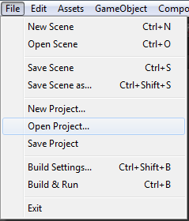

Import the Core package. From the menu item Assets->Import Package->Custom Package.

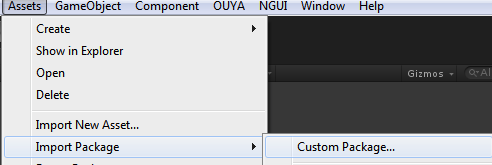

## `OuyaSDK-Core.unitypackage` ##

Import the OuyaSDK-Core.unitypackage.

`Ouya\SDK\Editor\OuyaMenuAdmin.cs` - Adds OUYA menu items for exporting packages for release

`Ouya\SDK\Editor\OuyaPanel.cs` - Provides example switcher to auto change package name and icons

`Ouya\SDK\Prefabs\OuyaGameObject.prefab` - Add the prefab to the initial scene for apps/games to enable the OUYA Plugin

`Ouya\SDK\Scripts\OuyaGameObject.cs` - Handles communication with the OUYA Plugin between C#, C++, and Java

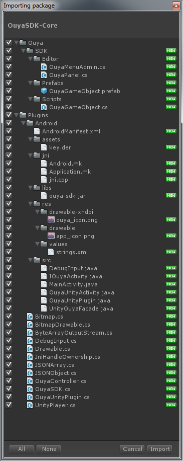

### Android Customization ###

`Plugins\Android\AndroidManifest.xml` - Defines the package identifier and start activity.

`Plugins\Android\assets\key.der` - The signing key from the developer portal

`Plugins\Android\libs\armeabi-v7a\lib-ouya-ndk.so` - Prebuilt native library for the OUYA Plugin

`Plugins\Android\libs\armeabi\lib-ouya-ndk.so` - Prebuilt native library for the OUYA Plugin

`Plugins\Android\libs\x86\lib-ouya-ndk.so` - Prebuilt native library for the OUYA Plugin

`Plugins\Android\libs\ouya-sdk.jar` - The OUYA SDK Java library

`Plugins\Android\OuyaUnityPlugin.jar` - Prebuit OUYA Unity Plugin Java library

`Plugins\Android\res\raw\drawable-xhdpi\ouya_icon.png` - The 732x412 OUYA Store icon

`Plugins\Android\res\raw\drawable\app_icon.png` - The 96x96 settings icon

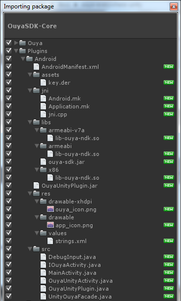

### Plugin Scripts ###

Files within `Plugins` make scripts available to `C#` and `JavaScript` developers.

`Plugins\JSONArray.cs` - JNI hooks for using Android JSON Array parsing

`Plugins\JSONObject.cs` - JNI hooks for using Android JSON Object parsing

`Plugins\OuyaController.cs` - JNI hooks for interacting with the OUYA Controller

`Plugins\OuyaSDK.cs` - The OUYA Plugin SDK methods for input and in-app-purchases

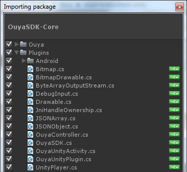

## Icons ##

On the first import you'll get the sample icons.
```
Assets/Plugins/Android/res/drawable-xhdpi/ouya_icon.png (732x412).
Assets/Plugins/Android/res/drawable/app_icon.png (96x96).
```

If the icons have already been customized, there's no need to import the icons and replace with the sample icons.

## Signing key ##

Importing the signing key is a placeholder for where to place the signing key downloaded from the developer portal. The signing key is used in in-app-purchase encryption and decryption. The in-app-purchase API will not work until you [create a game in the developer portal](https://devs.ouya.tv/developers/games) to download the game's signing key. Be cautious when importing updates to not replace this file.

Note (ODK 1.0.14.1): The signing key was moved to be compatible with 3rd party plugins.

```
Assets/Plugins/Android/assets/key.der
```

## Orientation ##

Within the Player Settings, Android Tab, set the default orientation to Landscape Left.

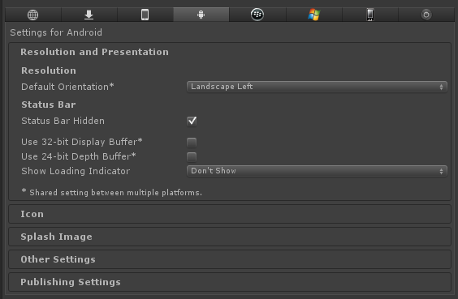

## OuyaGameObject.cs ##

Add the OuyaGameObject to your initial loading scene. It uses DontDestroyOnLoad so you only want one instance of the OuyaGameObject. It handles communication between Java to C#. Select the `OuyaGameObject` in the `SceneView` and in the inspector, the `OUYA Plugin Init Values` field will be visible. Add an entry for `tv.ouya.developer_id` that corresponds to your developer uuid in the [developer portal](http://devs.ouya.tv).

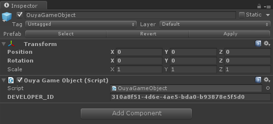

## Xiaomi Libraries

[Back to general info](enable_xiaomi_support.md#xiaomi-libraries)

Place the Xiaomi libraries in the following destinations:

* `Assets/Plugins/Android/assets/MiGameCenterSDKService.apk`

* `Assets/Plugins/Android/libs/SDK_MIBOX_2.0.1.jar`

The [releases section](#releases) has a link to the `Unity-OuyaSDK-Xiaomi.unitypackage` which contains the files at the intended locations.

## Xiaomi Required Permissions

[Back to general info](enable_xiaomi_support.md#xiaomi-required-permissions)

Xiaomi's SDK requires several additional permissions in `AndroidManifest.xml` in order to work.
```java
	<uses-permission android:name="com.xiaomi.sdk.permission.PAYMENT"/>
    <uses-permission android:name="android.permission.GET_TASKS"/>
    <uses-permission android:name="android.permission.READ_PHONE_STATE"/>
```

The [releases section](#releases) has a link to the `Unity-OuyaSDK-Xiaomi.unitypackage` which contains the `AndroidManifest.xml` with the added permissions at the intended location.

* `Assets/Plugins/Android/AndroidManifest.xml`

## Xiaomi Initialization

[Back to general info](enable_xiaomi_support.md#xiaomi-initialization)

Using the inspector, browse the `OuyaGameObject`. Here you can add strings to make the game compatible with OUYA Everywhere devices.

* `tv.ouya.developer_id` - The developer UUID can be found in the [developer portal](http://devs.ouya.tv) after logging in.

* `com.xiaomi.app_id` - The Xiaomi App Id is provided by the content team, email `officehours@ouya.tv` to obtain your key.

* `com.xiaomi.app_key` - The Xiaomi App Key is provided by the content team, email `officehours@ouya.tv` to obtain your key.

* `tv.ouya.product_id_list` - The product id list is a comma separated list of product ids that can be purchased in the game.

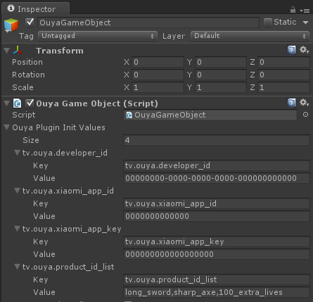

* `MiGameCenterSDKService.apk` should be placed in `Assets\Plugins\Android\assets`

* `ouya-sdk.jar` should be placed in `Assets\Plugins\Android\libs`

* `SDK_MIBOX_2.0.1.jar` should be placed in `Assets\Plugins\Android\libs`

* See the [Releases Section](#releases) to get the package for publishing to Xiaomi

## Disable Xiaomi Screensaver

[Back to general info](enable_xiaomi_support.md#disable-xiaomi-screensaver)

Updating to the latest Core plugin in [releases](#releases) will disable the Xiaomi screensaver while the unity app/game is running. 

## Create a Xiaomi-specific icon

[Back to general info](enable_xiaomi_support.md#create-a-xiaomi-specific-icon)

The `ouya_xiaomi_icon.png` 284x160 icon should be placed in `Assets/plugins/Android/res/drawable-xhdpi/ouya_xiaomi_icon.png`.

## Localization Resources

[Back to general info](enable_xiaomi_support.md#localization-resources)

Use [Android localization](http://developer.android.com/guide/topics/resources/localization.html) to include string resources for the languages supported by your game.

* `Assets/Plugins/Android/res/values/strings.xml` (Default)

* `Assets/Plugins/Android/res/values-de/strings.xml` (Dutch)

* `Assets/Plugins/Android/res/values-en/strings.xml` (English)

* `Assets/Plugins/Android/res/values-es/strings.xml` (Spanish) 

* `Assets/Plugins/Android/res/values-fr/strings.xml` (French)

* `Assets/Plugins/Android/res/values-it/strings.xml` (Italian)

* `Assets/Plugins/Android/res/values-zh-rCN/strings.xml` (Simplified Chinese)

Resource files contain `key/value` pairs for looking up localized strings given the `key` value.
Using the `OuyaSDK` API, invoke `OuyaSDK.getStringResource("app_name")` to return the localized string for the key `app_name` which in this example would return `安卓 出口` when the language is detected as `Simplified Chinese`, i.e. on the `Xiaomi` box.

```
<?xml version="1.0" encoding="utf-8"?>
<resources>
  <string name="app_name">安卓 出口</string>
  <string name="exit">出口</string>
</resources>
```

## Fonts

[Back to general info](enable_xiaomi_support.md#fonts)

Unity has a variety of GUI plugins which each handle fonts differently.

* For the [2D Toolkit](http://www.2dtoolkit.com) plugin, `TTF` fonts need to be converted to `Bitmap` fonts and then [import to a sprite collection](http://www.unikronsoftware.com/2dtoolkit/docs/latest/tutorial/importing_a_font_into_a_sprite_collection.html).

## Other Player Settings ##

In the Android `Player Settings` and within the `Other Settings` subgroup, here you can enter your package identifier from the [developer portal](http://devs.ouya.tv) into the `bundle id` field. Make sure the `minimum API level` field to 16.

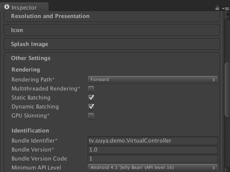

# Dependencies #

The OUYA Plugin has dependencies on the Android SDK for packaging and deploying Android applications.

The OUYA Plugin includes prebuilt Java and Native plugins, recompiling the Java and Native plugin is no longer required.

Android SDK - [http://developer.android.com/sdk/index.html?hl=sk](http://developer.android.com/sdk/index.html?hl=sk)

# OUYA SDK API #

Be sure to be on the `Android` platform before invoking the OUYA SDK API.

```
#if UNITY_ANDROID && !UNITY_EDITOR

	... make OUYA Everywhere API calls ...

#else

	... make calls to your preferred non-Android input system... (Linux/Mac/Windows/etc) 

#endif
```

## Initialization ##

Initialization is handled by the `OuyaGameObject` being placed in your initial scene.

Make sure that before invoking other OuyaSDK methods than isIAPInitComplete returns true. This gives time for the Java to initialize before accessing the controller, button names, button images, products, purchase, receipts, and toggling cursor visibility.

```
// returns true when the Java in-app-purchase system has initialized.
// return false when in-app-purchase calls should not be invoked 
// bool OuyaSDK.isIAPInitComplete();

#if UNITY_ANDROID && !UNITY_EDITOR

IEnumerator Start()
{
	while (!OuyaSDK.isIAPInitComplete())
	{
		yield return null;
	}
}

#endif
```

# Accessing OuyaController #

The namespace has to be added to find the OuyaController.

C#
```
#if UNITY_ANDROID && !UNITY_EDITOR
using tv.ouya.console.api;
#endif
```

## Button Data ##

Before accessing ButtonData, make sure that `OuyaSDK.isIAPInitComplete()` returns true.

## Accessing ButtonData / Button Names ##

OuyaController has a static method to retrieve button names. A null button name means the button was not found.  

C#
```
#if UNITY_ANDROID && !UNITY_EDITOR

OuyaController.ButtonData buttonData;
buttonData = OuyaController.getButtonData(OuyaController.BUTTON_O);
if (null == buttonData)
{
	return;
}
if (null == buttonData.buttonName)
{
	return;
}
string buttonName = buttonData.buttonName;

#endif
```

## Accessing ButtonData / Button Images ##

`OuyaController` has a static method to retrieve button images as Texture2D images. A null Texture2D image means the button was not found.

C#
```
#if UNITY_ANDROID && !UNITY_EDITOR

Texture2D buttonTexture = null;
OuyaController.ButtonData buttonData;
buttonData = OuyaController.getButtonData(OuyaController.BUTTON_O);
if (null == buttonData)
{
	return;
}
if (null == buttonData.buttonDrawable)
{
	return;
}
BitmapDrawable drawable = (BitmapDrawable)buttonData.buttonDrawable;
if (null == drawable)
{
	return;
}
Bitmap bitmap = drawable.getBitmap();
if (null == bitmap)
{
	return;
}
ByteArrayOutputStream stream = new ByteArrayOutputStream();
bitmap.compress(Bitmap.CompressFormat.PNG, 100, stream);
if (stream.size() > 0)
{
	buttonTexture = new Texture2D(0, 0);
	buttonTexture.LoadImage(stream.toByteArray());
}
stream.close();

#endif
```

# Accessing Axis Values #

C#
```
// PlayerNm is zero based and must be less than OuyaController.MAX_CONTROLLERS.
// GetAxis, GetAxisRaw expects the following axis values:
OuyaController.AXIS_LS_X
OuyaController.AXIS_LS_Y
OuyaController.AXIS_RS_X
OuyaController.AXIS_RS_Y
OuyaController.AXIS_L2
OuyaController.AXIS_R2

int playerNum = 0; //zero based

// @result - Returns the value of the axis with smoothing
float OuyaSDK.OuyaInput.GetAxis(int playerNum, int axis);

#if UNITY_ANDROID && !UNITY_EDITOR

OuyaSDK.OuyaInput.GetAxis(playerNum, OuyaController.AXIS_LS_X)
OuyaSDK.OuyaInput.GetAxis(playerNum, OuyaController.AXIS_LS_Y)
OuyaSDK.OuyaInput.GetAxis(playerNum, OuyaController.AXIS_RS_X)
OuyaSDK.OuyaInput.GetAxis(playerNum, OuyaController.AXIS_RS_Y)
OuyaSDK.OuyaInput.GetAxis(playerNum, OuyaController.AXIS_L2)
OuyaSDK.OuyaInput.GetAxis(playerNum, OuyaController.AXIS_R2)

#endif

// @result - Returns the value of the axis without smoothing
float OuyaSDK.OuyaInput.GetAxisRaw(int playerNum, int axis);

#if UNITY_ANDROID && !UNITY_EDITOR

OuyaSDK.OuyaInput.GetAxisRaw(playerNum, OuyaController.AXIS_LS_X)
OuyaSDK.OuyaInput.GetAxisRaw(playerNum, OuyaController.AXIS_LS_Y)
OuyaSDK.OuyaInput.GetAxisRaw(playerNum, OuyaController.AXIS_RS_X)
OuyaSDK.OuyaInput.GetAxisRaw(playerNum, OuyaController.AXIS_RS_Y)
OuyaSDK.OuyaInput.GetAxisRaw(playerNum, OuyaController.AXIS_L2)
OuyaSDK.OuyaInput.GetAxisRaw(playerNum, OuyaController.AXIS_R2)

#endif
```

# Accessing Button States #

C#
```
// GetButton, GetButtonDown, GetButtonUp expect the following button values:
OuyaController.BUTTON_O
OuyaController.BUTTON_U
OuyaController.BUTTON_Y
OuyaController.BUTTON_A
OuyaController.BUTTON_L1
OuyaController.BUTTON_R1
OuyaController.BUTTON_L3
OuyaController.BUTTON_R3
OuyaController.BUTTON_DPAD_UP
OuyaController.BUTTON_DPAD_DOWN
OuyaController.BUTTON_DPAD_RIGHT
OuyaController.BUTTON_DPAD_LEFT
OuyaController.BUTTON_MENU

// @result - true when the button is in the DOWN position
// @result - false when the button is in the UP position
bool OuyaSDK.OuyaInput.GetButton(int playerNum, int keyCode);

#if UNITY_ANDROID && !UNITY_EDITOR

OuyaSDK.OuyaInput.GetButton(playerNum, OuyaController.BUTTON_O)
OuyaSDK.OuyaInput.GetButton(playerNum, OuyaController.BUTTON_U)
OuyaSDK.OuyaInput.GetButton(playerNum, OuyaController.BUTTON_Y)
OuyaSDK.OuyaInput.GetButton(playerNum, OuyaController.BUTTON_A)
OuyaSDK.OuyaInput.GetButton(playerNum, OuyaController.BUTTON_L1)
OuyaSDK.OuyaInput.GetButton(playerNum, OuyaController.BUTTON_R1)
OuyaSDK.OuyaInput.GetButton(playerNum, OuyaController.BUTTON_L3)
OuyaSDK.OuyaInput.GetButton(playerNum, OuyaController.BUTTON_R3)
OuyaSDK.OuyaInput.GetButton(playerNum, OuyaController.BUTTON_DPAD_UP)
OuyaSDK.OuyaInput.GetButton(playerNum, OuyaController.BUTTON_DPAD_DOWN)
OuyaSDK.OuyaInput.GetButton(playerNum, OuyaController.BUTTON_DPAD_RIGHT)
OuyaSDK.OuyaInput.GetButton(playerNum, OuyaController.BUTTON_DPAD_LEFT)

#endif

// @result - true if the button was in the DOWN position in the last frame
bool OuyaSDK.OuyaInput.GetButtonDown(int playerNum, int button);

#if UNITY_ANDROID && !UNITY_EDITOR

OuyaSDK.OuyaInput.GetButtonDown(playerNum, OuyaController.BUTTON_O)
OuyaSDK.OuyaInput.GetButtonDown(playerNum, OuyaController.BUTTON_U)
OuyaSDK.OuyaInput.GetButtonDown(playerNum, OuyaController.BUTTON_Y)
OuyaSDK.OuyaInput.GetButtonDown(playerNum, OuyaController.BUTTON_A)
OuyaSDK.OuyaInput.GetButtonDown(playerNum, OuyaController.BUTTON_L1)
OuyaSDK.OuyaInput.GetButtonDown(playerNum, OuyaController.BUTTON_R1)
OuyaSDK.OuyaInput.GetButtonDown(playerNum, OuyaController.BUTTON_L3)
OuyaSDK.OuyaInput.GetButtonDown(playerNum, OuyaController.BUTTON_R3)
OuyaSDK.OuyaInput.GetButtonDown(playerNum, OuyaController.BUTTON_DPAD_UP)
OuyaSDK.OuyaInput.GetButtonDown(playerNum, OuyaController.BUTTON_DPAD_DOWN)
OuyaSDK.OuyaInput.GetButtonDown(playerNum, OuyaController.BUTTON_DPAD_RIGHT)
OuyaSDK.OuyaInput.GetButtonDown(playerNum, OuyaController.BUTTON_DPAD_LEFT)
OuyaSDK.OuyaInput.GetButtonDown(playerNum, OuyaController.BUTTON_MENU)

#endif

// @result - true if the button was in the UP position in the last frame
bool OuyaSDK.OuyaInput.GetButtonUp(int playerNum, int button);

#if UNITY_ANDROID && !UNITY_EDITOR

OuyaSDK.OuyaInput.GetButtonUp(playerNum, OuyaController.BUTTON_O)
OuyaSDK.OuyaInput.GetButtonUp(playerNum, OuyaController.BUTTON_U)
OuyaSDK.OuyaInput.GetButtonUp(playerNum, OuyaController.BUTTON_Y)
OuyaSDK.OuyaInput.GetButtonUp(playerNum, OuyaController.BUTTON_A)
OuyaSDK.OuyaInput.GetButtonUp(playerNum, OuyaController.BUTTON_L1)
OuyaSDK.OuyaInput.GetButtonUp(playerNum, OuyaController.BUTTON_R1)
OuyaSDK.OuyaInput.GetButtonUp(playerNum, OuyaController.BUTTON_L3)
OuyaSDK.OuyaInput.GetButtonUp(playerNum, OuyaController.BUTTON_R3)
OuyaSDK.OuyaInput.GetButtonUp(playerNum, OuyaController.BUTTON_DPAD_UP)
OuyaSDK.OuyaInput.GetButtonUp(playerNum, OuyaController.BUTTON_DPAD_DOWN)
OuyaSDK.OuyaInput.GetButtonUp(playerNum, OuyaController.BUTTON_DPAD_RIGHT)
OuyaSDK.OuyaInput.GetButtonUp(playerNum, OuyaController.BUTTON_DPAD_LEFT)
OuyaSDK.OuyaInput.GetButtonUp(playerNum, OuyaController.BUTTON_MENU)

#endif
```

## OuyaController.BUTTON_MENU ##

Note: Be sure to check for button states with GetButtonDown and GetButtonUp. Just checking for the GetButton state will never catch the event in time because the down and up event fire within the same frame.

# Check if controller is connected #

OuyaInput exposes a static method to check if the controller is connected.

C#
```
#if UNITY_ANDROID && !UNITY_EDITOR

//@returns true if the player number is connected
//@returns false if the player number is disconnected
bool OuyaSDK.OuyaInput.IsControllerConnected(int playerNum);

#endif
```

# Hide the mouse cursor #

In some cases you may want to hide or show the mouse cursor. The showCursor static method on OuyaController toggles cursor visibility.

C#
```
#if UNITY_ANDROID && !UNITY_EDITOR

// Hide the mouse cursor
OuyaController.showCursor(false);

// Show the mouse cursor
OuyaController.showCursor(true);

#endif
```

## Unity GUI Input

Unity 4.6 introduced `Unity GUI`. You will need to connect `OE-Input` with the `Unity GUI` using an `InputModule`.

### In Control

`InControl` is a 3rd party Unity package that works with OE-Input on the OUYA and controller support on non-OUYA platforms.

* The [InControl](http://www.gallantgames.com/pages/incontrol-new-unity-gui) Unity package provides an `InputModule` that will connect `OE-Input` with the `Unity GUI`.

* Be sure to add the [`INCONTROL_OUYA` define symbol](http://www.gallantgames.com/pages/incontrol-ouya) in your Android `player settings`.

* Setup the `Input Settings` by selecting the `Edit->Project Settings->InControl->Setup Input Manager` menu item.

# Pause #

The Pause event fires when the game is paused which could mean that the purchase dialog is opening or that the game is exiting. This event gives you a chance to pause the game or to exit cleanly.

Extend the `IPauseListener` interface to receive the callback for a pause event.

C#
```
public class MyScript : MonoBehaviour,
    OuyaSDK.IPauseListener
{
}
```

JavaScript
```
public class MyScript extends MonoBehaviour implements
	OuyaSDK.IPauseListener
{
}
```

Register the instance to receive the interface callback events.

C#
```
    void Awake()
    {
        OuyaSDK.registerPauseListener(this);
    }
    void OnDestroy()
    {
        OuyaSDK.unregisterPauseListener(this);
    }
```

JavaScript
```
    function Awake()
    {
        OuyaSDK.registerPauseListener(this);
    }

    function OnDestroy()
    {
        OuyaSDK.unregisterPauseListener(this);
    }
```

The pause event will fire when the application is paused.

C#
```
    public void OuyaOnPause()
    {
		Debug.Log("The game is paused.");
    }
```

JavaScript
```
    public function OuyaOnPause()
    {
		Debug.Log("The game is paused.");
    }
```

# Resume #

The Resume event fires when the game returns from being paused. This event tells you it's time for gameplay to continue.

Extend the `IResumeListener` interface to receive the callback for a pause event.

C#
```
public class MyScript : MonoBehaviour,
    OuyaSDK.IResumeListener
{
}
```

JavaScript
```
public class MyScript extends MonoBehaviour implements
	OuyaSDK.IResumeListener
{
}
```

Register the instance to receive the interface callback events.

C#
```
    void Awake()
    {
        OuyaSDK.registerResumeListener(this);
    }
    void OnDestroy()
    {
        OuyaSDK.unregisterResumeListener(this);
    }
```

JavaScript
```
    function Awake()
    {
        OuyaSDK.registerResumeListener(this);
    }

    function OnDestroy()
    {
        OuyaSDK.unregisterResumeListener(this);
    }
```

The resume event will fire when the application has resumed.

C#
```
    public void OuyaOnResume()
    {
		Debug.Log("The game has resumed.");
    }
```

JavaScript
```
    public function OuyaOnResume()
    {
		Debug.Log("The game has resumed.");
    }
```

# Request Gamer Info #

Gamer Info provides access to the gamer username and uuid.

Extend the `IRequestGamerInfoListener` interface to receive the callbacks for invoking `OuyaSDK.requestGamerInfo()`.

C#
```
public class MyScript : MonoBehaviour,
    OuyaSDK.IRequestGamerInfoListener
{
}
```

JavaScript
```
public class MyScript extends MonoBehaviour implements
	OuyaSDK.IRequestGamerInfoListener
{
}
```

Register the instance to receive the interface callback events.

C#
```
    void Awake()
    {
        OuyaSDK.registerRequestGamerInfoListener(this);
    }
    void OnDestroy()
    {
        OuyaSDK.unregisterRequestGamerInfoListener(this);
    }
```

JavaScript
```
    function Awake()
    {
        OuyaSDK.registerRequestGamerInfoListener(this);
    }

    function OnDestroy()
    {
        OuyaSDK.unregisterRequestGamerInfoListener(this);
    }
```

The success event will receive the gamer info.

C#
```
    public void RequestGamerInfoOnSuccess(string uuid, string username)
    {
    }
```

JavaScript
```
    public function RequestGamerInfoOnSuccess(uuid : String, username : String)
    {
    }
```

The failure event will receive an error code and error message.

C#
```
    public void RequestGamerInfoOnFailure(int errorCode, string errorMessage)
    {
    }
```

JavaScript
```
    public function RequestGamerInfoOnFailure(errorCode : int, errorMessage : String)
    {
    }
```

The cancel event indicates the request was cancelled.

C#
```
    public void RequestGamerInfoOnCancel()
    {
    }
```

JavaScript
```
    public function RequestGamerInfoOnCancel()
    {
    }
```

# Request Products #

Product Info provides access to the product name, details, localPrice, and other information.

Prepare a list of Purchasables to request details for.

C#
```
string[] productItems =
{
	"YOUR_PRODUCT_ID_1",
	"YOUR_PRODUCT_ID_2",
	"YOUR_PRODUCT_ID_3",
};

List<OuyaSDK.Purchasable> purchasables =
	new List<OuyaSDK.Purchasable>();
	
foreach (string productId in productItems)
{
	OuyaSDK.Purchasable purchasable = new OuyaSDK.Purchasable();
	purchasable.productId = productId;
	purchasables.Add(purchasable);
}

OuyaSDK.requestProducts(purchasables);
```

JavaScript
```
var productItems : String[] =
{
	"YOUR_PRODUCT_ID_1",
	"YOUR_PRODUCT_ID_2",
	"YOUR_PRODUCT_ID_3",
};

var purchasables : List<OuyaSDK.Purchasable> =
	new List<OuyaSDK.Purchasable>();
	
foreach (var productId : String in productItems)
{
	var purchasable : OuyaSDK.Purchasable = new OuyaSDK.Purchasable();
	purchasable.productId = productId;
	purchasables.Add(purchasable);
}

OuyaSDK.requestProducts(purchasables);
```

Extend the `IRequestProductsListener ` interface to receive the callbacks for invoking `OuyaSDK.requestProducts(purchasables)`.

C#
```
public class MyScript : MonoBehaviour,
    OuyaSDK.IRequestProductsListener
{
}
```

JavaScript
```
public class MyScript extends MonoBehaviour implements
	OuyaSDK.IRequestProductsListener
{
}
```

Register the instance to receive the interface callback events.

C#
```
    void Awake()
    {
        OuyaSDK.registerRequestProductsListener(this);
    }
    void OnDestroy()
    {
        OuyaSDK.unregisterRequestProductsListener(this);
    }
```

JavaScript
```
    function Awake()
    {
        OuyaSDK.registerRequestProductsListener(this);
    }

    function OnDestroy()
    {
        OuyaSDK.unregisterRequestProductsListener(this);
    }
```

The success event will receive a list of products.

C#
```
    public void RequestProductsOnSuccess(List<OuyaSDK.Product> products)
    {
    }
```

JavaScript
```
    public function RequestProductsOnSuccess(products : List.<OuyaSDK.Product>)
    {
    }
```

The failure event will receive an error code and error message.

C#
```
    public void RequestProductsOnFailure(int errorCode, string errorMessage)
    {
    }
```

JavaScript
```
    public function RequestProductsOnFailure(errorCode : int, errorMessage : String)
    {
    }
```

The cancel event indicates the request was cancelled.

C#
```
    public void RequestProductsOnCancel()
    {
    }
```

JavaScript
```
    public function RequestProductsOnCancel()
    {
    }
```

# Request Purchase #

A gamer can purchase an entitlement or consumable using `OuyaSDK.requestPurchase`.

Prepare a `Purchasable` to initiate a purchase.

C#
```
OuyaSDK.Purchasable purchasable = new OuyaSDK.Purchasable();
purchasable.productId = "YOUR_PRODUCT_ID";
OuyaSDK.requestPurchase(purchasable);
```

JavaScript
```
var purchasable : OuyaSDK.Purchasable = new OuyaSDK.Purchasable();
purchasable.productId = "YOUR_PRODUCT_ID";
OuyaSDK.requestPurchase(purchasable);
```

Extend the `IRequestPurchaseListener ` interface to receive the callbacks for invoking `OuyaSDK.requestPurchase(purchasable)`.

C#
```
public class MyScript : MonoBehaviour,
    OuyaSDK.IRequestPurchaseListener
{
}
```

JavaScript
```
public class MyScript extends MonoBehaviour implements
	OuyaSDK.IRequestPurchaseListener
{
}
```

Register the instance to receive the interface callback events.

C#
```
    void Awake()
    {
        OuyaSDK.registerRequestPurchaseListener(this);
    }
    void OnDestroy()
    {
        OuyaSDK.unregisterRequestPurchaseListener(this);
    }
```

JavaScript
```
    function Awake()
    {
        OuyaSDK.registerRequestPurchaseListener(this);
    }

    function OnDestroy()
    {
        OuyaSDK.unregisterRequestPurchaseListener(this);
    }
```

The success event will receive the purchased product.

C#
```
    public void RequestPurchaseOnSuccess(OuyaSDK.Product product)
    {
    }
```

JavaScript
```
    public function RequestPurchaseOnSuccess(product : OuyaSDK.Product)
    {
    }
```

The failure event will receive an error code and error message.

C#
```
    public void RequestPurchaseOnFailure(int errorCode, string errorMessage)
    {
    }
```

JavaScript
```
    public function RequestPurchaseOnFailure(errorCode : int, errorMessage : String)
    {
    }
```

The cancel event indicates the request was cancelled.

C#
```
    public void RequestPurchaseOnCancel()
    {
    }
```

JavaScript
```
    public function RequestPurchaseOnCancel()
    {
    }
```

# Request Receipts #

Receipts return all the `entitlements` that the `gamer` has purchased from the `developer`.

Extend the `IRequestReceiptsListener ` interface to receive the callbacks for invoking `OuyaSDK.OuyaSDK.requestReceipts()`.

C#
```
public class MyScript : MonoBehaviour,
    OuyaSDK.IRequestReceiptsListener
{
}
```

JavaScript
```
public class MyScript extends MonoBehaviour implements
	OuyaSDK.IRequestReceiptsListener
{
}
```

Register the instance to receive the interface callback events.

C#
```
    void Awake()
    {
        OuyaSDK.registerRequestReceiptsListener(this);
    }
    void OnDestroy()
    {
        OuyaSDK.unregisterRequestReceiptsListener(this);
    }
```

JavaScript
```
    function Awake()
    {
        OuyaSDK.registerRequestReceiptsListener(this);
    }

    function OnDestroy()
    {
        OuyaSDK.unregisterRequestReceiptsListener(this);
    }
```

The success event will receive a list of receipts.

C#
```
    public void RequestReceiptsOnSuccess(List<OuyaSDK.Receipt> receipts)
    {
    }
```

JavaScript
```
    public function RequestReceiptsOnSuccess(receipts : List.<OuyaSDK.Receipt>)
    {
    }
```

The failure event will receive an error code and error message.

C#
```
    public void RequestReceiptsOnFailure(int errorCode, string errorMessage)
    {
    }
```

JavaScript
```
    public function RequestReceiptsOnFailure(errorCode : int, errorMessage : String)
    {
    }
```

The cancel event indicates the request was cancelled.

C#
```
    public void RequestReceiptsOnCancel()
    {
    }
```

JavaScript
```
    public function RequestReceiptsOnCancel()
    {
    }
```

# Set Safe Area #

Part of the content submission guideline rules is that all important information needs to be in the safe zone. The safe area can be adjusted by passing an amount when calling `OuyaSDK.setSafeArea(amount)`.

C#
```
float amount;
amount = 0f; //full border pdding
amount = 1f; //no border padding
OuyaSDK.setSafeArea(amount);
```

JavaScript
```
var amount : float;
amount = 0; //full border pdding
amount = 1; //no border padding
OuyaSDK.setSafeArea(amount);
```

# Community Content #

The [Community Content](https://github.com/ouya/docs/blob/master/community_content.md) documentation has a detailed overview of features.

If the Community Content is available the `CC Actions` are available.

* Create
* Delete
* Download
* Edit
* Search for installed items
* Search for published items
* Publish
* Unpublish

The general process for using the Community Content API is register listeners and wait for initialization.

## `IContentInitializedListener` ##

One way to check if Community Content has been initialized is to implement the `IContentInitializedListener` interface.
Be sure to register/unregister the listener during the `Awake` and `OnDestroy` events.
`ContentInitializedOnInitialized` is invoked when the  `OuyaContent` becomes accessible.
`ContentInitializedOnDestroyed` is invoked when the `OuyaContent` has been destroyed.

C#
```
public class MyScript : MonoBehaviour
#if UNITY_ANDROID && !UNITY_EDITOR
    ,
    OuyaSDK.IContentInitializedListener
{
    private void Awake()
    {
        OuyaSDK.registerContentInitializedListener(this);
    }
    private void OnDestroy()
    {
        OuyaSDK.unregisterContentInitializedListener(this);
    }
    public void ContentInitializedOnInitialized()
    {
    }
    public void ContentInitializedOnDestroyed()
    {
    }
}
```

## `OuyaContent` ##

`OuyaContent` is the entry point for accessing the Community Content API.
`OuyaUnityPlugin` provides a reference to the `OuyaContent` object.
Make sure to wrap the `OuyaContent` accessor with `using` to ensure the JNI reference is disposed.

C#
```
using (OuyaContent ouyaContent = OuyaUnityPlugin.getOuyaContent())
{
}
```

## `isAvailable` ##

Before accessing Community Content, make sure the API is available to the gamer.
The Community Content API won't be available if an `age gate` is active for the gamer. 

C#
```
bool isAvailable = ouyaContent.isAvailable();
```

## `isInitialized` ##

One way to check if Community Content has been initialized is to invoke `isInitialized`.

C#
```
if (ouyaContent.isInitialized())
{
}
```

## `IContentDeleteListener` ##

Implement the `IContentDeleteListener` interface to receive the callbacks from deleting an `OuyaMod` community content object.
Be sure to register/unregister the listener during the `Awake` and `OnDestroy` events.
`ContentDeleteOnDeleted` is invoked when the  `OuyaMod` has been deleted.
`ContentDeleteOnDeleteFailed` is invoked when the `OuyaMod` deletion has failed.
The listener callbacks occur after `OuyaUnityPlugin.contentDelete` is invoked.

C#
```
public class MyScript : MonoBehaviour
#if UNITY_ANDROID && !UNITY_EDITOR
    ,
    OuyaSDK.IContentDeleteListener
{
    private void Awake()
    {
        OuyaSDK.registerContentDeleteListener(this);
    }
    private void OnDestroy()
    {
        OuyaSDK.unregisterContentDeleteListener(this);
    }
    public void ContentDeleteOnDeleted(OuyaMod ouyaMod)
    {
    }
    public void ContentDeleteOnDeleteFailed(OuyaMod ouyaMod, int code, string reason)
    {
    }
    void Delete(OuyaMod ouyaMod)
    {
        OuyaUnityPlugin.contentDelete(ouyaMod);
    }
}
```

## `IContentDownloadListener` ##

Implement the `IContentDownloadListener` interface to receive the callbacks from downloading an `OuyaMod` community content object.
Be sure to register/unregister the listener during the `Awake` and `OnDestroy` events.
`ContentDownloadOnComplete` is invoked when the `OuyaMod` has finished downloading.
`ContentDownloadOnProgress` is invoked when the `OuyaMod` download is in progress.
`ContentDownloadOnFailed` is invoked when the `OuyaMod` download has failed.
The listener callbacks occur after `OuyaUnityPlugin.contentDownload` is invoked.

C#
```
public class MyScript : MonoBehaviour
#if UNITY_ANDROID && !UNITY_EDITOR
    ,
    OuyaSDK.IContentDownloadListener
{
    private void Awake()
    {
        OuyaSDK.registerContentDownloadListener(this);
    }
    private void OnDestroy()
    {
        OuyaSDK.unregisterContentDownloadListener(this);
    }
    public void ContentDownloadOnComplete(OuyaMod ouyaMod)
    {
    }
    public void ContentDownloadOnProgress(OuyaMod ouyaMod, int progress)
    {
    }
    public void ContentDownloadOnFailed(OuyaMod ouyaMod)
    {
    }
    void Download(OuyaMod ouyaMod)
    {
        OuyaUnityPlugin.contentDownload(ouyaMod);
    }
}
```

## `IContentInstalledSearchListener` ##

Implement the `IContentInstalledSearchListener` interface to receive the callbacks from searching for installed `OuyaMod` community content object.
Be sure to register/unregister the listener during the `Awake` and `OnDestroy` events.
`ContentInstalledSearchOnResults` is invoked when the search for `OuyaMod` installed content has finished.
`ContentInstalledSearchOnError` is invoked when the `OuyaMod` search has failed.
The listener callbacks occur after `OuyaUnityPlugin.getOuyaContentInstalled` is invoked.

C#
```
public class MyScript : MonoBehaviour
#if UNITY_ANDROID && !UNITY_EDITOR
    ,
    OuyaSDK.IContentDownloadListener
{
    private void Awake()
    {
        OuyaSDK.registerContentInstalledSearchListener(this);
    }
    private void OnDestroy()
    {
        OuyaSDK.unregisterContentInstalledSearchListener(this);
    }
    public void ContentInstalledSearchOnResults(List<OuyaMod> ouyaMods, int count)
    {
    }
    public void ContentInstalledSearchOnError(int code, string reason)
    {
    }
    void Search()
    {
        OuyaUnityPlugin.getOuyaContentInstalled();
    }
}
```

## `IContentPublishedSearchListener` ##

Implement the `IContentPublishedSearchListener` interface to receive the callbacks from searching for published `OuyaMod` community content object.
Be sure to register/unregister the listener during the `Awake` and `OnDestroy` events.
`ContentPublishedSearchOnResults` is invoked when the search for `OuyaMod` published content has finished.
`ContentPublishedSearchOnError` is invoked when the `OuyaMod` search has failed.
The listener callbacks occur after `OuyaUnityPlugin.getOuyaContentPublished` is invoked.

C#
```
public class MyScript : MonoBehaviour
#if UNITY_ANDROID && !UNITY_EDITOR
    ,
    OuyaSDK.IContentPublishedSearchListener
{
    private void Awake()
    {
        OuyaSDK.registerContentPublishedSearchListener(this);
    }
    private void OnDestroy()
    {
        OuyaSDK.unregisterContentPublishedSearchListener(this);
    }
    public void ContentPublishedSearchOnResults(List<OuyaMod> ouyaMods, int count)
    {
    }
    public void ContentPublishedSearchOnError(int code, string reason)
    {
    }
    void Search(OuyaContent.SortMethod sortMethod)
    {
        OuyaUnityPlugin.getOuyaContentPublished(sortMethod);
    }
}
```

## `IContentPublishListener` ##

Implement the `IContentPublishListener` interface to receive the callbacks from publishing an `OuyaMod` community content object.
Be sure to register/unregister the listener during the `Awake` and `OnDestroy` events.
`ContentPublishOnSuccess` is invoked when the `OuyaMod` has published successfully.
`ContentPublishOnError` is invoked when the `OuyaMod` publish has failed.
The listener callbacks occur after `OuyaUnityPlugin.contentPublish` is invoked.

C#
```
public class MyScript : MonoBehaviour
#if UNITY_ANDROID && !UNITY_EDITOR
    ,
    OuyaSDK.IContentPublishListener
{
    private void Awake()
    {
        OuyaSDK.registerContentPublishListener(this);
    }
    private void OnDestroy()
    {
        OuyaSDK.unregisterContentPublishListener(this);
    }
    public void ContentPublishOnSuccess(OuyaMod ouyaMod)
    {
    }
    public void ContentPublishOnError(OuyaMod ouyaMod, int code, string reason)
    {
    }
    void Publish(OuyaMod ouyaMod)
    {
        OuyaUnityPlugin.contentPublish(ouyaMod);
    }
}
```

## `IContentSaveListener` ##

Implement the `IContentSaveListener` interface to receive the callbacks from saving an `OuyaMod` community content object.
Be sure to register/unregister the listener during the `Awake` and `OnDestroy` events.
`ContentSaveOnSuccess` is invoked when the `OuyaMod` has saved successfully.
`ContentSaveOnError` is invoked when the `OuyaMod` save has failed.
The listener callbacks occur after `OuyaUnityPlugin.saveOuyaMod` is invoked.
Saved OuyaMod content will return in the installed Community Content searches.
The saved OuyaMod content needs to be published to show in the published search results.

C#
```
public class MyScript : MonoBehaviour
#if UNITY_ANDROID && !UNITY_EDITOR
    ,
    OuyaSDK.IContentSaveListener
{
    private void Awake()
    {
        OuyaSDK.unregisterContentSaveListener(this);
    }
    private void OnDestroy()
    {
        OuyaSDK.unregisterContentSaveListener(this);
    }
    public void ContentSaveOnSuccess(OuyaMod ouyaMod)
    {
    }
    public void ContentSaveOnError(OuyaMod ouyaMod, int code, string reason)
    {
    }
    void Save(OuyaMod ouyaMod, OuyaMod.Editor editor)
    {
        OuyaUnityPlugin.saveOuyaMod(ouyaMod, editor);
    }
}
```

## `IContentUnpublishListener` ##

Implement the `IContentUnpublishListener` interface to receive the callbacks from unpublishing an `OuyaMod` community content object.
Be sure to register/unregister the listener during the `Awake` and `OnDestroy` events.
`ContentUnpublishOnSuccess` is invoked when the `OuyaMod` has unpublished successfully.
`ContentUnpublishOnError` is invoked when the `OuyaMod` unpublish has failed.
The listener callbacks occur after `OuyaUnityPlugin.contentUnpublish` is invoked.

C#
```
public class MyScript : MonoBehaviour
#if UNITY_ANDROID && !UNITY_EDITOR
    ,
    OuyaSDK.IContentUnpublishListener
{
    private void Awake()
    {
        OuyaSDK.registerContentUnpublishListener(this);
    }
    private void OnDestroy()
    {
        OuyaSDK.unregisterContentUnpublishListener(this);
    }
    public void ContentUnpublishOnSuccess(OuyaMod ouyaMod)
    {
    }
    public void ContentUnpublishOnError(OuyaMod ouyaMod, int code, string reason)
    {
    }
    void Unpublish(OuyaMod ouyaMod)
    {
        OuyaUnityPlugin.contentUnpublish(ouyaMod);
    }
}
```

## `IResumeListener` ##

Implement the `IResumeListener` interface to receive the resume callback.
When the Community Content rate and flag dialogs are closed the resume callback will indicate the game can continue.
Be sure to register/unregister the listener during the `Awake` and `OnDestroy` events.
`OuyaOnResume` is invoked when the game has been resumed.

C#
```
public class MyScript : MonoBehaviour
#if UNITY_ANDROID && !UNITY_EDITOR
    ,
    OuyaSDK.IResumeListener
{
    private void Awake()
    {
        OuyaSDK.registerResumeListener(this);
    }
    private void OnDestroy()
    {
        OuyaSDK.unregisterResumeListener(this);
    }
    public void OuyaOnResume()
    {
    }
}
```

## `Create` ##

The `OuyaContent` object is used to create content.
The `OuyaMod` content must be saved before it will be returned by searching for installed content.
The `OuyaMod` content must be published before it will be returned by searching for published content.

C#
```
    using (OuyaContent ouyaContent = OuyaUnityPlugin.getOuyaContent())
    {
        if (ouyaContent.isInitialized())
        {
            using (OuyaMod ouyaMod = ouyaContent.create())
            {
            }
        }
    }

```

## `OuyaMod.Editor` ##

The `Editor` object is used to edit the `OuyaMod` fields.

C#
```
    using (OuyaContent ouyaContent = OuyaUnityPlugin.getOuyaContent())
    {
	    using (OuyaMod ouyaMod = ouyaContent.create())
	    {
	        using (OuyaMod.Editor editor = ouyaMod.edit())
	        {
	        }
	    }
	}
```

Some fields are required.

C#
```
	void AddRequiredFields(OuyaMod ouyaMod)
	{
	    using (OuyaMod.Editor editor = ouyaMod.edit())
	    {
			editor.setTitle("Custom Level");
			editor.setCategory("level");
			editor.setDescription("This is my custom level");
	    }
	}
```

Files can be added to `OuyaMod` objects by passing a byte array.

C#
```
	void AddFile(OuyaMod ouyaMod, string filename, byte[] data)
	{
	    using (OuyaMod.Editor editor = ouyaMod.edit())
	    {
	        using (OutputStream os = editor.newFile(filename))
	        {
	            os.write(data);
	            os.close();
	        }
		}
	}
```

Screenshots can be added to `OuyaMod` objects by converting `Texture2D` to Android `Bitmap` objects.
Be sure to make the Texture readable and RGBA32 before attempting to convert to a `Bitmap` object.

C#
```
	void AddScreenshot(OuyaMod.Editor editor, Texture2D texture)
	{
		byte[] buffer = texture.EncodeToPNG();
		if (null != buffer &&
		    buffer.Length >= 0)
		{
		    Bitmap bitmap = BitmapFactory.decodeByteArray(buffer, 0, buffer.Length);
			editor.addScreenshot(bitmap);
		}
	}
```

The `Editor` object also sets optional fields.

C#
```
	void AddOptionalData(OuyaMod ouyaMod)
	{
	    using (OuyaMod.Editor editor = ouyaMod.edit())
	    {
			editor.addTag("space");
			editor.addTag("king of the hill");
			
			editor.setMetadata("difficulty=4;theme=space;mode=koth");
		}
	}
```

After editing fields be sure to save the changes.

C#
```
	void Save(OuyaMod ouyaMod)
	{
	    using (OuyaMod.Editor editor = ouyaMod.edit())
	    {
			OuyaUnityPlugin.saveOuyaMod(ouyaMod, editor);
		}
	}
```

# Examples #

Download the Examples package from github releases…

Import the Examples package. From the menu item Assets->Import Package->Custom Package… and browse to the "ouya-examples.unitypackage".

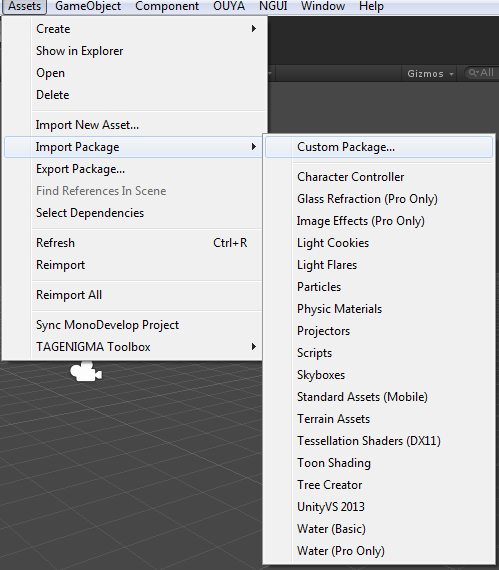

## OUYA Panel ##

Open the `OUYA Panel` from the `Window->Open OUYA Panel` menu item.

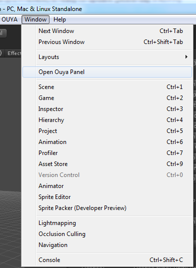

The `OUYA Panel` provides a quick way to switch between examples.

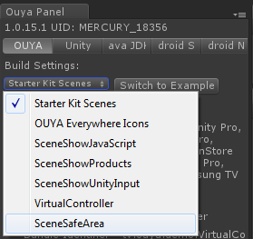

Use the drop down to select the example and then click the `Switch to Example` button which updates the icons and package name.

# Virtual Controller Example #

The virtual controller example exercises the new OUYA-Everywhere input. The button names and images are now accessible from the API. And the virtual controller buttons highlight for multiple controllers for supported controllers. The right-hand JOY buttons toggle input for specific player numbers.

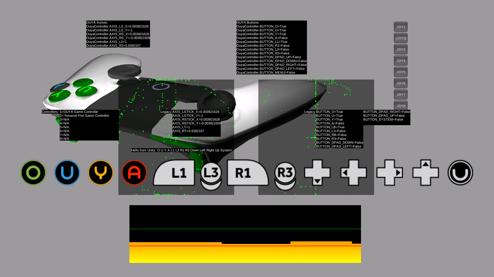

The [Virtual Controller](https://github.com/ouya/ouya-sdk-examples/blob/master/Unity/OuyaSDK/Assets/Ouya/Examples/Scripts/VirtualController.cs) script displays a 2D controller with axis and buttons that highlight when the physical controller is used.

## Input Test ##

The [Input Test](https://github.com/ouya/ouya-sdk-examples/blob/master/Unity/OuyaSDK/Assets/Ouya/Examples/Scripts/OuyaInputTest.cs) script displays all the axis, button up, and button down states to verify that input is correctly setup.

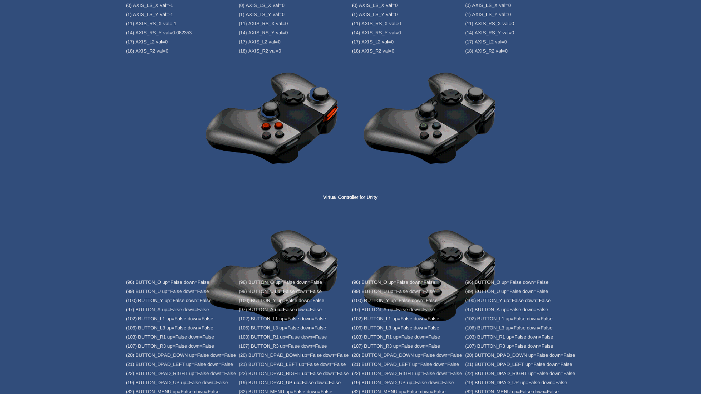

## In App Purchase Example ##

The `ShowProducts` scene is an in-app-purchase example that uses the `OuyaSDK` to access gamer info, purchasing, and receipts.


## Safe Area Example ##

The [Safe Area](https://github.com/ouya/ouya-sdk-examples/blob/master/Unity/OuyaSDK/Assets/Ouya/Examples/Scripts/OuyaSafeArea.cs) example uses the DPAD left and right to invoke `OuyaSDK.setSafeArea(float amount)`. Using 0.0 for the amount uses full border padding. Using 1.0 for the amount uses no border padding.

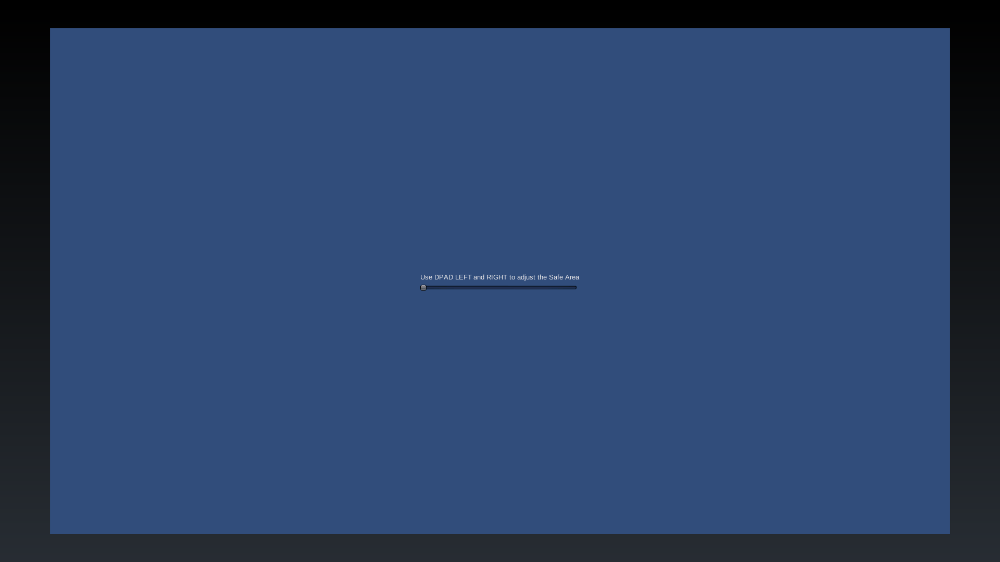

## Community Content Example ##

The [Community Content](https://github.com/ouya/ouya-sdk-examples/blob/master/Unity/OuyaSDK/Assets/Ouya/Examples/Scripts/OuyaCommunityContent.cs) example shows how to create, edit, publish, unpublish, download, and delete Community Content.


<hr>

# Customization #

The OUYA Plugin remains customizable and if you want to extend the Java and Native plugins there are dependencies on the Android SDK, Android NDK, and Java JDK.

Android NDK - [https://developer.android.com/tools/sdk/ndk/index.html](https://developer.android.com/tools/sdk/ndk/index.html)

Java6 (32-bit/64-bit) - [http://www.oracle.com/technetwork/java/javasebusiness/downloads/java-archive-downloads-javase6-419409.html](http://www.oracle.com/technetwork/java/javasebusiness/downloads/java-archive-downloads-javase6-419409.html)

If you are on Windows if you install the [[Tegra Android Developer Pack]](https://developer.nvidia.com/tegra-resources), it comes with all of the needed dependencies and is the easiest way to set things up. Be sure to register for "NVIDIA GameWorks™ Registered Developer Program" to get access to the Tegra Android Developer Pack downloads.[ [Tegra Registered Developer Program]](https://developer.nvidia.com/registered-developer-programs)

<hr>

# Legacy (old files no longer needed) #

If you used previous versions of the OUYA Unity Plugin many of the old files are no longer needed and can be considered legacy.

Some legacy files are not required to be imported or can be removed.

## Legacy InputManager.asset (Removed) ##

The InputManager Mappings file is no longer used by the plugin. So you may choose to keep your existing mapping file which is used for non-OUYA platforms.

```
ProjectSettings/InputManager.asset
```

## Legacy OuyaExampleCommon.cs (Removed) ##

The legacy OuyaExampleCommon.cs script can been removed or replaced with another input system.

```
Assets/Plugins/OuyaExampleCommon.cs
```

There are a number of related legacy input C# scripts that should be removed.

```
Assets/Plugins/IOuyaController.cs
Assets/Plugins/OuyaControllerCommon.cs
Assets/Plugins/OuyaExampleCommon.cs
Assets/Plugins/OuyaKeyCodes.cs
Assets/Plugins/PS2Controller.cs
Assets/Plugins/XBox360Controller.cs
```

## Legacy OuyaPostProcessor.cs (Removed) ##

The OuyaPostProcessor would auto compile C++ and Java source after a detected change. However, changes to the plugin are infrequent enough making this feature not used and so it was removed. Typically you only need to compile NDK and the Java Plugin after importing an update of the plugin.

```
Assets/Ouya/SDK/Editor/OuyaPostProcessor.cs
```

## Legacy OuyaUnityApplication.jar (Removed) ##

If you have the legacy OuyaUnityApplication.jar file make sure that it’s removed. If you forget this step, you’ll get an DEX error when building the game.

```
Assets\Plugins\Android\OuyaUnityApplication.jar
```

## Legacy OuyaUnityApplication.java (Removed) ##

If you have the legacy OuyaUnityApplication.java file make sure that it’s removed. If you forget this step, you’ll get a Java compile error.

```
Assets\Plugins\Android\src\OuyaUnityApplication.java
```

## Legacy OuyaNativeActivity.java (Removed) ##

If you have the legacy OuyaNativeActivity.java file make sure that it’s removed. If you forget this step, you’ll get a Java compile error.

```
Assets\Plugins\Android\src\OuyaNativeActivity.java
```

## Legacy R.java (Removed) ##

The Core Unity Package may include example R.java files that should not be imported into your game. You may want to delete these extra files if they were imported.

Note (ODK 1.0.14.1): R.java and resources were moved to be compatible with other 3rd party plugins that also supplied this generated file.  

```
Assets\Plugins\Android\src\tv\...\R.java
```

## Legacy Litjson (Removed) ##

Litjson is a public domain 3rd party library for parsing JSON data. Android already has classes for handling JSONObject parsing and so the legacy Litjson was replaced.

```
Assets\Litjson
```
