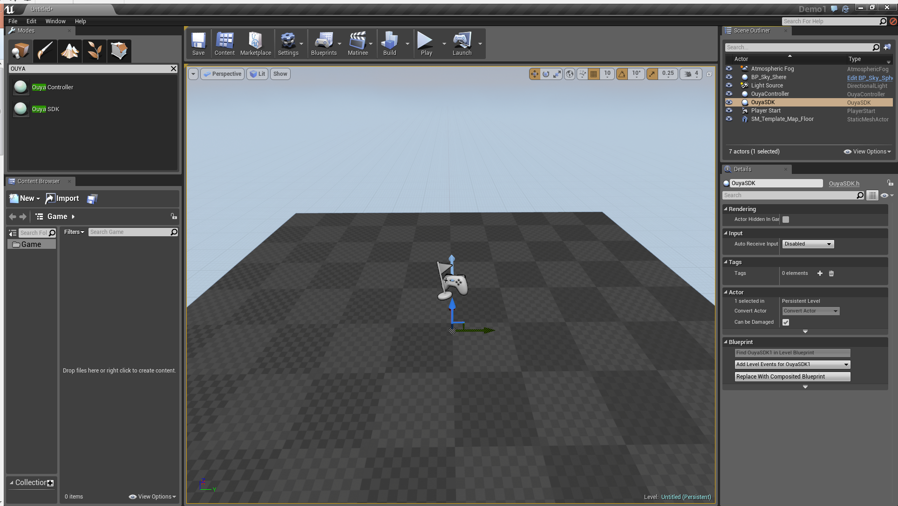
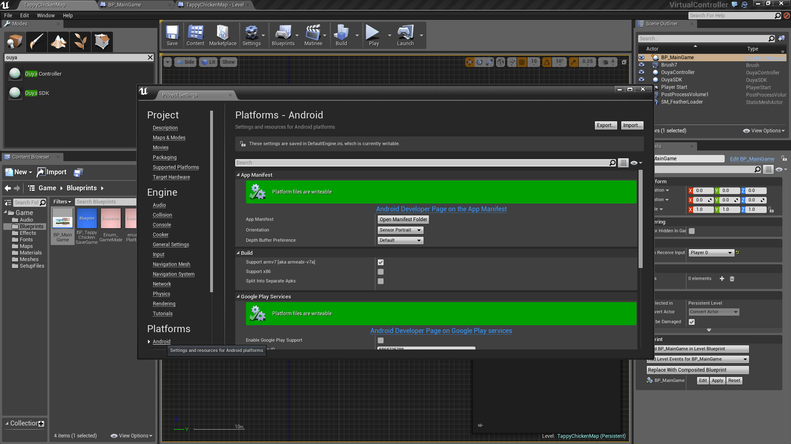

# Unreal Engine

## Forums #

* [Unreal on OUYA Forums](http://forums.ouya.tv/categories/unreal-on-ouya)

* [UnrealEngine Forums](https://forums.unrealengine.com/forum.php)

## Getting Started #

<table border=1>
 <tr>
 <td>UE4 on OUYA (28:49)<br/>
<a href="http://www.youtube.com/watch?feature=player_embedded&v=lK7qGgeuI74" target="_blank">
</a>
 </td>
 <td></td>
 </tr>
</table>

## Quick Start

* First you need an [Unreal subscription](http://unrealengine.com) ($19/month + 5%)

* Link your Github account with your Unreal account per the [wiki instructions](https://wiki.unrealengine.com/GitHub_Setup#GitHub_Account)

* Only after linking your Github account will you have access to the [UE4 Source](https://github.com/EpicGames/UnrealEngine).

## Resources

* Get the [Unreal Engine](https://www.unrealengine.com/what-is-unreal-engine-4) - Unreal Engine and Source, All for $19 per month + 5% of Revenue

* [Unreal Forum Post](https://forums.unrealengine.com/showthread.php?51910-Getting-Started-Android-Development-References-Documentation-Feedback) - Unreal - Tracking OUYA Plugin process and requests for info

* [UE4 Video Playlist](https://wiki.unrealengine.com/Category:Epic_Video_Playlists) - Unreal - Epic Video Playlists

* [UE4 Programming Playlist](https://wiki.unrealengine.com/Introduction_to_UE4_Programming_Playlist) - Unreal - Introduction to UE4 Programming Playlist

* [Android Quick Start](https://docs.unrealengine.com/latest/INT/Platforms/Android/GettingStarted/index.html) - Unreal - Documentation steps for getting started with Unreal

* [Android Reference Guide](https://docs.unrealengine.com/latest/INT/Platforms/Android/Reference/index.html) - Unreal - Environment variable setup for Android publishing

* [Blueprints](https://docs.unrealengine.com/latest/INT/Engine/Blueprints/UserGuide/Types/ClassBlueprint/index.html) - Unreal - Visual Scripting

* [Introduction to Paper2D](https://docs.unrealengine.com/latest/INT/Videos/Player/index.html?series=PLZlv_N0_O1gauJh60307mE_67jqK42twB&video=w5I3ljBJKa0) - Unreal - Intro to 2D sprites

## Build UE4

* Download the [4.5-OUYA branch](https://github.com/ouya/UnrealEngine/tree/4.5-OUYA) to get the `OUYA fork` of the `Unreal Engine`

```
git clone -b 4.5-OUYA https://github.com/ouya/UnrealEngine
Cloning into 'UnrealEngine'...
remote: Counting objects: 243979, done.
remote: Compressing objects: 100% (53/53), done.
remote: Total 243979 (delta 8), reused 13 (delta 6)
Receiving objects: 100% (243979/243979), 291.48 MiB | 2.50 MiB/s, done.
Resolving deltas: 100% (172998/172998), done.
Checking connectivity... done.
Checking out files: 100% (26995/26995), done.
```

* Download `Required_1of2.zip` and `Required_2of2.zip` from the [4.5.X Releases](https://github.com/EpicGames/UnrealEngine/releases) and unpack in the `UnrealEngine` checkout folder.


* Follow the [Build the Engine](https://wiki.unrealengine.com/GitHub_Setup#Buld_the_Engine) steps to generate the Visual Studio solution.
 


* Open the `UE4.sln` in Visual Studio


* Add `Solution Configurations` and `Solutions Platforms` to the Visual Studio Toolbar to easily target the `UE4` build platforms. 


* Build the `Development Editor` on the `Win64` platform which will build the `UnrealEngine\Engine\Binaries\Win64\UE4Editor.exe` editor application.


* Build the `Development Client` on the `Android` platform which will build the `UnrealEngine\Engine\Binaries\Android\UE4Client-armv7-es2.so` native library.


* Run the script `UnrealEngine\Engine\Binaries\Android\copy_client_for_game.cmd` to copy the native library as the `UE4Game-armv7-es2.so` dependency to use when building BluePrint projects.

 

* Launch the `UE4` editor from `UnrealEngine\Engine\Binaries\Win64\UE4Editor.exe`.


# `UE4 Editor`

* Create a `New Project` as a `Blueprint` project in the `Unreal Project Browser` to publish to `Android` the fastest. Select `No Starter Content` to reduce the file size. Enter a location of an empty folder to place the project and give it a name. Click `Create Project`.


* Use the `Object Browser` and search for `OUYA` to add the `OuyaController` and `OuyaSDK` actors to the level.



* Open the `Level Blueprint`.


* With `OuyaSDK` selected in the `Scene Outliner`, `Right-Click` to add a reference in the `Level Blueprint`.


* With `OuyaController` selected in the `Scene Outliner`, `Right-Click` to add a reference in the `Level Blueprint`.


* Click the `Compile` button to update the latest `Blueprint` changes after adding the `OuyaSDK` and `OuyaController` object references to the `Level Blueprint`.


* `Right-Click` on the `Event Graph` to add an `Event Tick` to the `Level Blueprint`. The event adds an update event to the flow. 


* `Right-Click` on the `Event Graph` while the `OuyaSDK` object in the `Scene Outliner` is selected to add `Ouya Get Any Button Down` to the `Level Blueprint`. The event checks if any controller has a `pressed` event for the `button` parameter. 

## OUYA-Everywhere Input


* `Right-Click` on the `Event Graph` while the `OuyaController` object in the `Scene Outliner` is selected to add `Get BUTTON O` to the `Level Blueprint`. The event gets the `KeyCode` for the `BUTTON_O` on the OUYA Controller. 


* `Right-Click` on the `Event Graph` while the `OuyaSDK` object in the `Scene Outliner` is selected to add `Ouya Clear Button States` to the `Level Blueprint`. The event clears any detected `pressed` and `released` states so the next `Update Tick` can detect the next events.


* Click the `Compile` button to update the latest `Blueprint` changes after adding a set of events that will detect a `pressed` event for the given `button` for any `OuyaController`.


* Click the `Play` button to verify the flow is functioning properly to troubleshoot any issues.


## Deployment

* Before building for `Android` check your `Project Settings` in the `Unreal Editor`.


* Click `Android` in the `Platforms` section. 



* Set the `Orientation` to `Landscape` for the TV.


* Click the `Open Manifest Folder` button to customize the manifest.


* Edit the `AndroidManifest.xml` in a `Text-Editor`.


* Add the `intent-filter` so the game will appear in the `Play` section in the `OUYA Launcher`.

<pre>
&lt;category android:name="tv.ouya.intent.category.GAME" /&gt;
</pre>


* Build for `Tegra 3` devices using the `File->Package Project->Android->Android (DXT)` menu item.


* Browse for an empty folder or use the previous path to output the `APK` from the build process.


* Click `Show Output Log` to watch for any packaging errors that may occur while building the `APK`.


* A `Blueprint` only project should build within a few minutes versus a `Code` project which will take much longer.


* Run the `Install_ProjectName_Development.bat` script to install to the connected `OUYA`.


* Generally the install takes 1 second per MB and prints `Success` when the install has completed.


## Examples

Examples are included at the base GIT path.

### Tappy Chicken

`Tappy Chicken` is a complete example project in the `Unreal Launcher`. The complete project can be installed within the `MarketPlace` in the `Complete Projects` section.

* Double-Click the `BP_MainGame` blueprint to open the `Event Graph` of the `Class Blueprint`.
 
 

* Add a `Custom Event` named `OUYA_PLAY` that simulates clicking on the `PLAY` button at the start of the game. 


* Add a `Custom Event` named `OUYA_TOUCH` that simulates "tapping anywhere" at the start of the game. 


* Add a `Custom Event` named `OUYA_FLAP` that simulates flapping the chicken during gameplay.


* Compile the blueprint changes.

* Open the `Level Blueprint`.


The following event flow adds the custom events needed to play `Tappy Chicken` on the OUYA. If the `BUTTON_O` pressed event is detected on `Any` OUYA Controller then the custom events will be invoked for `OUYA_PLAY`, `OUYA_TOUCH`, and `OUYA_FLAP`. `OUYA Clear Button States` clears the detected pressed and released events so they can be detected in the next update frame.


* Compile the blueprint changes.

* Backup the changes with the `File->Save All` menu item.
